# RainCode

> 个人本地 AI 编程工作台 —— 单机优先、数据全本地、自带 API Key 接入任意 OpenAI 兼容模型。

[](https://github.com/Rainmemery/RainCode/actions/workflows/ci.yml)
[](PROGRESS.md)
[](LICENSE)


> **🤖 本项目为 vibecoding 产物**：由 AI 编程助手（vibe coding 工作流）全程协作设计与开发，人类角色定位为需求提出、方案评审与验收。设计与实现过程见 [PROGRESS.md](PROGRESS.md) 与 [docs/](docs/README.md)。

## 产品一览

| Web 会话工作台 | Windows 桌面端 |
| --- | --- |
| 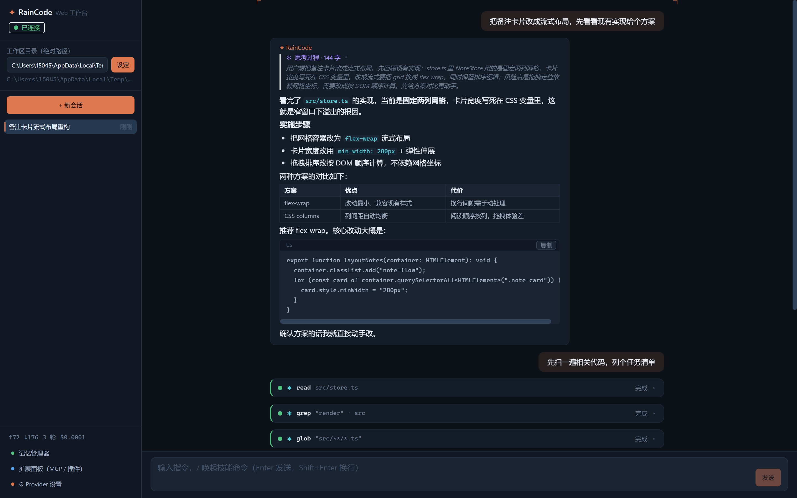 | 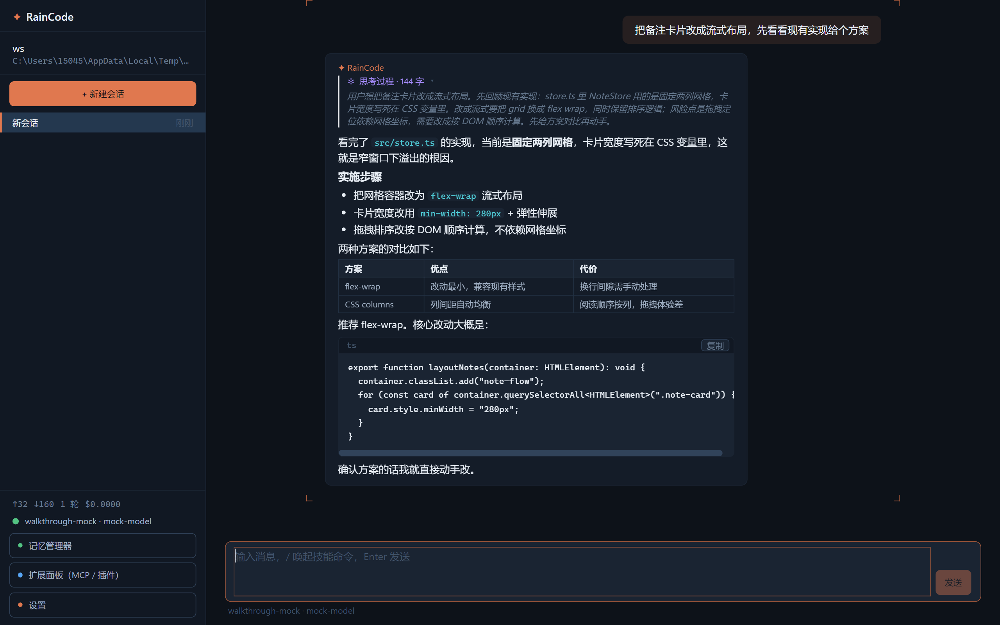 |

视觉遵循 [docs/03-ui-design](docs/03-ui-design.md) v1.3「赤陶磷光」token 体系：思考块（`✻ 思考过程` 流式展开 / 完成折叠，随会话持久化）、工具卡五状态（glyph 语言 ◇✱←$ 与 CLI 同源 + 参数摘要按工具域提炼 + 状态底色 tint + diff 行着色）、代码围栏头行语言芯片与一键复制、kbd 快捷键芯片、取景框角标。截图由 `pnpm shots:web` / `pnpm shots:desktop` 驱动**真实产品入口**自动生成（mock LLM + CDP，[scripts/](scripts/)），非设计稿。

RainCode 的功能定位与 Claude Code / Codex 对齐：整合**代码生成、工具调用、MCP 调用、子代理管理、沙箱执行环境、命令权限控制、项目记忆**七大核心模块，提供 **CLI 与 Windows 桌面应用**双端形态，两端共享同一套后端服务（`@raincode/server` 唯一组装点）与同一套 RPC 协议（传输无关：进程内 in-memory / 子进程 stdio）。

## 当前状态

**M3（七模块全量对齐）验收完成** ✅（T3.1~T3.9，NFR-1~7 全量重测与 4.2 对比矩阵核对见 [docs/benchmarks/m3-2026-10-02.md](docs/benchmarks/m3-2026-10-02.md)；M2 基准见 [docs/benchmarks/m2-2026-09-29.md](docs/benchmarks/m2-2026-09-29.md)）。**M4（工程加固与遗留收口）全量完成** ✅：T4.1 CI（[Actions](https://github.com/Rainmemery/RainCode/actions/workflows/ci.yml) windows-latest 六门禁与本地同集）· T4.2 内核收尾竞态修复 · T4.3 生成式协议目录（[docs/generated/protocol-catalog.md](docs/generated/protocol-catalog.md)，`protocol:check` 防漂移入 CI）· T4.4 技能模型侧可发现性 · T4.5 Web 端管理面板对齐 · T4.6 [防御式模式文档](docs/defensive-patterns.md) · T4.7 遗留收口批次 A（dist 安装包 + 双端真浏览器走查）· T4.8 遗留收口批次 B（SSH 真协议端到端 + 真实仓库 CVE 修复样例 + 真实 MCP 任务样例 + Provider 连通矩阵自动化；执行留存 [docs/benchmarks/m4-2026-10-04.md](docs/benchmarks/m4-2026-10-04.md)）· T4.9 可视化测试缺陷修复批次。**M5（扩展机制与上下文治理）进行中** 🚧：T5.1 hooks 生命周期 v1 ✅（协议 v1.12 additive：hooks 域 3 方法 + `hook.started/completed` 事件——hooks.json 双源（user/project，CC 兼容 command 子集）+ project 源 workspace trust 授信（每 dispatch 前重验、绑定配置 digest、撤销立即失效）+ PreToolUse/UserPromptSubmit/PostToolUse/Stop 四生命周期接线（deny 拦截先于权限判定 / additionalContext provenance 注入下一轮 / failed·timed_out 告警不阻塞）+ log-only 审计事件对 hook.invoked/hook.result（stderr 截断落盘）+ 双端 hook 执行投影；`pnpm smoke:hooks` 五验收用例）· T5.2 沙箱 enforcement 上报 · T5.3 记忆与历史检索增强 · T5.4 compact 预剪枝 · T5.5 config dump + 事件矩阵 · T5.6 MCP 工具目录化（可裁）· T5.7 工程收尾（可裁）（07-dev-plan [§11](docs/07-dev-plan.md)，01-PRD v1.1 已登记；参照 [三仓调研报告](docs/research/2026-10-04-m5-reference-repos.md)（MiMo-Code / deepseek-harness / ZCode）；遗留项全量登记于 [docs/legacy-items.md](docs/legacy-items.md) 并原样保留）。

| 能力 | 状态 |
| --- | --- |
| Agent 内核（turn 状态机 / 会话生命周期 / checkpoint 恢复 / epoch 守卫 / 受限重试） | ✅ M1 |
| 工具调用（11 个内置工具 / 声明式权限元数据 / 只读并行 / 输出预算裁剪） | ✅ M1~M4 |
| 命令权限控制（五级判定链 / bash argv 求值 / grantId 审批闭环 / 三层规则 / 审计） | ✅ M1 |
| 控制面协议（55 方法 / 19 事件 / 密钥引用制 / capability 协商） | ✅ M2/M3 |
| 上下文压缩 compact（80% 阈值自动触发 / 异步不阻塞 / 记忆抽取钩子） | ✅ M2 |
| MCP 接入（stdio / Streamable HTTP / SSE，`mcp__<server>__<tool>` 命名空间；运行时启停 / 健康检查 ping） | ✅ M2/M3 |
| 子代理管理（profile 双源解析 / 并发槽排队 / 级联取消 / 事件镜像合并） | ✅ M2 |
| 项目记忆（MEMORY.md 注入 / FTS5 检索 / 会话记忆抽取 / 晋升草案待确认区 / 桌面记忆管理器） | ✅ M2/M3 |
| P1 工具（`web_fetch` SSRF 防护 / `ask_user_question` 交互提问） | ✅ M2 |
| rpc stdio 绑定 + headless 宿主（`raincode serve`） | ✅ M2 |
| 桌面端 Alpha（Electron 三泳道 + React，会话流 / 工具卡 / 审批弹窗 / Provider 设置 / 记忆管理器 / 扩展面板 / 斜杠命令面板 / 用量统计） | ✅ M2/M3 |
| 会话管理（rename / fork / usage 费用估算 / archive / mode） | ✅ M2 |
| 容器沙箱（Docker / WSL 执行域 + 不可用回退，config.json `sandbox` 节） | ✅ M3 |
| 远程执行（SSH 远程工作区，复用 Executor 抽象，本地审计保留） | ✅ M3 |
| 技能与斜杠命令（技能包双源加载 / `$ARGUMENTS` 模板展开 / 3 个官方示例技能） | ✅ M3 |
| 插件化（`plugins/<name>/` 清单+ES module 契约 / activate-deactivate 生命周期 / 启停持久化 / `plugin__<名>__<工具>` 命名空间 / 故障隔离不拖垮内核 / 官方示例插件 hello） | ✅ M3 |
| 子代理编排增强（内置角色模板 researcher/reviewer/tester / 并行委派汇聚） | ✅ M3 |
| Web 界面（`raincode web` 宿主 + WebSocket 绑定 / `ws.auth` 连接级鉴权 / 断线重连 + seq 缺口 resume 补偿 / 浏览器会话工作台） | ✅ M3 |

## 环境要求

- Node.js ≥ 20
- pnpm 11（`packageManager` 已锁定，Corepack 可直接启用）
- Windows 优先（开发 / 测试均在 Windows 上进行），理论兼容 macOS/Linux
- 桌面端额外依赖 Electron 33（`pnpm install` 自动拉取；国内网络建议设置 `ELECTRON_MIRROR=https://npmmirror.com/mirrors/electron/`）
- better-sqlite3 预编译二进制经 prebuild-install 下载，GitHub release 直连不可达时回退 node-gyp（需 VS C++ 工具链）；国内网络建议同时设置 `npm_config_better_sqlite3_binary_host_mirror=https://registry.npmmirror.com/-/binary/better-sqlite3`（prebuild-install 只认下划线形式的 `npm_config_*` 环境变量，`.npmrc` 的短横线键不会被转换）

## 快速开始

```bash
# 1. 安装依赖
pnpm install

# 2. 环境健康检查（可选）
pnpm typecheck && pnpm lint && pnpm architecture:check

# 3. 配置模型 Provider（OpenAI 兼容协议，详见下文「Provider 配置」）
#    最简方式：创建 config/providers.local.json（已被 .gitignore 隔离）
#    { "baseURL": "https://your-endpoint/v1", "apiKey": "sk-...", "model": "your-model" }
#    ⚠️ 位置注意：该文件按**进程启动 cwd** 解析（`<cwd>/config/providers.local.json`）。
#    `pnpm --filter @raincode/cli raincode ...` 的 cwd 是 apps/cli——仓库根的配置不会被读到。
#    二选一：把配置放到 apps/cli/config/providers.local.json，或显式
#    --provider-config <仓库根>/config/providers.local.json（也可设 RAINCODE_PROVIDER_CONFIG）。

# 4. 运行 CLI（从仓库根以 tsx 直跑，cwd = 仓库根，config/providers.local.json 直接生效）
node --import tsx apps/cli/src/index.ts ping        # 握手：打印协议版本与 capability 列表
node --import tsx apps/cli/src/index.ts run "解释这个仓库的目录结构"     # 非交互单轮
node --import tsx apps/cli/src/index.ts chat        # 交互 REPL（推荐日常使用）
# 亦可 pnpm --filter @raincode/cli raincode <cmd>（注意上述 cwd 口径）
```

> ⚠️ **密钥安全约束**：API Key 只存在于内存与本地配置文件，绝不写入任何被跟踪文件、日志、输出或审计（架构级约束，见 docs/04-architecture §5.3）。推荐 `apiKeyRef: "file:config/apikey.txt"` 引用制。

## CLI 命令

| 命令 | 说明 |
| --- | --- |
| `raincode ping` | 进程内启动 Agent Service 并握手，打印协议版本（也作为冷启动基准打点） |
| `raincode run "<prompt>"` | 非交互模式：创建会话 → 发送 → 流式打印 → 退出；`--yes` 自动允许工具审批（临时 session 规则，不落库） |
| `raincode chat` | 交互 REPL（见下表），流式渲染 + 工具卡片 + 交互审批 |
| `raincode serve` | headless stdio 宿主：stdin/stdout 承载 JSONL 协议帧（桌面端 agent 子进程同形态，可人工 cat 调试） |
| `raincode web` | Web 会话工作台宿主：HTTP(+WS) 监听 `ws://127.0.0.1:8787/ws`（`--port` `--host` 可调）；`ws.auth` 连接级鉴权（`--token` / `RAINCODE_WEB_TOKEN` / 自动生成打印到 stderr）；`--static <dir>` 服务浏览器工作台资源（缺省探测 `apps/web/dist`） |
| `raincode help` | 帮助 |

通用选项（`run` / `chat` / `serve` 共用）：`--base-url` `--model` `--api-key` `--name` `--provider-config <path>` `--workspace <dir>` `--title <title>` `--yes`。

### chat REPL 内置命令

| 命令 | 说明 |
| --- | --- |
| `/exit` | 退出（归档提示） |
| `/sessions` | 会话列表（Active / Archived） |
| `/resume <id>` | 恢复会话并切换为当前活动会话（checkpoint + 增量重放 ≤ 1s） |
| `/rename <title>` | 重命名当前会话 |
| `/fork [title]` | 复制全量历史分叉新会话并切换（源会话不动，`parent_session_id` 回链） |
| `/usage` | 当前会话累计 tokens / 轮次 / 费用估算（Provider 配置单价后显示） |
| `/mode <normal\|plan\|auto-accept>` | 协作模式切换（plan 写类 deny / auto-accept workspace 内自动放行 / normal 询问） |
| `/archive [--force]` | 归档会话（运行中后台任务未收束时需 `--force`） |
| `/compact` | 手动触发上下文压缩（低于阈值报 INVALID_PARAMS；压缩期间对话不阻塞） |
| `/providers` | 查看 config 域 Provider 列表与单价 |
| `/skills` | 技能面板：列出可用技能（名称 / 参数提示 / 来源层 / 描述） |

写操作等敏感工具会触发**交互式审批**，四级数字决策：`1` 仅本次允许 / `2` 本会话始终（写 session 规则）/ `3` 项目始终（写 project 规则）/ `4` 拒绝。

### 技能与斜杠命令

除上表内置命令外，chat REPL 中 `/<技能名> [参数]` 会路由到**技能**（可复用工作流的提示词模板）：server 侧展开模板（`$ARGUMENTS` 占位替换为参数；无占位符时参数追加到模板末尾）后按普通输入起 turn，流式渲染与审批闭环完全一致。内置命令名优先于技能名；未知名不是技能时报未知命令提示。

在 `<workspace>/.raincode/skills/<name>.md`（项目级）或 `~/.raincode/skills/<name>.md`（全局，`RAINCODE_HOME` 数据目录）放置技能文件（markdown + frontmatter，正文 = 提示词模板，workspace 层同名优先）：

```markdown
---
name: review
description: 对指定文件或改动做一轮代码审查（风险分级 + 可执行修复建议）
argumentHint: "<文件或目录或关注点>"
---
你是一名严格的资深代码审查员。请对 $ARGUMENTS 执行代码审查，产出结构化审查报告。
...
```

仓库 `examples/skills/` 提供 3 个官方示例技能（`review` 代码审查 / `test-gen` 测试生成 / `docs` 文档生成），复制进上述任一技能目录即可使用；协议面为 `skills.list` / `skills.invoke`（06-api-spec §2.9）。

### 插件化

插件 = `<RAINCODE_HOME>/plugins/<name>/` 目录（`plugin.json` 清单 + 入口 ES module），是注册进工具注册表的**可执行代码扩展**——工具以 `plugin__<插件名>__<工具名>` 全名注册（`tool.tools.list` 中 source=plugin），权限缺省从严（needsApproval=true，可用声明或权限规则放宽）：

```json
{ "name": "hello", "description": "示例插件", "version": "0.1.0", "entry": "index.mjs" }
```

```js
// index.mjs —— activate 返回工具描述符数组；deactivate 可选（停用时调用）
export function activate() {
  return [{
    name: "greet",
    description: "问候语生成",
    parametersJsonSchema: { type: "object", properties: { name: { type: "string" } } },
    metadata: { readOnly: true, needsApproval: false, riskLevel: "low" },
    async execute(args) { return `Hello, ${args?.name ?? "world"}!`; },
  }];
}
```

发布 = 把插件目录拷入 plugins 目录后点扩展面板「**刷新**」（`plugins.rescan` 运行时重扫描，免重启装载；CLI 可直接调用该方法）——已有插件不重载不触碰，重复刷新幂等。运行时启停经 `plugins.setEnabled`（停用名单持久化 `plugins.json`，目录即配置、停用 ≠ 卸载）。故障隔离：清单/入口/activate 失败 → 该插件 failed（其余插件与内核不受影响），工具执行错误 → 数据级错误回传模型自纠。仓库 `examples/plugins/hello` 为官方示例插件（greet + word_count 双工具）。

## 桌面端（Windows Alpha）

Electron 三泳道架构：main（窗口 + agent 子进程守护 + 帧转发，不解析业务帧）/ renderer（React 18 + Zustand + Tailwind）/ agent 子进程（与 CLI 完全同一 `createAgentServiceNode` 组装）。

```bash
# 开发模式（vite dev server + electron，窗口真实弹出）
pnpm --filter @raincode/desktop dev

# 构建产物（main/preload CJS + agent esbuild bundle + renderer vite bundle）
pnpm --filter @raincode/desktop build

# Windows 安装包（electron-builder nsis；dist 脚本自动完成 electron-ABI 原生模块暂存 + gh-proxy 镜像/winCodeSign 缓存兜底——T4.7 L-04 已自动化并经安装冒烟验证）
pnpm --filter @raincode/desktop dist
```

Alpha 功能范围：三栏主界面（会话列表 + 会话流 + 输入区）、思考块（`✻ 思考过程` 流式展开 / 完成后自动折叠，reducer 层 reasoning 独立累积）、工具调用卡片（五状态：排队 / 运行中 / 成功 / 失败 / 已作废；glyph 语言与 CLI 同源 ◇✱←$；`mcp__` 调用与子代理派发带模块徽标；参数摘要按工具域提炼；结果 diff 行着色）、权限审批弹窗（顶部琥珀色带 + 风险徽章 + kbd 快捷键芯片 + `1-4` 直选 + `Esc` 拒绝，弹窗出现时自动接管焦点——消息输入框聚焦时快捷键同样生效）、Provider 设置（添加 / 切换 / 活跃徽章）、记忆管理器（MEMORY.md 预览 / 晋升草案确认 / 条目检索与晋升）、**扩展面板（MCP 服务器启停 / 健康检查 / 重试 + 插件启停与状态 + 「刷新」重扫描免重启装载新插件，全局事件活更）**、**斜杠命令面板（`/` 唤起技能清单，↑↓ + Tab 补全，Enter 经 `skills.invoke` 端到端执行）**、**会话用量统计（↑/↓ tokens / 回合数 / 费用估算）**、工作区目录选择、流式输出与光标、代码围栏一键复制、子进程崩溃自动重启提示。视觉遵循 [docs/03-ui-design](docs/03-ui-design.md) v1.3「赤陶磷光」体系（取景框角标 / 模块标识色 / 减动效偏好全覆盖）。与 CLI 共享同一 `RAINCODE_HOME` 数据目录——CLI 里开始的会话，桌面端打开即续接。会话列表为数据根**全量会话**（跨工作区共享、跨端可见，不按工作区过滤——过滤属后续候选）。GUI 回归走查：`pnpm walkthrough:desktop`（CDP 驱动构建产物，14 断言；`RAINCODE_WALKTHROUGH_APP_PATH` 指向静默安装后的 RainCode.exe 即对安装产物冒烟——T4.7 已验证 nsis 安装包全链路）。

| 工具卡（摘要 v2 + 展开态） | 权限审批弹窗 |
| --- | --- |
| 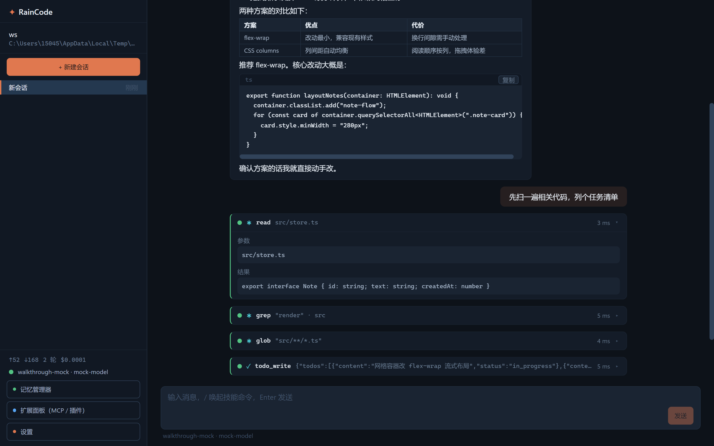 | 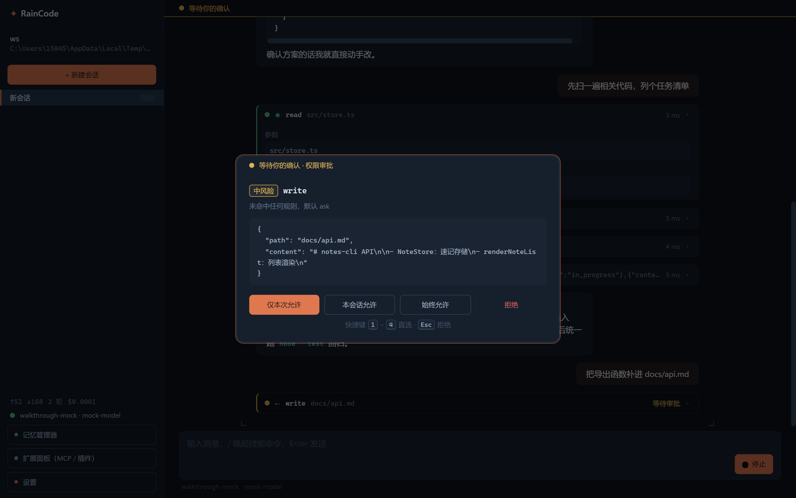 |

<details>
<summary><strong>更多桌面端截图</strong></summary>

| 记忆管理器 | 扩展面板（MCP / 插件） |
| --- | --- |
| 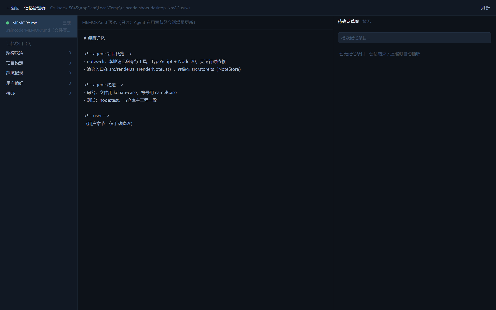 | 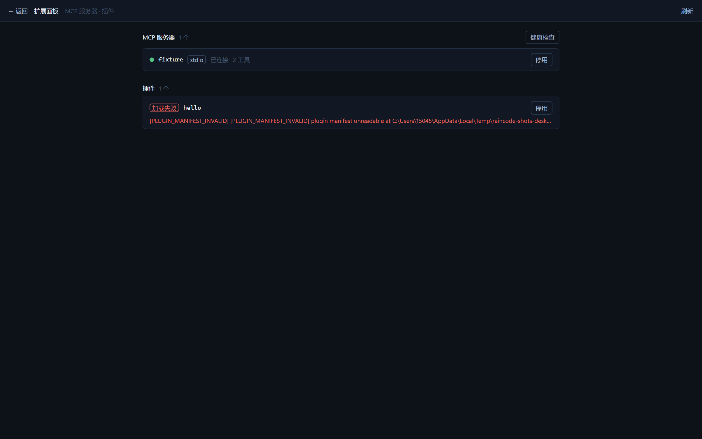 |

</details>

## Web 界面（浏览器会话工作台）

WebSocket 绑定（T3.8，协议 v1.9）——**帧协议与方法表零改动**，是「传输无关 RPC」设计的最终验证：

```bash
# 1) 构建（或 pnpm --filter @raincode/web dev 走 Vite dev server）
pnpm --filter @raincode/web build

# 2) 启动 Web 宿主（HTTP + WS 同端口；装配口径与 raincode serve 一致）
raincode web --port 8787
# stderr 输出：
#   [raincode/web] auth token (auto-generated): <TOKEN>
#   [raincode/web] rpc endpoint: ws://127.0.0.1:8787/ws
#   [raincode/web] workbench: http://127.0.0.1:8787/?token=<TOKEN>&ws=ws://127.0.0.1:8787/ws

# 3) 浏览器打开 workbench URL；token 也可用 --token / RAINCODE_WEB_TOKEN 显式指定
```

- **连接级鉴权（`ws.auth`，capability 协商）**：websocket 绑定的首请求必须是 `ws.auth { token }`，成功前一切请求（含 `system.ping`）回 `UNAUTHORIZED`；token 服务端常数时间比较、绝不落盘落日志（04 §5.3）。stdio / in-memory 绑定同生共死，不设门也不暴露该方法。
- **断线恢复**：浏览器端指数退避重连（1s ×2 封顶 10s），重连握手成功后对活跃会话 `session.resume` 快照补推（全量重建 + 未决审批）；会话事件 seq 跳变（真实丢帧）同样触发 resume 补偿（06 §6.3 第 4 条）。
- **多连接扇出**：多个浏览器标签页可同时连接，会话事件投递到全部活跃连接；多标签审批弹窗互相同步（同一 `pendingApprovals` 投影）。
- **心跳**：宿主 30s 周期 WS ping 探活，空闲连接自动断开；`RAINCODE_WS_DELTA_WINDOW_MS` 可调大流式批量窗口（广域网）。

Alpha 功能范围：会话列表 / 新建 / 切换、工作区路径输入、会话流式渲染（markdown 轻渲染、思考块流式展开 / 完成后自动折叠、工具卡五状态与模块徽标、代码围栏一键复制）、交互审批（四级决策 + kbd 快捷键芯片 + 键盘直选）、Provider 设置、连接状态条（重连可视化）、管理面板四件套——记忆管理器（MEMORY.md 预览 / 草案确认 / 条目检索晋升）、扩展面板（MCP 状态启停与健康检查 + 插件启停）、斜杠命令面板（`/` 唤起技能清单，↑↓/Tab 补全）、用量统计（侧栏 ↑/↓ token 与回合数）——与桌面端同构消费同一服务面（T4.5，L-08 核销）。视觉与桌面端统一（[docs/03-ui-design](docs/03-ui-design.md) v1.3「赤陶磷光」token 体系，UI 重设计轮自 `ink-*` 简化盘迁移）。真浏览器回归走查：`pnpm walkthrough:web`（Edge/Chrome headless CDP 驱动真实 `raincode web` 入口，19 断言：鉴权 / 会话 / 审批落盘 / 宿主重启恢复 / 多标签扇出与标签冻结补偿——T4.7，L-05 核销）。

| 会话流（思考块 + 工具卡 + 语言芯片围栏） | 权限审批弹窗（kbd 快捷键直选） |
| --- | --- |
| 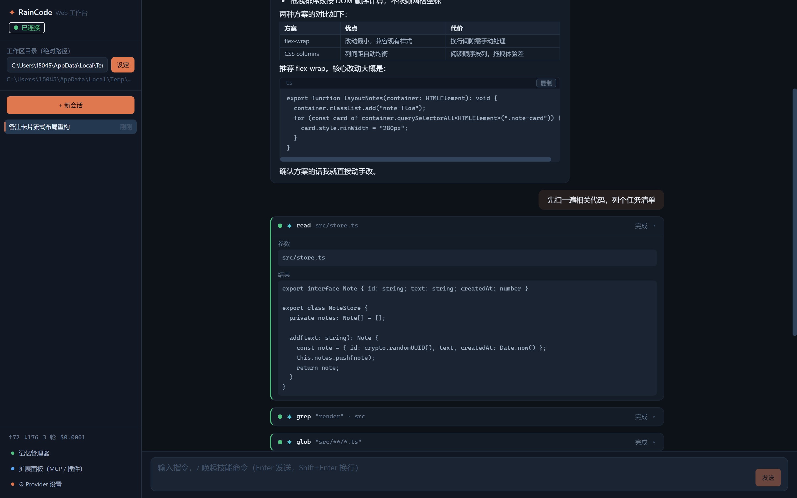 | 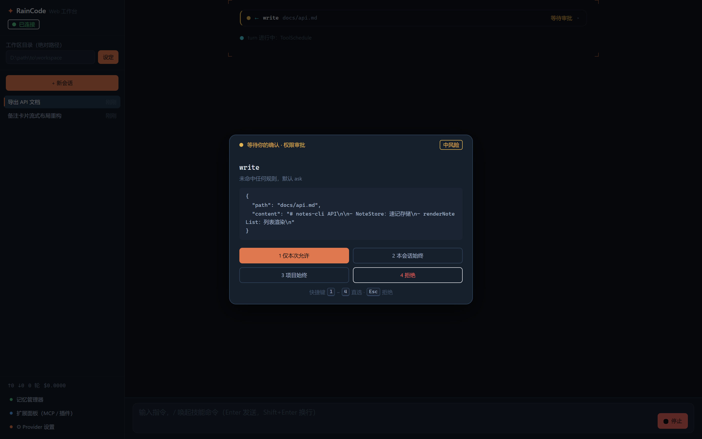 |

<details>
<summary><strong>更多 Web 端截图</strong></summary>

| 斜杠命令面板 | 记忆管理器 | 扩展面板 | Provider 设置 |
| --- | --- | --- | --- |
| 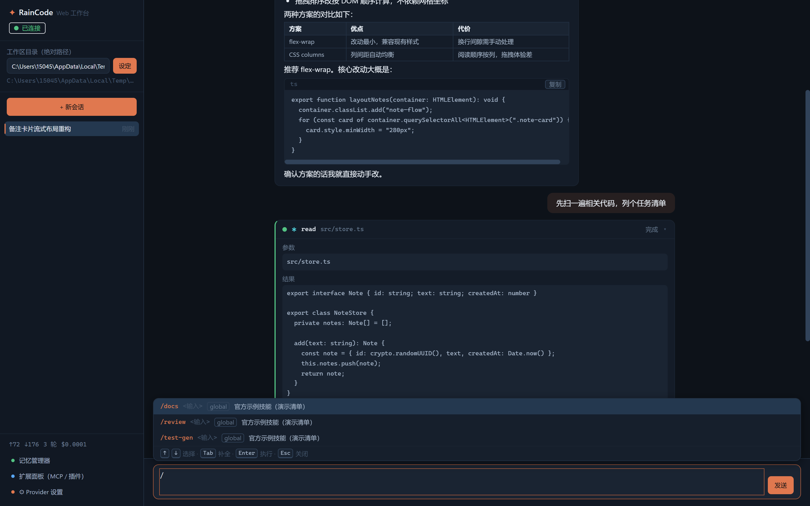 | 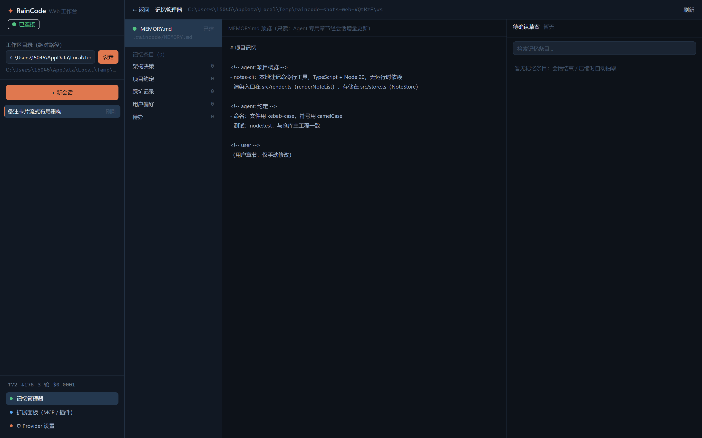 | 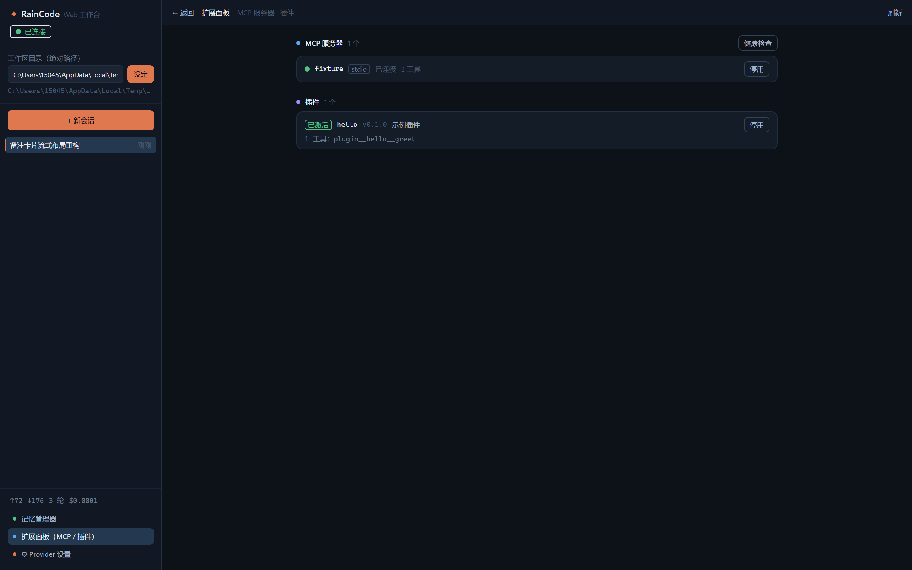 | 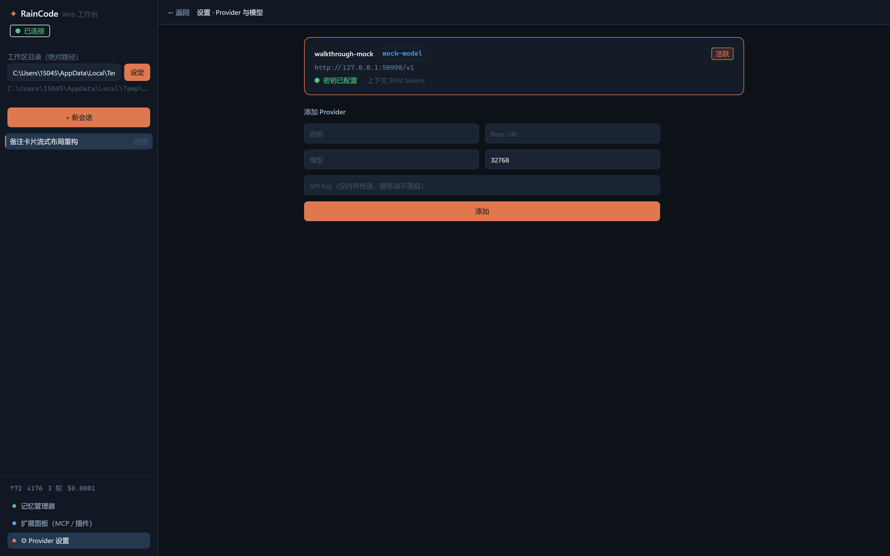 |

</details>

## Provider 配置

**优先级（低 → 高，字段级就近覆盖）**：① 配置文件 → ② 环境变量 → ③ CLI 参数。

### 方式 A：配置文件 `config/providers.local.json`（推荐，已 gitignore）

```jsonc
// 形态一：单 Provider 平铺
{
  "name": "my-provider",
  "baseURL": "https://your-endpoint/v1",
  "model": "your-model",
  "maxContextTokens": 32768,
  "apiKeyRef": "file:apikey.txt"        // 引用制：相对路径以配置文件目录为基准
  // "apiKey": "sk-..."                  // 也可明文（仅限本地开发）
}
```

```jsonc
// 形态二：多 Provider + 活跃项（运行时 /providers、config.providers.switch 切换）
{
  "providers": [
    { "id": "p1", "name": "main", "baseURL": "https://a/v1", "model": "m1",
      "apiKeyRef": "file:key1.txt",
      "inputPricePerMtok": 0.14, "outputPricePerMtok": 0.28 },
    { "id": "p2", "name": "backup", "baseURL": "https://b/v1", "model": "m2", "apiKey": "sk-..." }
  ],
  "activeProviderId": "p1"
}
```

`inputPricePerMtok` / `outputPricePerMtok`（USD / 百万 token）配置后 `/usage` 与 `session.usage` 给出费用估算。

### 方式 B：环境变量

```bash
export RAINCODE_PROVIDER_BASE_URL="https://your-endpoint/v1"
export RAINCODE_PROVIDER_MODEL="your-model"
export RAINCODE_PROVIDER_API_KEY="sk-..."
export RAINCODE_PROVIDER_NAME="my-provider"          # 可选
export RAINCODE_PROVIDER_MAX_CONTEXT_TOKENS=32768    # 可选，缺省 32768
```

### 方式 C：CLI 参数（临时覆盖）

```bash
raincode chat --base-url https://your-endpoint/v1 --model your-model --api-key sk-...
```

未配置 Provider 时 CLI 仍可启动（`ping` / `sessions` / `resume` 可用），`run` / `chat` 发送时报 `CONFIG_PROVIDER_NOT_FOUND` 引导配置。

## 数据目录

全部本地状态落在 `RAINCODE_HOME`（缺省 `~/.raincode`）：

```
~/.raincode/
├── raincode.db          # SQLite（WAL）：sessions / permission_rules / permission_decisions /
│                        #   approvals / memory_entries（FTS5 trigram）/ schema_migrations
├── sessions/            # JSONL 会话事件流（按 workspace 分目录；checkpoint 恢复点内联）
├── config.json          # 运行时配置（Provider 多项 / activeProviderId；apiKey 只存 file: 引用）
├── mcp.json             # MCP 全局服务器配置
├── agents/              # 全局子代理 profiles（<name>.md）
└── skills/              # 全局技能（<name>.md；斜杠命令模板）

<workspace>/.raincode/   # 项目级（随仓库，可入库共享给团队）
├── MEMORY.md            # 项目记忆（模板初始化；Agent 章节自动维护 / 用户章节手动）
├── plugins/             # 插件目录（T3.5：plugin.json + 入口 index.mjs；发布 = 目录拷入）
├── plugins.json         # 插件停用名单（目录即配置，仅状态持久化）
├── mcp.json             # 项目级 MCP 配置（与全局冲突键拒绝）
├── agents/<name>.md     # 项目级子代理 profiles
└── skills/<name>.md     # 项目级技能（同名 workspace 层优先）
```

## MCP 配置

与 Claude / Cursor 生态 `mcpServers` 约定兼容。三种 transport：

```jsonc
// ~/.raincode/mcp.json（全局）或 <workspace>/.raincode/mcp.json（项目级）
{
  "mcpServers": {
    "filesystem": {
      "transport": "stdio",
      "command": "npx",
      "args": ["-y", "@modelcontextprotocol/server-filesystem", "D:\\workspace"],
      "env": {},                // 可选；注入前经脱敏过滤
      "timeoutMs": 60000,
      "enabled": true
    },
    "remote-api": {
      "transport": "http",      // 或 "sse"
      "url": "https://mcp.example.com/stream",
      "headers": { "Authorization": "Bearer ..." }
    }
  }
}
```

- MCP 工具以 `mcp__<serverKey>__<toolName>` 命名空间注册进工具系统，权限元数据**从严**（needsApproval=true），与内置工具同走三态判定。
- **serverKey 由 map 键承载**（Claude/Cursor 生态 mcpServers 约定；条目内显式 `serverKey` 字段可省，给出时须与键一致——T3.9 起两种形态均接受）。CLI / `serve` / `web` / 桌面 agent 全入口默认装配 mcp 域：全局层 `~/.raincode/mcp.json` 总是生效；project 层 `<workspace>/.raincode/mcp.json` 在单工作区入口（`run/chat --workspace`）生效，多工作区入口（桌面 / web）仅全局层；损坏配置降级为 stderr 告警 + 域空转，不阻断 agent 启动。
- 连接状态机：Disconnected → Connecting → Connected，失败指数退避重连（1/2/4/8/16s，5 次耗尽 → Failed）；单 server 故障仅影响自身命名空间（失败隔离）。
- 断连重连后工具清单自动刷新；`mcp.server_status_changed` 事件实时上报状态。
- 也可运行时经 RPC 管理：`mcp.servers.list/add/remove/retry/setEnabled/health`（桌面端 MCP 面板同源）。
- **运行时启停**：`setEnabled(false)` 停用（断连 + 工具注销 + mcp.json `enabled` 持久化，配置保留可再启）；`setEnabled(true)` 受理即返重连。
- **健康检查**：`mcp.servers.health` 对 Connected server 发 MCP `ping` 实测 RTT；其余状态只读投影（探测不建连、不改状态机，自动恢复仍由调用超时与重连链路承担）。

## 子代理（Sub-agent）

在 `<workspace>/.raincode/agents/<name>.md` 或 `~/.raincode/agents/<name>.md` 放 markdown profile（frontmatter 手写解析，正文 = 子代理系统提示）：

```markdown
---
name: reviewer
description: 代码审查专家：只读分析，输出结构化审查意见
tools: read, glob, grep
maxTurns: 20
---
你是严格的代码审查员。逐文件检查传入范围，输出：问题清单（严重度/位置/建议）。
```

- 主代理经 `agent` 工具派发：`{ profile: "reviewer", task: "审查 src/rpc" }`，阻塞等待子会话终态、结论回传主循环（子代理中间过程不污染主上下文）。
- **内置角色模板**（M3 T3.6）：未放置任何 profile 时也有开箱即用的 `researcher`（只读调研）/ `reviewer`（代码审查）/ `tester`（测试执行）——解析链 workspace → global → 内置，用户同名 profile 遮蔽内置；同轮多个 `agent` 调用经只读并行并发执行（上限 4），完成通知按批次合并回主循环。
- 并发槽缺省 4，超限 FIFO 排队（`queuePosition` 可见）；`subagent.stop` 级联取消。
- 子代理事件镜像（spawned / progress / completed）500ms 窗口合并，终态永不合并。
- profile 缺省 `tools` 只读白名单，层级固定 2（子代理不可再派孙子代理）。

## 内置工具

| 工具 | 说明 | 权限元数据 |
| --- | --- | --- |
| `read` | 读文件（行号窗口 / 图片） | 只读，自动放行 |
| `write` | 写文件（workspace 路径守卫） | 写操作，需审批 |
| `edit` | 精确文本替换（唯一性校验） | 写操作，需审批 |
| `bash` | 受控 shell 执行（超时 / 输出预算 / 后台任务 / argv 级规则求值） | 按命令求值 |
| `glob` / `grep` | 文件名模式 / 内容搜索（默认忽略 node_modules、.git） | 只读，自动放行 |
| `todo_write` | 任务清单维护（会话内计划跟踪） | 无副作用 |
| `skill` | 调用技能包（系统提示目录自主发现；展开模板回传同 turn 续答；`modelInvocable` 开关约束） | 无副作用，自动放行 |
| `web_fetch` | 抓取 URL 转文本（SSRF 强制黑名单：私网/环回/DNS 解析校验/重定向逐跳防护） | network，从严审批 |
| `ask_user_question` | 向用户提问并等待应答（复用审批闭环；CLI 提问卡 / 桌面弹窗） | 无副作用 |

MCP 工具（`mcp__<server>__<tool>`）与子代理派发（`agent`）在同一注册中心与权限体系内运行。所有工具执行统一受并发上限（只读可并行，写串行）、单调用超时与 256KB 输出预算裁剪约束。

## 沙箱执行域（Docker / WSL）

bash 与后台任务的执行环境经 `Executor` 抽象投递（02 §5.3 扩展点），在 `RAINCODE_HOME/config.json` 配置：

```jsonc
{
  "sandbox": {
    "executor": "docker",          // local（缺省）| docker | wsl | ssh
    "image": "node:20-bookworm-slim", // docker 专用，缺省如左
    "network": "none",             // docker 网络策略：none（缺省，断网隔离）| bridge
    "wslDistro": "Ubuntu-22.04",   // wsl 专用，缺省默认发行版
    "ssh": {                       // ssh 专用（executor=ssh 时必填）
      "host": "build.example.com",
      "user": "deploy",            // 可选，缺省当前用户
      "port": 22,                  // 可选
      "identityFile": "C:/keys/id_ed25519", // 可选；BatchMode 下密钥不通即回退
      "remoteWorkspaceRoot": "/srv/work/ws" // 远端 workspace 根（与本地一一映射）
    }
  }
}
```

- **docker（ES-3）**：容器内仅挂载 workspace（文件系统隔离，主机其余路径不可见）+ 缺省断网；命令经 `docker run --rm` 执行，workdir 自动映射（`D:\ws\docs` → `/workspace/docs`）；CLI 进程退出后 best-effort `docker rm -f` 清理容器。
- **wsl（ES-4）**：Linux 环境隔离（`wsl --cd` 自动翻译路径）；发行版文件系统完整可见——环境隔离而非安全边界。
- **ssh（ES-5 远程执行）**：命令经 `ssh` 在远端主机执行，本地 cwd 前缀映射到 `remoteWorkspaceRoot`（远端仓库修改 → 远程测试 → 结果回传）；连接参数含 `-o BatchMode=yes`（密钥不通即收敛，不挂交互提示）；**本地审计记录保留**——JSONL 事件流、审批审计均落本地 `RAINCODE_HOME`，与执行域无关。
- **回退与标记**：执行域不可用（CLI 探测失败——本机未装 Docker/WSL 发行版、SSH 主机不可达或连接配置缺失）自动回退 local 并在 stderr 告警；bash 结果 `data.sandbox` 与非 local 时的内容头行标注真实执行环境。local 模式保持 P0「约束非隔离」语义（路径守卫 / 审批前置 / 超时终止不变）。

## 命令权限与审批

- **五级判定链**：显式 deny → 显式 allow（含通配）→ ask 规则 → 协作模式缺省（plan 写类 deny / auto-accept workspace 内 allow（机器级操作保守不放行）/ normal 询问）→ 默认 ask。
- **规则三层作用域**：`session`（内存，会话结束即弃）/ `project`（SQLite，按 workspace 隔离）/ `global`（SQLite 全局）；层级内 `deny > ask > allow` 收敛，同键后写覆盖。
- **bash 命令级求值**：argv 语义拆解（非字符串前缀），高危根命令（`rm` / `del` / `format` 等）通配 allow 强制降级 ask——宁可误问不可漏拦。
- **审批闭环**：ask → `grantId` 审批单（120s 超时按 deny 收敛）→ CLI 交互或桌面弹窗应答 → `permission.resolved` 事件 + 审计落库；单消费（重复应答报 `PC_GRANT_CONSUMED`）。
- **路径越界防护**：workspace 外写操作强制升级 ask，获批后精确放行该绝对路径。
- 规则管理：`permission.rules.list/add/remove`（scope + tool + pattern），决策审计 `permission.decisions.list` 可追溯。

## 项目记忆

- **L1 项目记忆** `<workspace>/.raincode/MEMORY.md`：每次会话全文注入 systemPrompt；结构化章节（项目概览 / 技术栈 / 约定等）由 Agent 自动维护，`<!-- user -->` 用户章节仅手动修改（越界写入被拒）。
- **L2 会话记忆**：会话归档 / compact 前由 LLM 抽取关键事实落 `memory_entries`（FTS5 trigram 检索），幂等去重、矛盾条目 supersede；`memory.search` 关键词检索、`memory.write` 手工写入、`memory.promote` 将会话记忆晋升进 MEMORY.md 指定章节（需用户确认）。
- **L3 晋升草案待确认区**：抽取落盘的高置信（confidence ≥ 0.8）新条目自动生成晋升草案（kind → 章节预填，todo 与低置信排除），`memory.drafts.list/resolve` 待用户确认合入或忽略；直接管 promote 同条目自动收敛其 pending 草案。
- **桌面记忆管理器**：左侧记忆源分桶 / 中部 MEMORY.md 只读预览 / 右侧待确认草案（章节可改、确认合入）+ 条目检索、kind 过滤、置信度与 superseded 标记、直管晋升（03 §6.3 稿件 03）。

## 环境变量总览

| 变量 | 说明 |
| --- | --- |
| `RAINCODE_HOME` | 数据根目录（缺省 `~/.raincode`） |
| `RAINCODE_PROVIDER_BASE_URL` / `_MODEL` / `_API_KEY` / `_NAME` / `_MAX_CONTEXT_TOKENS` | Provider 环境变量层 |
| `RAINCODE_PROVIDER_CONFIG` | Provider 配置文件路径覆盖（缺省 `<cwd>/config/providers.local.json`） |
| `RAINCODE_MIGRATIONS_DIR` | 迁移脚本目录（仅打包形态内部使用） |
| `RAINCODE_APP_VERSION` | 应用版本注入（仅打包形态内部使用） |
| `RAINCODE_DESKTOP_VITE_URL` / `RAINCODE_DESKTOP_NODE` | 桌面端 dev 脚本内部使用 |
| `RAINCODE_CLI_SHOW_REASONING` | CLI 思维链展示开关：`1`/`true` 时 reasoning delta 经 stderr 逐条输出（dim+斜体）；缺省省略（每 turn 一次 stderr 提示），答案正文 stdout 保持纯净 |

## 开发与测试

```bash
# 工程门禁（四命令，提交前必须全绿）
pnpm typecheck            # 全仓类型检查（strict）
pnpm lint                 # oxlint
pnpm architecture:check   # 架构门禁：依赖白名单 / 循环依赖 / 500 行上限 / 深导入 / managedOnly
pnpm test                 # 单元测试（node:test + tsx，零外呼）

# 冒烟测试（端到端链路，本机 mock，无外呼无真实密钥）
pnpm smoke:p0             # P0 全集（内部并复 compact/mcp/subagent/memory/migrations/kernel/p1tools 等全部 smoke）
pnpm smoke:stdio          # stdio 绑定 + headless 六场景
pnpm smoke:e2e            # 端到端主链路（单独运行）

# NFR 基准（口径见 docs/benchmarks/）
pnpm bench:all                        # NFR-1/2/3/5/7（冷启动 / 发送开销 / 渲染延迟 / 会话恢复 / 崩溃恢复）
pnpm bench:mem:desktop                # NFR-4 桌面端空载内存（先 pnpm --filter @raincode/desktop build；窗口会弹出）

# 产品截图再生（README picture/ 素材；真实入口 + mock LLM + CDP，先构建对应端）
pnpm shots:web                        # web 7 张（会话流 / 工具卡 / 斜杠面板 / 记忆 / 扩展 / 设置 / 审批）
pnpm shots:desktop                    # desktop 5 张（会话流 / 工具卡 / 审批 / 记忆 / 扩展）
```

测试体系与各脚本覆盖范围详见 [docs/testing.md](docs/testing.md)；基准留存见 [docs/benchmarks/](docs/benchmarks/)。

## 项目结构

```
RainCode/
├── apps/
│   ├── cli/          # CLI：ping / run / chat / serve（readline REPL + ANSI 富文本渲染）
│   └── desktop/      # 桌面端：Electron main + preload + React renderer + agent 子进程宿主
├── packages/
│   ├── shared/       # 协议 schema（zod 单一事实源）+ 共享类型
│   ├── rpc/          # 传输无关 RPC（in-memory / stdio 绑定；请求-响应 + 事件订阅）
│   ├── llm/          # OpenAI 兼容流式客户端（SSE 归一化 / Provider 差异 fixture 消化）
│   ├── storage/      # SQLite（WAL）+ JSONL 会话流 + checkpoint 恢复
│   ├── agent-core/   # turn 状态机 + 会话生命周期 + 子代理 + 压缩（内核）
│   ├── tools/        # 工具注册中心 + 9 内置工具 + 执行器（并发/超时/输出预算/SSRF/路径守卫）
│   ├── permission/   # 五级判定链 + bash argv 求值 + 审批闭环 + 规则持久化 + 审计
│   ├── server/       # Agent Service 唯一组装点（双端共享；55 方法/19 事件装配）
│   ├── mcp/          # MCP 三 transport 接入 + 连接状态机 + 命名空间工具适配
│   └── memory/       # MEMORY.md 管理 + FTS5 记忆检索 + 会话记忆抽取
├── architecture/     # policy.yaml（架构治理策略，门禁依据）
├── docs/             # 设计文档全集（见 docs/README.md 索引）+ 基准报告 + UI 原型
├── scripts/          # smoke 冒烟 / NFR 基准 / 架构检查 / 打包产物验证
└── PROGRESS.md       # 任务进度唯一事实来源
```

## 文档

| 文档 | 内容 |
| --- | --- |
| [docs/README.md](docs/README.md) | 文档索引（按阅读顺序） |
| [docs/01-PRD.md](docs/01-PRD.md) | 产品定位 / 功能清单 / NFR 指标 / 竞品对比矩阵 |
| [docs/02-module-design.md](docs/02-module-design.md) | 七大功能模块详细设计 |
| [docs/03-ui-design.md](docs/03-ui-design.md) | 设计 tokens / 桌面端逐界面规范 / 工具卡与审批交互 |
| [docs/04-architecture.md](docs/04-architecture.md) | 包划分 / 进程模型 / RPC 抽象 / ADR 决策记录 |
| [docs/05-database.md](docs/05-database.md) | SQLite 表结构 / JSONL 会话流 / 迁移策略 / 密钥引用制 |
| [docs/06-api-spec.md](docs/06-api-spec.md) | RPC 协议全集（方法 / 事件 / 错误码 / 版本策略） |
| [docs/07-dev-plan.md](docs/07-dev-plan.md) | 里程碑排期（M1~M3 + §10 M4 增补）/ 任务分解 / 风险清单 |
| [docs/legacy-items.md](docs/legacy-items.md) | 遗留项唯一台账（处置口径 / 收口路径 / 保留申报） |
| [docs/research/2026-10-03-deepseek-harness.md](docs/research/2026-10-03-deepseek-harness.md) | deepseek-harness 调研报告（能力对照 / 借鉴决策，M4 规划输入） |
| [docs/testing.md](docs/testing.md) | 测试体系：单测 / 冒烟 / 基准 / 门禁 |
| [PROGRESS.md](PROGRESS.md) | 任务进度唯一事实来源（恢复开发第一步读它） |

## 贡献

欢迎 Issue 与 PR，见 [CONTRIBUTING.md](CONTRIBUTING.md)。开发前请务必阅读 [docs/README.md](docs/README.md) 文档索引与 [PROGRESS.md](PROGRESS.md) 当前进度；架构级改动需同步 `architecture/policy.yaml` 并通过 `architecture:check`。

## 许可证

[MIT](LICENSE) © 2026 rain
