# RainCode 模块详细设计（02-module-design）

> 版本：v0.1（设计稿）
> 日期：2026-09-24
> 范围：七大功能模块的职责边界、状态与数据流、对外接口、异常与边界场景
> 关联：04-architecture（总体架构）、05-database（存储设计，本文仅引用表名）
> 约定：接口签名与类型名为英文代码；叙述、图示标签为中文。本文只定义设计，不包含实现代码（TS 类型/签名/伪代码除外）。
> **校准注记（2026-10-03，M3 收官后规划轮）**：本文已随 M1~M3 实现轮完成实质校准，结构性偏差均在 PROGRESS §3/§4 申报（如 ask_user_question 未实现 T14 awaiting_user 全状态机，见 legacy-items L-18）；版本号保持 v0.1 不作形式升版，实现细节以代码与 06-api-spec 为准。

---

## 0. 总览

### 0.1 模块与包归属

| # | 模块 | 主归属包 | 代码子域 | 优先级 | 一句话职责 |
| --- | --- | --- | --- | --- | --- |
| 1 | Agent Core（Agent 内核） | `packages/agent-core` | `src/turn`、`src/session`、`src/inbox`、`src/compact` | P0 | Turn 循环、状态机、串行接纳、流式桥接、上下文压缩 |
| 2 | Tool System（工具调用系统） | `packages/tools` | `src/registry`、`src/executor`、`src/handlers/*` | P0 | 工具契约、注册表、执行器、内置工具集 |
| 3 | MCP Integration（MCP 调用） | `packages/mcp` | `src/manager`、`src/transport` | P1 | 外部 MCP server 接入，统一注册进工具系统 |
| 4 | Sub-agent Manager（子代理管理） | `packages/agent-core` | `src/subagent` | P1 | 子代理 profile 解析、隔离会话派生、事件镜像 |
| 5 | Execution Sandbox（沙箱执行环境） | `packages/tools` | `src/sandbox` | P0（本地）/ P2（容器） | 进程级受控执行：路径约束、超时、输出预算、后台任务 |
| 6 | Permission Control（命令权限控制） | `packages/permission` | `src/evaluator`、`src/rules`、`src/approval` | P0 | 三态判定、bash 命令级规则、审批闭环、审计 |
| 7 | Project Memory（项目记忆系统） | `packages/memory` | `src/project-file`、`src/session-memory`、`src/recall` | P1 | MEMORY.md 注入、会话记忆抽取与召回 |

> 说明：本设计刻意不新增 `sandbox`、`subagent` 等顶层包——ZCode 的教训之一是包粒度碎片化导致依赖图失控。沙箱内聚于工具系统（它是工具执行的约束层），子代理内聚于 Agent Core（它复用同一内核工厂）。

### 0.2 模块依赖方向

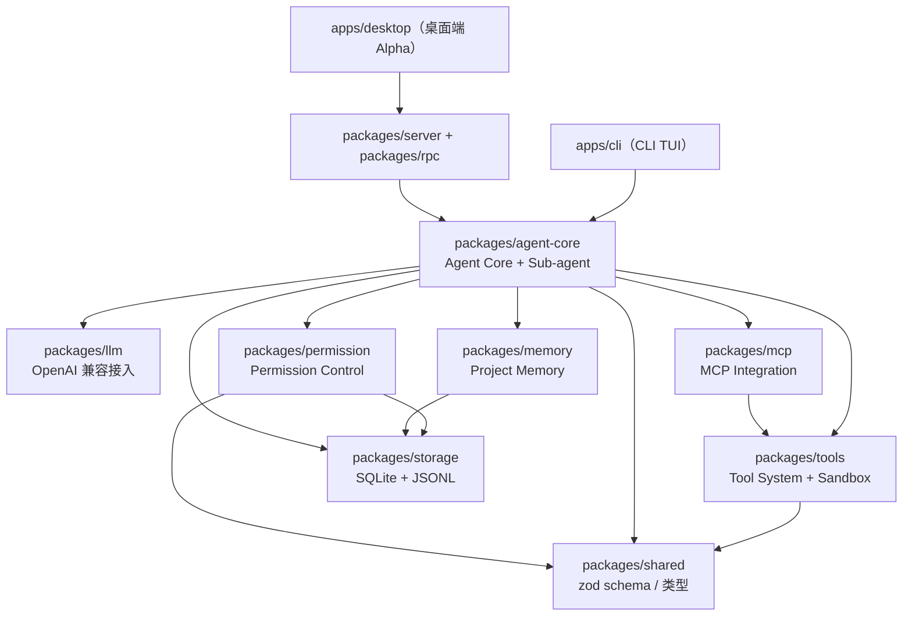

依赖规则：
- 上层（apps、server）依赖内核，内核不反向依赖上层；所有跨进程通信经 `packages/rpc`，内核对传输不可知。
- `packages/llm` 只做协议适配，不感知会话/工具语义；Agent Core 是唯一编排者。
- `packages/shared` 只放跨包 zod schema 与纯类型，禁止放入行为逻辑（避免 ZCode「shared 巨石化」教训）。

### 0.3 统一术语

| 术语 | 定义 |
| --- | --- |
| Turn | 一次完整处理单元：用户输入 → 模型响应（含多轮工具调用往返）→ 收尾落盘 |
| Phase | Turn 内部的阶段状态（见 §1.2.1 TurnPhase） |
| 单写者 | 任一时刻一个会话只有一个写者（正在执行的 turn），杜绝并发写会话状态 |
| CommandInbox | 同会话指令的串行接纳队列；运行中输入降级为 steering 注入 |
| Steering | turn 运行中将用户新输入注入当前 turn 的下一次模型请求，而非新开 turn |
| sideEffectScope | 工具副作用范围声明：`none / workspace / machine / network` |
| 三态 | 权限判定结果：`allow / ask / deny` |
| Compact | 上下文压缩：用摘要替换早期历史，保留系统提示与最近 N 条 |

---

## 1. Agent Core（Agent 内核）

### 1.1 职责边界

**做什么：**
- 驱动 Turn 循环：接纳输入 → 组装上下文 → 调用模型 → 流式接收 → 调度工具 → 聚合结果 → 收尾。
- 维护 TurnPhase 状态机，非法迁移立即抛错（fail-fast，防止带病继续）。
- 管理会话生命周期：创建、恢复（含崩溃恢复）、归档；会话事件以 JSONL 追加落盘（`packages/storage`）。
- 实现单写者串行接纳（CommandInbox）：同会话指令严格串行，运行中输入转为 steering 注入当前 turn。
- 将 `packages/llm` 的 SSE 流映射为统一会话事件流（`session.event.*`），供 CLI/桌面端订阅。
- 触发并托管 auto-compact 上下文压缩（异步、不阻塞当前 turn）。
- 通过同一内核工厂派生子会话，托管 Sub-agent Manager（见 §4）。

**不做什么：**
- 不实现任何具体工具——工具契约与执行属于 `packages/tools`，内核只经由 `ToolRegistry`/`ToolExecutor` 调用。
- 不做模型协议适配（OpenAI 兼容流式解析属于 `packages/llm`）；内核只消费统一的流事件。
- 不做权限规则求值（属于 `packages/permission`）；内核在每个工具调用前调用其 `evaluate()` 并按三态执行。
- 不做 UI 渲染与命令行解析（属于 `apps/cli`、`apps/desktop`）。
- 不维护持久化存储细节（属于 `packages/storage`），内核只依赖其端口接口。

**关于「代码生成能力」的定位（必须声明）：**
RainCode **不设独立的代码生成引擎**。代码生成 = 模型在 Turn 循环中经 `write` / `edit` 等工具直接读写工作区文件实现的。理由：
1. 生成即副作用——写文件必须走权限三态与沙箱路径约束，独立引擎会绕开安全链路；
2. 生成需要上下文——read/glob/grep 的结果在同一会话历史中，独立引擎会造成状态双写；
3. 对齐 Claude Code / Codex 的已被验证的形态：一个循环 + 一组工具，而非流水线式生成器。
因此 Agent Core 的核心产出就是「把 turn 循环做对」，生成质量通过工具集与提示词工程改进，不通过增加引擎改进。

### 1.2 状态与数据流

#### 1.2.1 TurnPhase 状态机

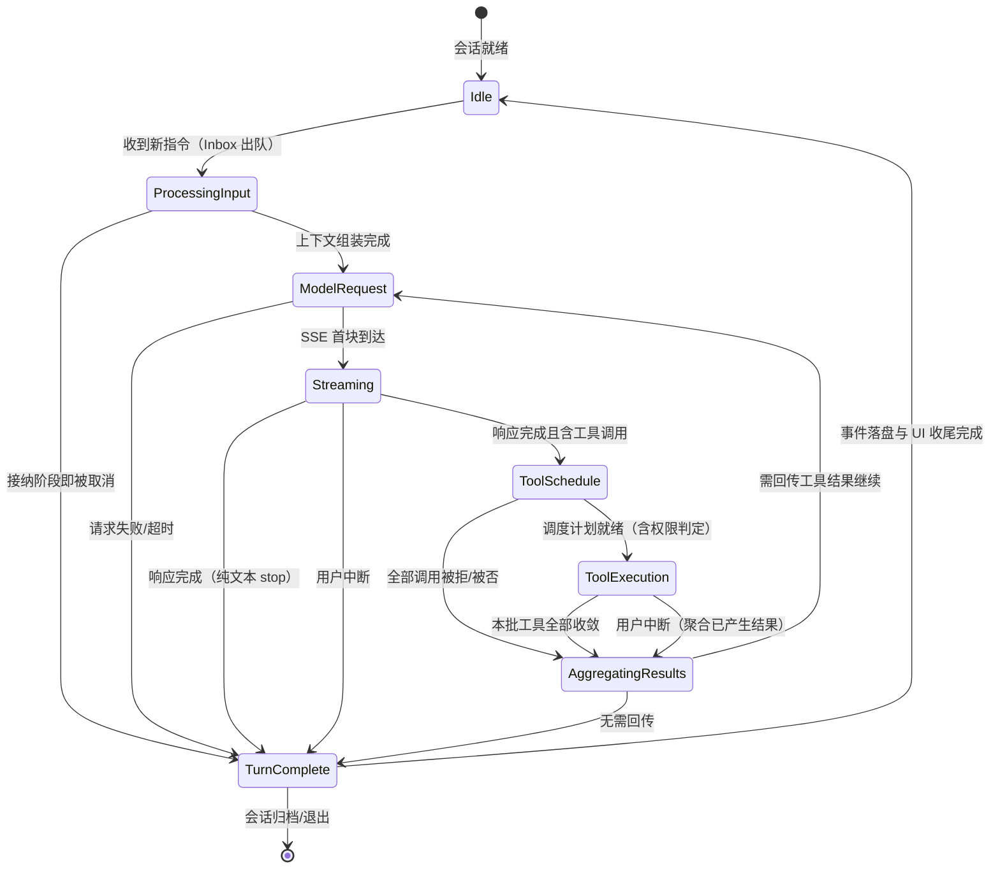

**合法迁移表**（未列出的组合一律视为非法，`transition()` 抛 `IllegalPhaseTransitionError`）：

| # | 当前状态 | 触发事件 | 次状态 | 说明 |
| --- | --- | --- | --- | --- |
| T1 | Idle | `command.submitted` | ProcessingInput | Inbox 出队，单写者开始 |
| T2 | ProcessingInput | `context.assembled` | ModelRequest | 系统提示 + 历史 + steering 合并完成 |
| T3 | ProcessingInput | `turn.cancelled` | TurnComplete | 指令在排队/组装期被取消 |
| T4 | ModelRequest | `stream.opened` | Streaming | SSE 首块到达 |
| T5 | ModelRequest | `request.failed` | TurnComplete | 网络失败/限流重试耗尽，turn 以错误收束 |
| T6 | Streaming | `message.completed(tool_calls)` | ToolSchedule | 模型发出工具调用 |
| T7 | Streaming | `message.completed(stop)` | TurnComplete | 纯文本回答，turn 结束 |
| T8 | Streaming | `turn.cancelled` | TurnComplete | 用户中断流式 |
| T9 | ToolSchedule | `schedule.ready` | ToolExecution | 权限判定通过，可执行 |
| T10 | ToolSchedule | `schedule.all_blocked` | AggregatingResults | 全部被拒，聚合拒绝原因回传模型 |
| T11 | ToolExecution | `batch.settled` | AggregatingResults | 本批工具调用全部收敛（含失败） |
| T12 | ToolExecution | `turn.cancelled` | AggregatingResults | 中断后仍需聚合已产生结果，保证历史完整 |
| T13 | AggregatingResults | `followup.required` | ModelRequest | 工具结果需回传模型继续推理 |
| T14 | AggregatingResults | `followup.not_required` | TurnComplete | 如 `ask_user_question` 挂起等答、终态提交等 |
| T15 | TurnComplete | `settle.done` | Idle | 持久化与 UI 收尾完成 |

补充约束：
- T13→ModelRequest 构成模型↔工具的多轮往返；每轮都递增 `turn.modelRound`，受 `maxRoundsPerTurn`（默认 32）保护，超限视为异常收敛到 T14 并附诊断。
- **Steering 是正交通道，不是迁移**：在 Streaming / ToolExecution / AggregatingResults 期间到达的用户输入不触发任何迁移，只写入 `turn.steeringBuffer`，在下一次 T2 组装时合并注入。这与单写者语义一致：turn 的「写权」自始至终属于同一个执行体。

#### 1.2.2 会话生命周期

会话状态：`Created → Active → Archived`；Active 期间支持崩溃恢复（重放 JSONL 事件重建内存态）。恢复性能基线 ≤ 1s：采用「末尾快照 + 增量重放」，即会话每 settle 一个 turn 追加一条 checkpoint 行，恢复时从最近 checkpoint 起重放。

| # | 当前状态 | 触发事件 | 次状态 | 说明 |
| --- | --- | --- | --- | --- |
| C1 | （未创建） | `session.create` | Created | 初始化会话目录与 JSONL 事件文件 |
| C2 | Created | `session.opened` | Active | 可接纳指令，注册进单写者域 |
| C3 | Active | `session.resume` | Active | 崩溃/重开后 checkpoint + 增量重放 |
| C4 | Active | `session.archive` | Archived | flush 未落盘事件 + 标记只读 |

#### 1.2.3 单写者串行接纳（CommandInbox）

指令三分类：

| 类别 | 例子 | 接纳策略 |
| --- | --- | --- |
| `turn.new` | 发送新任务 | 空闲则立即开 turn；运行中则排队（或按配置拒绝/替换） |
| `turn.steer` | 运行中补充说明 | 运行中注入 `steeringBuffer`；空闲则按 `turn.new` 处理 |
| `session.control` | 取消、压缩、模式切换、审批应答 | 控制类优先，穿透队列立即处理 |

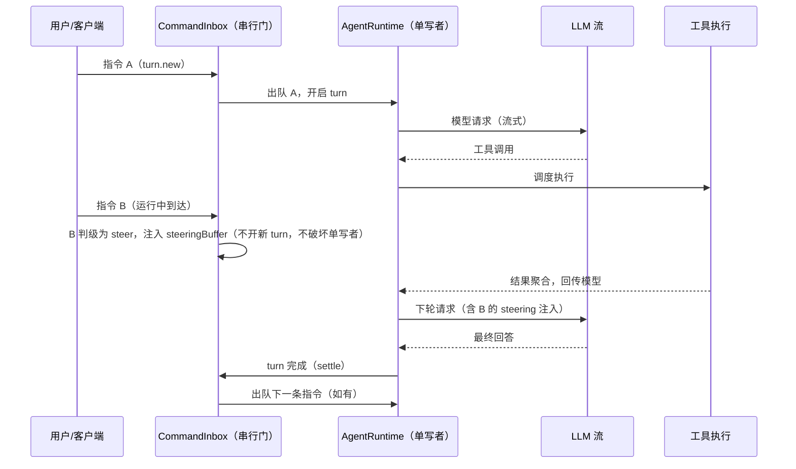

实现要点（继承 ZCode 双层门经验）：per-session 门保证同会话指令按接纳顺序串行；`pinLiveInput` 在接纳瞬间固定指令意图，排队/重连期间不被后续输入污染；门在异常路径上必须释放（finally 语义），防死锁。

#### 1.2.4 流式输出事件与 SSE 映射

| LLM SSE 事件（packages/llm 归一化后） | Agent Core 会话事件 | 消费方 |
| --- | --- | --- |
| `stream.opened` | `session.event.turn_started` | UI：进入流式态 |
| `delta.text` | `session.event.text_delta` | UI：增量渲染正文 |
| `delta.reasoning` | `session.event.reasoning_delta` | UI：思考过程折叠展示 |
| `delta.tool_call{name,args_partial}` | `session.event.tool_call_pending` | UI：工具卡片占位 |
| `message.completed(tool_calls)` | `session.event.tool_calls_requested` | 内核：进入 ToolSchedule |
| `message.completed(stop)` | `session.event.turn_completed` | UI：收尾 |
| `stream.error` | `session.event.turn_failed` | UI：错误呈现 |

映射为纯转换层：不缓冲全文、不在此层做业务判断；`packages/llm` 负责把不同 Provider 的 SSE 差异抹平成上表左侧的统一事件。

#### 1.2.5 auto-compact 上下文压缩

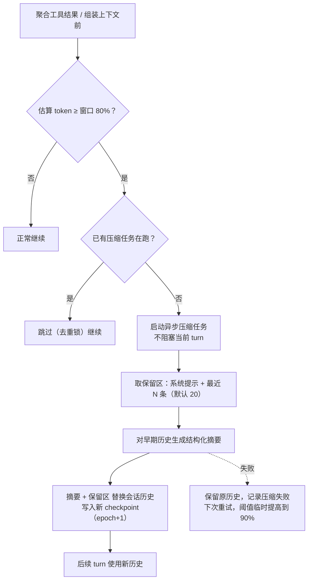

约束：压缩异步执行（性能基线「上下文压缩异步不阻塞」）；压缩读历史快照与写新历史之间以 `epoch` 单调递增防旧写覆盖新写（继承 ZCode「旧快照不得覆盖新状态」的单调合并教训）；压缩期间到达的 steering 与工具结果进入保留区，不丢失。

**microcompact 预剪枝（T5.4，参照 [docs/research/2026-10-04-m5-reference-repos.md] §1-3 两仓同题互证）**：full compact 触发前的独立 pass，与 full compact 同一触发点（组装上下文前 / T13 聚合后），**先 micro 后 full**：

| 常量 | 值 | 来源 |
| --- | --- | --- |
| 触发阈值（上下文占比） | 0.9 × full compact 触发线 | ZCode `DEFAULT_MICROCOMPACT_THRESHOLD_RATIO`（偏差申报：不做其绝对 2000-token buffer——小窗口钳 0，比例式尺度无关） |
| 可压缩工具白名单 | read / bash / grep / glob / web_fetch | ZCode Read/Bash/Grep/Glob/WebFetch 对名映射 |
| 保留最近候选 | 5 条（可配 0 = 候选全剪） | ZCode `KEEP_RECENT_TOOL_RESULTS` |
| 最小节省 tokens 门槛 | 256（整 pass all-or-nothing） | ZCode `MIN_TOKEN_SAVINGS` |
| 单条阈值 / head / tail | 8192 / 4096 / 1024 code points | dsh `DEFAULTS` |

机制约束：
- **单过确定性收敛**：超阈值 tool result 以 head + marker + tail 替换中段，按 Unicode code point 切分不劈代理对（字素簇仍可能切开，与 dsh 同口径申报）；配置校验 head+marker+tail ≤ 单条阈值 ⇒ 剪后恒 ≤ 阈值且严格小于原文，重入（含 marker）天然跳过（幂等）。
- **回指事件协议**：剪枝落 `compaction.pruned` 事件行（storage 级，同 compaction.applied 先例，不经 RPC 发布、协议零变更、不 bump epoch）；`replacements[].sourceMessageId` 回指原文 message 行（dsh `sourceEventSeqs` 语义的 RainCode 形态：会话内 message 行 seq 不入内存历史、resume 后不可得，id 为全局唯一稳定回指键），`prunedContent` 内联——resume/回放与内存一致；原文保留于 JSONL，`session_search` 可召回。
- **压缩锁括弧协议兼容**：预剪枝不取压缩去重锁、不 bump epoch、不产生 compact.started/completed——独立 pass 可插于 full compact 之前；剪枝只换内容不增删消息（index 稳定），full compact 的快照前缀与 `summarizedCount` 位置截断语义不受影响。
- **节省回落**：应用后节省 tokens 自 usage 估算回落（最近真实请求含未剪枝原文），预剪枝足够时 full compact 让位不再触发。

### 1.3 对外接口

```typescript
// packages/agent-core/src/turn/phase.ts
export type TurnPhase =
  | "Idle" | "ProcessingInput" | "ModelRequest" | "Streaming"
  | "ToolSchedule" | "ToolExecution" | "AggregatingResults" | "TurnComplete";

export class IllegalPhaseTransitionError extends Error {
  constructor(public readonly from: TurnPhase, public readonly to: TurnPhase, event: string);
}

// packages/agent-core/src/turn/controller.ts
export interface TurnController {
  readonly phase: TurnPhase;
  readonly turnId: string;
  submit(command: TurnCommand): Promise<TurnOutcome>;  // 经 Inbox 串行化
  cancel(reason: CancelReason): Promise<void>;         // 触发 T3/T8/T12
  onPhaseChange(listener: (e: PhaseChangeEvent) => void): Unsubscribe;
}

export type TurnCommand =
  | { kind: "turn.new"; sessionId: SessionId; input: UserInput; attachments?: Attachment[] }
  | { kind: "turn.steer"; sessionId: SessionId; input: UserInput }
  | { kind: "session.control"; sessionId: SessionId; action: ControlAction }; // cancel | compact | respond | setMode

export type TurnOutcome =
  | { status: "completed"; usage: TokenUsage; rounds: number }
  | { status: "cancelled"; at: TurnPhase }
  | { status: "failed"; error: TurnError };

// packages/agent-core/src/inbox/command-inbox.ts
export interface CommandInbox {
  /** 同会话指令串行接纳；返回排队位置与最终接纳结果。 */
  enqueue(cmd: TurnCommand): { position: number; admission: Promise<AdmissionResult> };
  /** 运行中输入：立即注入 steeringBuffer，返回 injected/queued。 */
  steer(cmd: Extract<TurnCommand, { kind: "turn.steer" }>): "injected" | "queued";
  pendingCount(sessionId: SessionId): number;
}

// packages/agent-core/src/runtime.ts —— 内核工厂（CLI / server / 子代理共用）
export interface AgentRuntimeFactory {
  create(config: RuntimeConfig): AgentRuntime;
}

export interface AgentRuntime {
  readonly sessionId: SessionId;
  readonly phase: TurnPhase;
  readonly inbox: CommandInbox;
  readonly turn: TurnController;
  readonly events: EventStream<SessionEvent>;       // 供 UI / 子代理镜像订阅
  compact(): Promise<CompactionReport>;             // 手动触发压缩
  archive(): Promise<void>;                         // 归档：flush + 标记 archived
}

export interface RuntimeConfig {
  workspaceRoot: string;
  providers: ProviderConfig[];                      // 见 packages/llm
  toolRegistry: ToolRegistry;                       // 见 packages/tools
  permission: PermissionService;                    // 见 packages/permission
  memory?: ProjectMemoryService;                    // 见 packages/memory
  subagent?: SubagentRuntimeOptions;                // 见 §4
  compaction?: CompactionOptions;                   // 阈值比例、保留条数、摘要模型
  maxRoundsPerTurn?: number;                        // 默认 32
}

// packages/agent-core/src/session/lifecycle.ts
export interface SessionLifecycle {
  create(init: SessionInit): Promise<SessionHandle>;     // Created → Active
  resume(sessionId: SessionId): Promise<SessionHandle>;  // checkpoint + 重放，≤1s
  archive(sessionId: SessionId): Promise<void>;          // Active → Archived
  list(filter?: SessionFilter): Promise<SessionSummary[]>;
}

// packages/agent-core/src/compact/service.ts
export interface CompactionService {
  /** 异步执行；inFlight 期间幂等跳过；完成后生成 epoch+1 checkpoint。 */
  maybeCompact(snapshot: ContextSnapshot): Promise<CompactionTicket | null>;
  onDone(listener: (report: CompactionReport) => void): Unsubscribe;
}

export interface CompactionOptions {
  thresholdRatio: number;      // 默认 0.80（窗口 80% 触发）
  keepRecentCount: number;     // 默认 20 条
  summaryModel?: string;       // 默认复用主模型
}
```

### 1.4 异常与边界场景

| 场景 | 处理策略 |
| --- | --- |
| 非法状态迁移（如 Idle→Streaming） | `transition()` 抛 `IllegalPhaseTransitionError`；事件落盘后进程内 fail-fast，不尝试自动纠偏 |
| Turn 运行中用户发送新任务 | Inbox 判级：默认入队为 `turn.new`（配置可改为「提示排队中」）；steering 文本走注入通道 |
| 模型请求超时 / 限流 | 指数退避重试（默认 3 次）；耗尽后 T5→TurnComplete 并附 `turn_failed` 事件，会话仍可继续 |
| 流式中途断连（SSE 断流） | 尝试同请求续流；不可续则本 round 记为不完整，聚合已有 delta，按 T5 收束 |
| 工具执行中会话被取消 | T12：中断信号广播到工具执行器，聚合已产生结果后收束，历史保持完整（不留悬挂 tool_call） |
| 崩溃后恢复 | 从最近 checkpoint 重放 JSONL；恢复中发现的悬挂 tool_call 以 `isError=true` 补齐结果 |
| 压缩任务与活跃 turn 竞争历史 | 压缩基于快照工作；提交时校验 epoch，旧 epoch 写入丢弃（单调合并） |
| 压缩摘要生成失败 | 保留原历史，阈值临时上调至 90%，下个触发点重试；连续 3 次失败仅告警不再重试 |
| steering 在 turn 收尾瞬间到达 | 收尾竞态窗口内（TurnComplete→Idle 之前）一律入队为 `turn.new`，不丢输入 |
| ask_user_question 等待用户应答 | T14 收束当前 turn（结果标记 `awaiting_user`）；应答经 `session.control/respond` 开新 turn 续答 |
| 同会话多客户端（CLI + 桌面）同时写 | 单写者语义在 server 层收敛为一个 runtime 实例；多端只订阅事件流（见 packages/server） |

---

## 2. Tool System（工具调用系统）

### 2.1 职责边界

**做什么：**
- 定义工具契约：名称、描述、zod 参数 schema、声明式副作用 metadata、`execute` 实现。
- 维护 `ToolRegistry`：内置工具 + MCP 工具（来自 `packages/mcp` 适配器）+ 未来插件工具的统一注册点。
- 提供 `ToolExecutor`：入参 zod 校验 → 权限判定委托 → 沙箱约束下执行 → 结果统一格式化与预算裁剪。
- 提供 P0 内置工具集（见清单表）。

**不做什么：**
- 不决定「是否允许执行」——三态判定在 `packages/permission`，本系统只消费其结果；
- 不驱动调用循环——「模型 → 工具 → 回传」的循环由 Agent Core 驱动，本系统是被调用的无状态服务（除显式的会话级状态如 todo 列表、read-file 快照）；
- 不做进程树/路径约束的具体实现——委托 §5 Execution Sandbox；
- 不做模型协议层面的工具 schema 编码（OpenAI `tools` 字段格式转换属于 `packages/llm`）。

### 2.2 状态与数据流

工具执行本身是有界的同步过程，不设长驻状态机；关键数据流如下（Agent Core 在 T9→T11 区间驱动）：

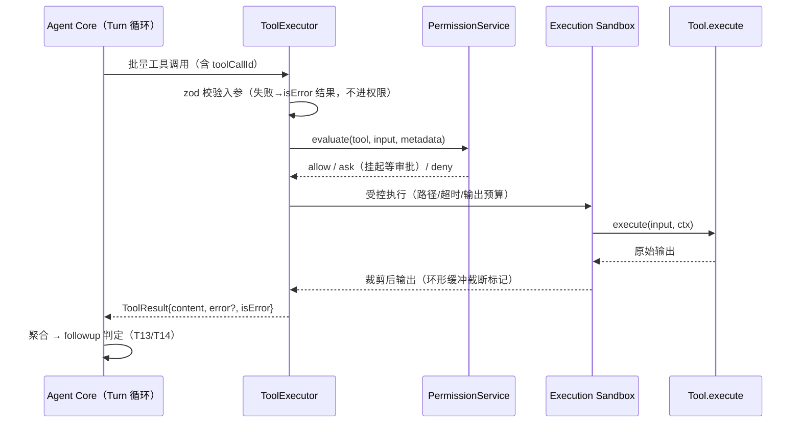

并行规则：同一批工具调用中，`metadata.readOnly === true` 的工具可并行执行；有副作用的工具串行执行（按模型给出顺序）。批内任一失败不影响其余调用的执行，全部收敛后统一聚合。

### 2.3 对外接口

```typescript
// packages/tools/src/registry/tool.ts
export interface ToolMetadata {
  readOnly: boolean;                       // 只读（可并行、通常免审批）
  destructive: boolean;                    // 破坏性（删除/覆盖/不可逆）
  sideEffectScope: "none" | "workspace" | "machine" | "network";
  riskLevel: "low" | "medium" | "high";
  needsApproval: boolean;                  // 元数据层是否建议 ask（非最终判定）
  timeoutMs?: number;                      // 缺省走沙箱默认
  maxOutputBytes?: number;                 // 输出预算，缺省 256KB
}

export interface Tool<TInput = unknown, TOutput = unknown> {
  name: ToolName;                          // 内置工具名（见清单）；MCP 工具见 §3.3
  description: string;                     // 模型可见描述
  parameters: z.ZodType<TInput>;           // 运行时校验 + 生成 provider schema
  metadata: ToolMetadata;
  execute(input: TInput, ctx: ToolExecutionContext): Promise<ToolOutput<TOutput>>;
}

export interface ToolOutput<T> {
  data: T;
  /** 模型可见文本；缺省由执行器按序列化规则生成 */
  content?: string;
  display?: ToolDisplayPayload;            // UI 渲染辅助（diff、表格等）
}

// packages/tools/src/executor/result.ts —— 统一结果格式
export interface ToolResult {
  toolCallId: string;
  toolName: string;
  content: string;                         // 模型可见内容（已裁剪）
  error?: { code: ToolErrorCode; message: string; detail?: string };
  isError: boolean;
  truncated: boolean;                      // 输出被预算裁剪时为 true
  durationMs: number;
}

// packages/tools/src/registry/registry.ts
export interface ToolRegistry {
  register(tool: Tool<any, any>, source: ToolSource): void; // source: builtin | mcp | plugin
  get(name: string): Tool<any, any> | undefined;
  list(filter?: { source?: ToolSource }): ToolDescriptor[]; // 含 zod→JSONSchema 投影
}

// packages/tools/src/executor/executor.ts
export interface ToolExecutor {
  /** Agent Core 在 T9→T11 区间调用；权限 ask 时挂起直至审批应答或超时。 */
  runBatch(calls: ToolCall[], ctx: ToolBatchContext): Promise<ToolResult[]>;
}
```

**内置工具清单**：

| 工具名 | 用途 | 关键参数 | 副作用范围 | P 级 |
| --- | --- | --- | --- | --- |
| `bash` | 执行 shell 命令（经沙箱） | `command`, `timeoutMs`, `runInBackground` | machine | P0 |
| `read` | 读文件（文本/图片/PDF 抽取文本） | `path`, `offset`, `limit` | none | P0 |
| `write` | 写文件（整文件覆盖，先读后写约束） | `path`, `content` | workspace | P0 |
| `edit` | 精确字符串替换编辑（唯一匹配校验） | `path`, `oldString`, `newString`, `replaceAll` | workspace | P0 |
| `glob` | 文件名模式匹配 | `pattern`, `path` | none | P0 |
| `grep` | 内容正则搜索（ripgrep 语义） | `pattern`, `path`, `glob`, `outputMode` | none | P0 |
| `todo_write` | 写任务清单（覆盖式更新） | `todos[]` | workspace | P0 |
| `todo_read` | 读当前任务清单 | 无 | none | P0 |
| `web_fetch` | 抓取 URL 转 Markdown（域名白名单校验） | `url`, `maxBytes` | network | P1 |
| `ask_user_question` | 向用户提出结构化问题并挂起等答 | `questions[]` | none | P1 |
| `session_search` | 跨会话检索历史（part 级 FTS：文本+工具名；T5.3） | `query`, `limit` | none | P1 |
| `mcp_tool_search` | MCP 工具目录检索（BM25 K1=1.2；命中自下一轮起可调用；T5.6） | `query`, `limit` | none | P1 |

> `todo` 状态存于会话内存并随事件落盘；`write/edit` 依赖 `read` 建立的文件快照（read-file state）做「先读后写」校验，防止盲写覆盖。

**插件 marketplace 分发（T6.1 / 06 §2.10 v1.14）**：插件工具的第三条进入通道（内置 / MCP / 插件之外再加分发层）——marketplace 域在 plugins 域之上提供「来源注册（marketplace.json + 注册表，path 源先行）→ 校验安装（内容寻址 seed + symlink/junction 逃逸防护，安装副本落 `<dataRoot>/marketplaces/cache/<marketplaceId>/<plugin>/<version>/`）→ 插件域激活（attachExternal，与目录发布记录互斥）→ 可卸载」；安装副本 `<dir>/skills/` 同时作为技能第三源（优先级 workspace > global > plugin）。协议面 4 方法 `marketplace.add/list/install/uninstall` 与错误码段 15 详见 06 §2.10 / §4.3；实现单点 `packages/server/src/marketplace-runtime.ts`（fs 原语 `marketplace-fs.ts`）。

### 2.4 异常与边界场景

| 场景 | 处理策略 |
| --- | --- |
| 入参不满足 zod schema | 不进入权限与执行，直接返回 `isError=true`（`invalid_input`），附 schema 摘要帮助模型自纠 |
| 工具名不存在 / MCP server 离线 | 返回 `isError=true`（`unknown_tool` / `mcp_unavailable`），模型可见，不影响其他调用 |
| 权限判定为 ask 而客户端不可达（如 headless） | 按 `askFallback` 配置：默认 deny 并在结果中说明，可配置为 auto-allow（仅受信环境） |
| 工具执行超时 | 沙箱按 `timeoutMs` 终止进程树，返回 `timeout` 错误并附已捕获的部分输出 |
| 输出超出 `maxOutputBytes` | 环形缓冲保留头尾（头 70% / 尾 30%），标记 `truncated=true`，提示模型缩小读取范围 |
| 同批只读 + 写工具混合 | 拆分为串行写段与并行只读段，写段按序执行，总体仍在一个 batch 内收敛 |
| `edit` 的 oldString 多处匹配 | 返回 `ambiguous_match` 错误，不执行；要求模型扩大上下文片段 |
| web_fetch 命中内网地址/黑名单域名 | 直接拒绝（SSRF 防护），错误注明原因 |

---

## 3. MCP Integration（MCP 调用）

### 3.1 职责边界

**做什么：**
- 管理 MCP server 连接生命周期：connect / listTools / callTool / 断线重连 / 失败隔离。
- 支持三种 transport：`stdio`（子进程）、`http`（Streamable HTTP）、`sse`（兼容旧版）。
- 将远端工具适配为 `Tool` 对象（zod schema 由 MCP `inputSchema` 转换），统一注册进 `ToolRegistry`，命名加命名空间前缀。
- 提供配置加载（`mcp.json`）与连接状态事件。

**不做什么：**
- 不实现 MCP 协议细节之外的业务（协议交互复用官方 SDK）；
- 不做权限判定（MCP 工具与内置工具走同一 `packages/permission` 链路，其 metadata 由适配器按「外部工具默认从严」规则合成）；
- 不缓存工具结果（MCP 工具每次调用即发）；P0 不含本模块，P1 落地 stdio + HTTP。

### 3.2 状态与数据流

每个 serverKey 一条连接，状态机独立：

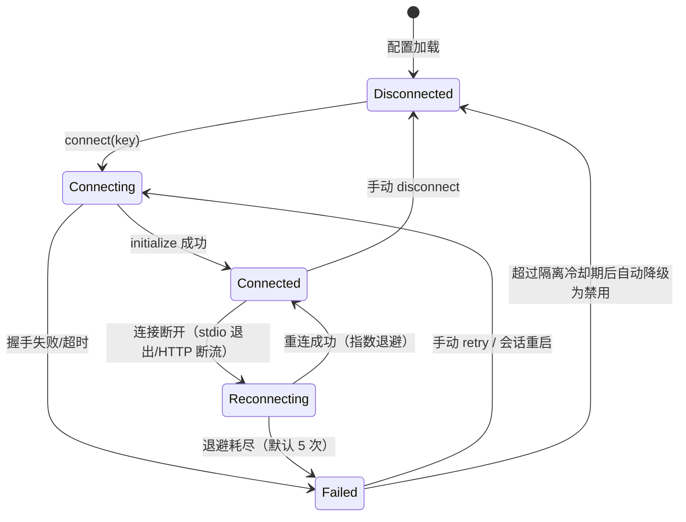

**连接状态迁移表**：

| # | 当前状态 | 触发事件 | 次状态 | 说明 |
| --- | --- | --- | --- | --- |
| M1 | Disconnected | `connect` | Connecting | 启动子进程 / 建立连接 |
| M2 | Connecting | `initialized` | Connected | 拉取工具清单并注册 |
| M3 | Connecting | `handshake_failed` | Failed | 附错误详情，不阻塞其他 server |
| M4 | Connected | `connection_lost` | Reconnecting | 退避 1s/2s/4s/8s/16s |
| M5 | Reconnecting | `reconnected` | Connected | 重新 listTools，比对增量 |
| M6 | Reconnecting | `retries_exhausted` | Failed | 工具在注册表中标记 unavailable |
| M7 | Failed | `retry` | Connecting | 用户显式重试或会话重启 |
| M8 | Connected/Failed | `disconnect` | Disconnected | 清理子进程树（经 §5 进程管理） |

失败隔离原则：任一 server 的故障（崩溃、超时、协议错误）只影响其命名空间下的工具（标记 unavailable），绝不影响其他 server 与内置工具；`callTool` 超时默认 60s，超时不杀连接，仅本调用报错。

### 3.3 对外接口

```typescript
// packages/mcp/src/config.ts
export type McpTransport = "stdio" | "http" | "sse";

export interface McpServerConfig {
  serverKey: string;                       // 命名空间键，[a-z0-9_-]
  transport: McpTransport;
  command?: string;                        // stdio 必填
  args?: string[];                         // stdio
  env?: Record<string, string>;            // stdio 环境变量注入（经脱敏过滤）
  cwd?: string;                            // stdio 子进程工作目录
  url?: string;                            // http/sse 必填
  headers?: Record<string, string>;        // http/sse（如鉴权头）
  timeoutMs?: number;                      // callTool 超时，默认 60000
  enabled?: boolean;                       // 默认 true
}

// packages/mcp/src/manager.ts
export interface McpManager {
  connect(key: string): Promise<void>;
  disconnect(key: string): Promise<void>;
  listTools(key: string): Promise<McpToolDescriptor[]>;
  callTool(key: string, toolName: string, args: unknown): Promise<McpCallResult>;
  status(): McpServerStatus[];             // 各 server 连接状态与工具数
  onStatusChange(listener: (s: McpServerStatus) => void): Unsubscribe;
}

// 工具命名空间（与 ZCode 同构，模型可见名）
// mcp__<serverKey>__<toolName>
export function toMcpToolName(serverKey: string, toolName: string): string;
// 非法字符统一替换为 "_"，空段回退 "unknown"，保证 provider schema 合法
```

适配规则：MCP `inputSchema`（JSON Schema）转换为等价 zod schema（不可表达处降级为 `z.unknown()` 并保留原始 schema 校验）；`ToolSource` 标记为 `mcp`；权限 metadata 合成策略：`readOnly=false、destructive=false、sideEffectScope="machine"、riskLevel="medium"、needsApproval=true`——外部工具默认从严，允许用户在权限规则中为可信 server 显式放宽。

**MCP 工具目录化（T5.6，MiMo mcp-tool-search 参照）**：目录模式（mcp 域装配且未显式 `toolSearch:false`）下，MCP 工具完整参数 schema 不再全量进模型载荷——载荷 = 非 MCP 工具 + `mcp_tool_search`（description 承载预算化目录摘要）+ 已激活 MCP 工具。机制四件套：

- **目录与预算降级**：目录快照 = 生效工具（registry source="mcp"，字典序）的 name/description；渲染预算 = 10% 模型窗口封顶 20000 tokens（窗口未知按 20000，估算 tokens=ceil(chars/3)），超预算降级为仅名称列表，仍超则确定性字典序前缀 + 省略计数；参数 schema 与参数描述绝不进目录（仅作检索语料）。目录 digest（sha256 12 位）变化即「重发布」（热变更下一 turn 生效，T4.4 同款诊断）。
- **BM25 检索**：`mcp_tool_search(query, limit≤32)` 经 server 侧内存索引（K1=1.2，语料 = 名 + 描述 + 递归参数名/描述；ASCII 按非字母数字切分、CJK 二元 bigram），相对分数地板 top×0.15（T5.3 检索同纪律）。
- **请求域激活**：搜索命中自**下一轮**起可按名调用；新 turn 重置激活集；单 turn 累计激活有界（32）；激活登记以同索引对搜索调用确定性重导出（不信任模型可见输出），digest 变化整体失效。
- **执行安全**：全部 MCP 执行器保持注册（权限/审批/hooks 不变）；目录模式调度期守卫——未激活 `mcp__*` 调用先于 zod/hook/permission 拒绝（`TOOL_MCP_NOT_LOADED` + 指引先检索），覆盖幻觉调用与同轮并行 search+MCP 调用。偏差申报：MiMo 的上下文压力降级（用量 ≥70% 转名称列表）不做，压力面归 compact 线治理；子代理循环不接目录端口（维持全量 schema 投影）。

### 3.4 异常与边界场景

| 场景 | 处理策略 |
| --- | --- |
| 子进程启动即崩溃（如命令不存在） | M3→Failed，状态事件给出 stderr 摘要；其余 server 不受影响 |
| 工具调用超时 | 单调用报错；连接保持（HTTP）/ 进程保留（stdio）；连续 N 次超时触发重连 |
| stdio 子进程 stdout 混入非协议输出 | 严格帧解析，脏数据丢弃并计数告警 |
| listTools 返回与上次不同（工具增删） | 增量更新注册表；被删工具标记 unavailable，会话内引用它的旧消息保持原样 |
| serverKey 冲突（同 key 多配置） | 配置加载期校验拒绝，报告冲突文件位置 |
| env 注入含密钥（apiKey 等） | 注入前过 `SECRET_ENV_FILTER`（继承自 shell 继承环境的反向过滤），审计日志脱敏 |
| HTTP server 返回 401/403 | 标记 Failed 并提示配置鉴权；不自动重试认证类错误 |
| sse 兼容模式断流 | 与 http 相同进入 Reconnecting；SSE 为 P1 兼容路径，不做功能扩展 |
| MCP 工具与内置工具重名 | 命名空间保证不冲突；若用户配置 serverKey 为内置名（如 `bash`），加载期拒绝 |
| 目录模式下调用未加载的 MCP 工具（幻觉/同轮并行/目录变更后旧引用） | 调度期拒绝（`TOOL_MCP_NOT_LOADED`，先于 zod/hook/permission），message 指引先 `mcp_tool_search` 检索；命中自下一轮生效（T5.6） |
| 目录热变更（server 连接/断开，工具集变化） | 目录 digest 变化 → 重发布诊断 + 已激活集整体失效；新目录下一 turn 生效（T5.6） |

---

## 4. Sub-agent Manager（子代理管理）

### 4.1 职责边界

**做什么：**
- 解析子代理 profile（markdown + frontmatter），校验字段与白名单合法性。
- 通过**同一个 AgentRuntime 工厂**创建子会话：独立上下文、受控工具集、独立 turn 循环；与主会话唯一的耦合点是「结果回传 + 事件镜像」。
- 将子代理的工具事件映射为主会话的通知事件（镜像回传），主会话 UI 无需感知两套协议。
- 管理并发：全局并发上限默认 4；超限排队。
- 子代理完成后生成结构化结果，以「完成通知」注入主循环（作为一条系统级消息参与下轮模型请求）。

**不做什么：**
- 不做第二套执行引擎——子代理与主代理共用 turn 状态机、工具系统、权限链路；
- 不允许子代理再派生子代理（层级固定为 2，防递归失控）；
- 不共享主会话历史（上下文隔离是子代理的价值所在，也是 token 防护墙）。

### 4.2 状态与数据流

子代理运行状态机（终态后句柄保留结果直至主会话消费）：

**子代理运行状态迁移表**：

| # | 当前状态 | 触发事件 | 次状态 | 说明 |
| --- | --- | --- | --- | --- |
| S1 | Pending | `slot_available`（并发槽位空闲） | Running | 超上限时停留 Pending 排队 |
| S2 | Running | `sub_turn.completed` | Completed | 子 turn 正常收束 |
| S3 | Running | `sub_turn.failed` | Failed | 模型请求耗尽 / 内部错误 |
| S4 | Running | `max_turns_exhausted` | Stopped | 超轮次截断，已产出内容保留 |
| S5 | Running | `stop` / 主会话取消 | Stopped | 级联取消（进程树终止） |
| S6 | Pending | `stop` | Stopped | 排队中即被取消 |

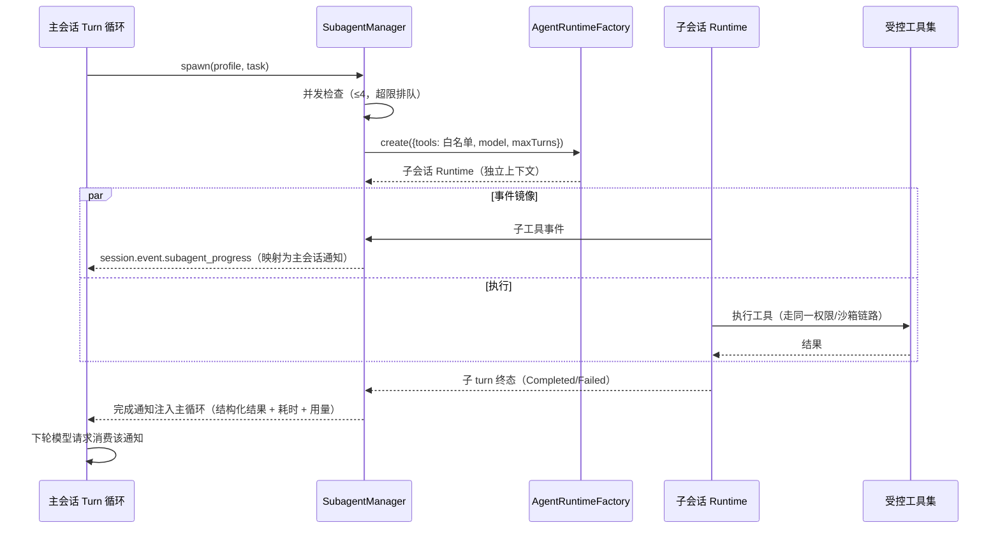

镜像事件映射表：

| 子会话事件 | 主会话通知事件 |
| --- | --- |
| `turn_started` | `subagent_progress{stage:"started"}` |
| `tool_calls_requested` | `subagent_progress{stage:"tool", toolName, summary}` |
| `turn_completed` | `subagent_progress{stage:"done"}` |
| `turn_failed` | `subagent_progress{stage:"failed", error}` |

### 4.3 对外接口

```typescript
// packages/agent-core/src/subagent/profile.ts —— profile 文件规范
// 位置：<workspace>/.raincode/agents/<name>.md 或全局 ~/.raincode/agents/<name>.md
// 格式：markdown + YAML frontmatter

export interface SubagentProfile {
  /** frontmatter 字段 */
  name: string;                 // 唯一标识，[a-z0-9-]
  description: string;          // 模型可见：何时派发给该子代理
  tools?: string[];             // 工具白名单；缺省继承主会话全集
  model?: string;               // 覆盖主会话模型；缺省同主模型
  maxTurns?: number;            // 默认 20，硬上限 100
  /** markdown 正文 = 子代理系统提示 */
}

// packages/agent-core/src/subagent/manager.ts
export interface SubagentManager {
  spawn(profile: SubagentProfile | string, task: string): Promise<SubagentHandle>; // string=按 name 解析
  get(id: SubagentId): SubagentHandle | undefined;
  list(): SubagentHandle[];
  stop(id: SubagentId, opts?: { reason?: string }): Promise<void>;
  setConcurrencyLimit(n: number): void;    // 默认 4
  onEvent(listener: (e: SubagentEvent) => void): Unsubscribe;
}

export interface SubagentHandle {
  readonly id: SubagentId;
  readonly profile: SubagentProfile;
  readonly status: "Pending" | "Running" | "Completed" | "Failed" | "Stopped";
  result(): Promise<SubagentResult>;       // 终态后 resolve
}

export interface SubagentResult {
  status: "Completed" | "Failed" | "Stopped";
  summary: string;                         // 子代理最终回答（结构化通知的正文）
  usage: TokenUsage;
  turnsUsed: number;
}
```

派发入口：主会话工具集中注册 `agent`（P1）工具，模型通过它传 `profile` + `task` 发起派发；`SubagentManager` 由 Agent Core 在创建 runtime 时按配置装配，主会话与子会话共享 `ToolRegistry` 但以白名单过滤投影。

### 4.4 异常与边界场景

| 场景 | 处理策略 |
| --- | --- |
| 并发超过上限（默认 4） | 新 spawn 排队（Pending）；主会话事件中提示排队位置 |
| 子代理超过 maxTurns | 强制收束为 Stopped，结果注明「超轮次截断」，已产出内容保留 |
| 子代理请求派生子代理 | 子会话工具投影中不包含 `agent` 工具，天然不可达 |
| profile 文件缺失/字段非法 | spawn 前校验失败即报错回模型（`invalid_profile`），不创建会话 |
| 白名单包含 MCP 不可用工具 | 过滤掉并在派发通知中说明；全空白名单视为配置错误拒绝派发 |
| 主会话被取消 | 级联 stop 所有 Running 子代理（经 §5 进程树终止），结果标记 Stopped |
| 子代理内部模型请求失败 | 子会话按 T5 收束为 Failed；主会话收到失败通知后可自行决定重试 |
| 镜像事件洪泛（子代理高频工具调用） | 同一子代理的 progress 事件按 500ms 窗口合并去重，终态事件不合并 |
| 子会话写权限外溢 | 子会话与主会话使用同一 workspaceRoot 与权限规则，不因是子代理而放宽 |
| 完成通知注入时主 turn 已收束 | 通知落盘为会话消息，下个 turn 组装上下文时正常载入 |

---

## 5. Execution Sandbox（沙箱执行环境）

### 5.1 职责边界

**做什么（P0 = 本地受控执行）：**
- 为 `bash` 等进程型工具提供受控执行：workspace cwd 限定、越界路径检测、超时终止、输出环形缓冲、环境变量注入与过滤。
- 管理进程树：以 root identity（pid + 启动时间戳）识别归属，终止时校验所有权，防 PID 复用误杀（继承 ZCode 进程树经验）。
- 后台任务 registry：`start / kill / list`，任务产出落盘可被后续读取。
- 暴露 `Executor` 接口抽象，为 P2 容器化（Docker / WSL）预留扩展点。

**不做什么：**
- P0 不做操作系统级硬隔离（无容器/Job Object 深度管控）——本地模式的「沙箱」是**约束与审计**（路径、超时、预算、审批前置），不是安全边界；真正的强隔离是 P2 容器执行器的职责，文档与 UI 需明示这一边界；
- 不做命令语义理解（`rm -rf` 危险性判断属于权限模块的规则求值）；
- 不实现网络隔离（P2 容器执行器可带 `--network` 策略）。

### 5.2 状态与数据流

前台执行是无状态请求-响应；后台任务有状态机：

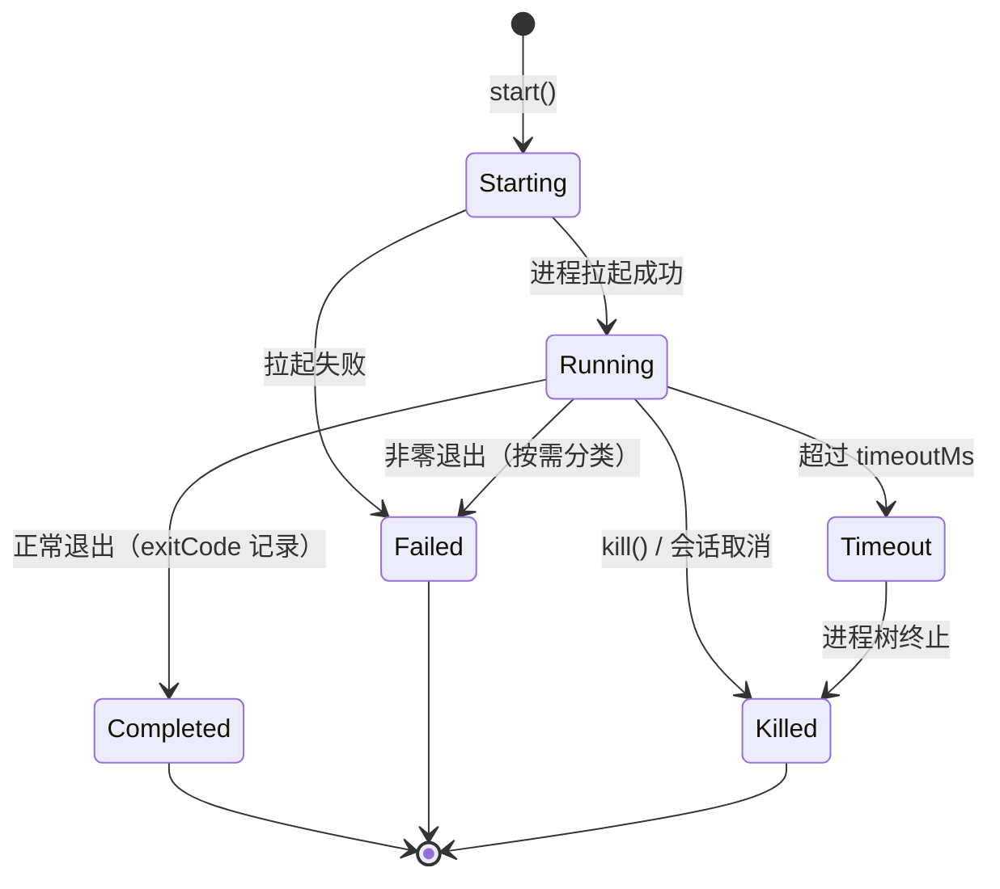

**后台任务迁移表**：

| # | 当前状态 | 触发事件 | 次状态 | 说明 |
| --- | --- | --- | --- | --- |
| B1 | Starting | `spawn_ok` | Running | 记录 root identity |
| B2 | Starting | `spawn_error` | Failed | 立即通知发起方 |
| B3 | Running | `exit(code=0)` | Completed | 产出保留至 registry 清理 |
| B4 | Running | `exit(code≠0)` | Failed | 附 stderr 尾部片段 |
| B5 | Running | `timeout` | Killed | 先优雅终止再强杀整棵树 |
| B6 | Running | `kill` | Killed | 所有权校验通过后终止 |

本地执行数据流：

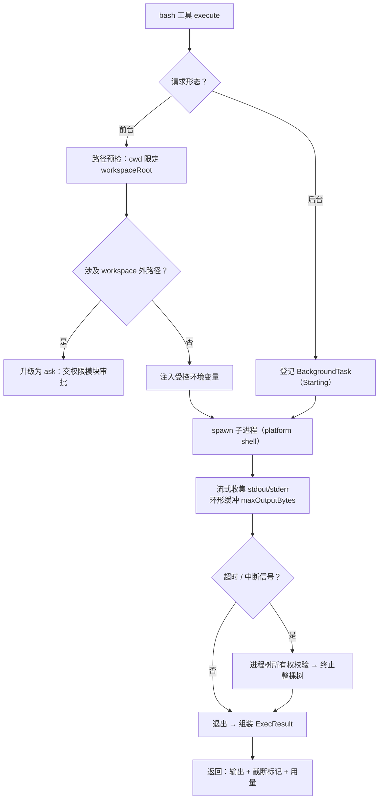

### 5.3 对外接口

```typescript
// packages/tools/src/sandbox/executor.ts —— P2 容器扩展点（本地实现为默认绑定）
export interface Executor {
  readonly kind: "local" | "docker" | "wsl" | "ssh";
  /** 边界强度自报（T5.2）：绝对边界方为 full，约束/环境隔离一律 partial。 */
  readonly enforcement: "full" | "partial";
  run(req: ExecRequest): Promise<ExecResult>;          // 前台
  start(req: ExecRequest): Promise<BackgroundTaskHandle>; // 后台
  kill(taskId: string): Promise<KillOutcome>;
  list(): BackgroundTaskInfo[];
}

export interface ExecRequest {
  command: string;                          // 平台 shell 命令串
  cwd: string;                              // 必须位于 workspaceRoot 内
  env?: Record<string, string>;             // 注入项（白名单合并 + 秘密过滤）
  timeoutMs?: number;                       // 默认 120000，上限 600000
  maxOutputBytes?: number;                  // 环形缓冲上限，默认 256KB
  runInBackground?: boolean;
}

export interface ExecResult {
  exitCode: number | null;                  // null = 被信号终止
  stdout: string;
  stderr: string;
  timedOut: boolean;
  truncated: boolean;
  durationMs: number;
  outOfScopePaths?: string[];               // 越界访问检测记录（审计用）
}

// packages/tools/src/sandbox/background.ts
export interface BackgroundTaskRegistry {
  start(req: ExecRequest, meta: TaskMeta): Promise<BackgroundTaskHandle>;
  kill(taskId: string): Promise<KillOutcome>;     // 所有权校验失败则拒绝
  list(filter?: { sessionId?: SessionId }): BackgroundTaskInfo[];
  readOutput(taskId: string, opts?: { tail?: number }): Promise<string>;
}

export interface KillOutcome {
  taskId: string;
  ok: boolean;
  reason?: "not_found" | "not_running" | "ownership_rejected" | "terminated";
}

// 进程树安全终止（平台相关，Windows 用快照 + startTime 校验）
export interface ProcessTreeTerminator {
  terminate(root: RootIdentity): Promise<{ killed: number; verified: boolean }>;
}
```

环境变量策略：默认继承**最小集**（PATH、SystemRoot、TEMP、HOME 等平台必需项）+ 工具显式注入项；`SECRET_ENV_FILTER` 过滤明显的凭据类变量不进入审计日志。Windows 实现要点：经 `cmd.exe /c` 或用户配置 shell 执行；越界检测对 argv 与脚本中的绝对路径做规范化比对（大小写不敏感、短路径名展开）。

**enforcement 自报与模型可见性（T5.2）**：各执行域对「已放行操作」的边界强度自报（shared `SandboxEnforcement = "full" | "partial"`，dsh 纪律「绝对边界不得当作 full」）——`local=partial`（约束非隔离，同构 dsh Windows ACL 档先例）、`docker=full`（workspace 独挂 + 缺省断网的绝对 fs 边界；bridge 属显式网络面放宽，fs 边界不变）、`wsl=partial`（环境隔离非安全边界：发行版 fs 完整可见、/mnt/* 主机盘可达、网络开放；对 07 §11.2 初稿 wsl=full 的偏差申报）、`ssh` 按远端探针注入（探针不可得报 partial，v1 无远端沙箱机制）。携带面：bash 结果 `data.sandbox/enforcement` **每次调用持续携带**（非一次性告警，后台路径同）；非 local 域内容首行 `sandbox: <kind> (enforcement: <mode>)` 模型可见标注。约束面拒绝（path-guard 产生的 `TOOL_PATH_ESCAPED`）由 ToolExecutor 中央追加模型可见标记 `[sandbox: path access denied under partial mode]` + 同轮重试提示——恒 partial（拒绝发生在投递前的应用层，与执行域是否 docker 无关）。

### 5.4 异常与边界场景

| 场景 | 处理策略 |
| --- | --- |
| cwd 越出 workspaceRoot | 拒绝执行（`cwd_out_of_scope`）；沙箱不做静默改写 |
| 命令读写 workspace 外路径 | P0 标记为需审批（权限层 ask）；审批通过后放行并记录审计 |
| 进程超时无响应 | 先发终止信号，宽限期 2s 后强杀整棵进程树；所有权校验防 PID 复用误杀 |
| 子进程再拉起孙进程后 root 已退出 | 树快照按启动时间校验成员归属，仅终止仍属于本次执行的成员 |
| 输出洪泛（如 `yes` 死循环） | 环形缓冲封顶，磁盘不落地；超预算且无退出迹象按超时处理 |
| 后台任务在会话归档后仍在跑 | 归档前逐个提示；用户确认后 kill，或选择 detach（记录 ownership 移交） |
| kill 一个已自然结束的任务 | 返回 `not_running`，幂等不报错 |
| 环境变量注入与系统冲突 | 注入项覆盖同名最小集变量，覆盖行为记入审计 |
| 权限审批通过后命令内容已变（竞态） | 沙箱以审批时快照的归一化命令执行；不一致即拒绝（approve-what-runs 原则） |
| Docker/WSL 执行器不可用（P2） | `Executor` 工厂回退 local 并告警；kind 标记保证 UI 展示真实执行环境 |

---

## 6. Permission Control（命令权限控制）

### 6.1 职责边界

**做什么：**
- 对每次工具调用做三态判定（`allow / ask / deny`），输出结构化决策与理由（审计用）。
- 维护五级判定链：**工具 metadata → 协作模式 → 会话规则 → 项目规则 → 全局规则**，首个命中生效。
- bash 命令级规则求值：argv 解析、只读命令白名单、通配规则匹配。
- ask 态审批闭环：生成审批单 → UI 弹窗 → 用户 respond → 继续/中断 turn。
- 规则持久化（scope: session / project / global，SQLite `permission_rules` 表）与决策审计（`permission_decisions` 表）。

**不做什么：**
- 不执行任何工具——只做判定与审批流转；
- 不维护工具元数据（由 `packages/tools` 声明，本模块只读取）；
- 不做沙箱层路径/进程约束（§5 职责）；两者是「判定（本模块）→ 约束（沙箱）」的先后关系。

### 6.2 状态与数据流

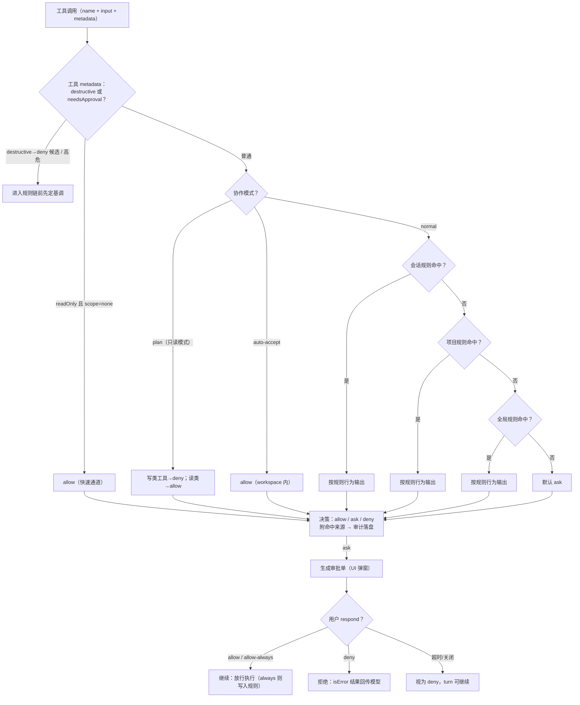

判定链优先级细则（首个命中生效）：

| 层级 | 载体 | 生命周期 | 说明 |
| --- | --- | --- | --- |
| 1. 工具 metadata | `ToolMetadata`（代码声明） | 构建期 | destructive 直接抬升为高危；readOnly 走快速通道 |
| 2. 协作模式 | 会话模式（normal / plan / auto-accept） | 会话期 | plan 模式下写类一律 deny |
| 3. 会话规则 | 内存 | 会话期 | 「allow-always 本次会话」落点 |
| 4. 项目规则 | SQLite `permission_rules`（scope=project） | 持久 | 跟随 workspace |
| 5. 全局规则 | SQLite `permission_rules`（scope=global） | 持久 | 用户全局偏好 |
| 兜底 | — | — | 默认 ask（fail-safe） |

bash 命令级求值（继承 ZCode 规则求值器思路）：
1. **argv 解析**：命令串 → 结构化调用树（识别 `&&`/`||`/`;`/管道分段、wrapper 命令 `sudo/env/nohup/time`、脚本执行器 `npm run/pnpm run` 等），每段独立参与规则匹配；
2. **只读白名单**：内置只读命令注册表（`git status/log/diff`、`ls`、`cat` 等）命中且全段只读 → 可判 allow（低风险）；
3. **通配规则**：规则形如 `bash(git *)`、`bash(npm run test:*)`，按 argv 前缀树匹配；含高危根命令（`rm`、`sh`、`powershell`、`dd`、`mkfs`…）的命令**不允许被通配规则 allow**，只能逐次 ask；
4. 分段中任一段为 ask/deny → 整条命令按最严段判定。

审批闭环时序：

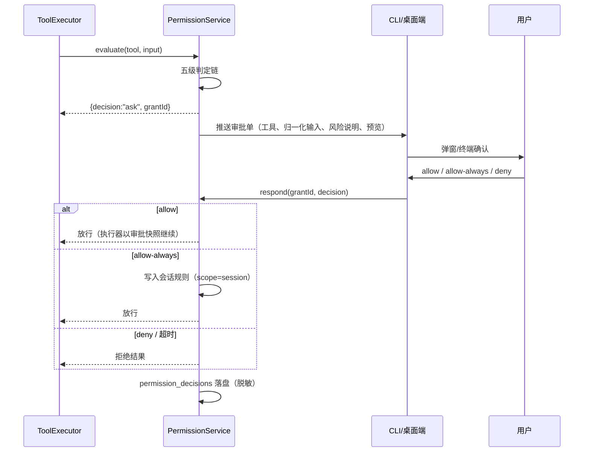

### 6.3 对外接口

```typescript
// packages/permission/src/types.ts
export type PermissionDecision = "allow" | "ask" | "deny";
export type RuleScope = "session" | "project" | "global";

export interface PermissionRule {
  id: string;
  scope: RuleScope;
  tool: string;                    // 工具名；bash 规则为 "bash"
  pattern?: string;                // 通配模式，如 "git *"；缺省匹配该工具全部调用
  behavior: Exclude<PermissionDecision, "ask"> | "ask"; // allow | deny | ask
  createdAt: number;
  source: "user" | "allow-always" | "import";
}

export interface ToolPermissionRequest {
  toolName: string;
  input: unknown;                  // 归一化后的执行输入（与最终执行同字节）
  metadata: ToolMetadata;
  mode: "normal" | "plan" | "auto-accept";
  sessionId: SessionId;
  workspaceRoot: string;
}

export interface PermissionVerdict {
  decision: PermissionDecision;
  matchedBy: "metadata" | "mode" | "session-rule" | "project-rule" | "global-rule" | "default";
  ruleId?: string;
  grantId?: string;                // decision=ask 时下发
  reason: string;                  // 人类可读理由（审计与 UI 展示）
}

// packages/permission/src/service.ts
export interface PermissionService {
  evaluate(req: ToolPermissionRequest): Promise<PermissionVerdict>;
  /** ask 态审批应答；allow-always 时按 scope 落规则。 */
  respond(grantId: string, d: { decision: "allow" | "deny"; always?: boolean }): Promise<void>;
  onPendingApproval(listener: (p: PendingApproval) => void): Unsubscribe;

  addRule(rule: Omit<PermissionRule, "id" | "createdAt">): Promise<PermissionRule>;
  removeRule(id: string): Promise<void>;
  listRules(scope?: RuleScope): Promise<PermissionRule[]>;
}

// packages/permission/src/bash.ts —— bash 命令级求值
export interface BashRuleEvaluator {
  parse(command: string): BashCommandAnalysis;      // argv 分段 + wrapper/脚本识别
  isReadOnlyCommand(command: string): boolean;      // 只读白名单（全段只读才为 true）
  matchRules(analysis: BashCommandAnalysis, rules: PermissionRule[]): PermissionRule | null;
}

// 持久化表（详见 05-database）：permission_rules、permission_decisions
// decisions 记录：时间、sessionId、toolName、归一化输入摘要（脱敏）、decision、matchedBy、grantId、respondLatencyMs
```

### 6.4 异常与边界场景

| 场景 | 处理策略 |
| --- | --- |
| 规则相互冲突（同工具 allow 与 deny 并存） | 层级内按「deny > ask > allow」从严收敛；同层级同行为取最新 |
| 审批单超时（默认 120s，可配） | 视为 deny；执行器收到拒绝结果，turn 继续而非悬挂 |
| 客户端离线时收到 ask | 审批单持久化；客户端重连后补推；恢复会话时未决审批重新弹出（继承 ZCode 权限授予恢复机制） |
| allow-always 误授权后想撤销 | `removeRule` 即时生效；UI 提供规则管理入口 |
| 通配规则试图 allow 高危根命令 | 匹配器强制跳过 allow 语义，降级为 ask |
| 命令含变量展开/子 shell 导致解析不确定 | 解析器返回 `inconclusive`，判定为 ask（宁严勿松） |
| 非bash 工具误配 bash 语法规则 | 规则校验期拒绝（pattern 仅对 bash 求值器有意义） |
| 审计日志写入失败 | 判定照常生效（不阻塞执行），失败进入本地重试队列；连续失败告警 |
| 多端同时审批同一 grantId | grantId 单消费：首个 respond 生效，其余返回已决状态 |
| plan 模式下模型尝试写操作 | 层级 2 直接 deny，理由注明「plan 模式禁止写操作」，模型可据此请求切回 normal |
| 规则数量膨胀（上千条） | 规则按 tool+scope 建索引；匹配复杂度 O(命中段数 × 该工具规则数)，性能基线内 |

---

## 7. Project Memory（项目记忆系统）

### 7.1 职责边界

**做什么：**
- **第一层 · 项目 MEMORY.md**：`<workspace>/.nova/MEMORY.md`，人工与 Agent 共同维护；每次会话启动时注入系统上下文。
- **第二层 · 会话记忆**：会话结束或 compact 时抽取要点（决策、约定、踩坑、待办）结构化落盘 SQLite `memory_entries`。
- **第三层 · 自动抽取（P2）**：独立的记忆 Agent 循环，定期/按事件增量提炼 memory_entries 并可回写 MEMORY.md 草案（需用户确认后写入）。
- **召回接口**：启动注入（第一层全文）+ `search()` 按需检索（关键词/标签，P2 升级向量检索）。

**不做什么：**
- 不做全局跨项目记忆检索（P2 后再议边界）；每条记忆都归属 workspace；
- 不自动改写用户手写的 MEMORY.md 章节（Agent 增量内容仅写入指定章节，见格式规范）；
- 不承担上下文压缩（compact 属于 Agent Core，本模块只是 compact 时的记忆抽取调用方）；
- 不做代码语义索引/ embeddings 索引库（那是检索型知识库，超出「记忆」边界，P2+ 另立设计）。

### 7.2 状态与数据流

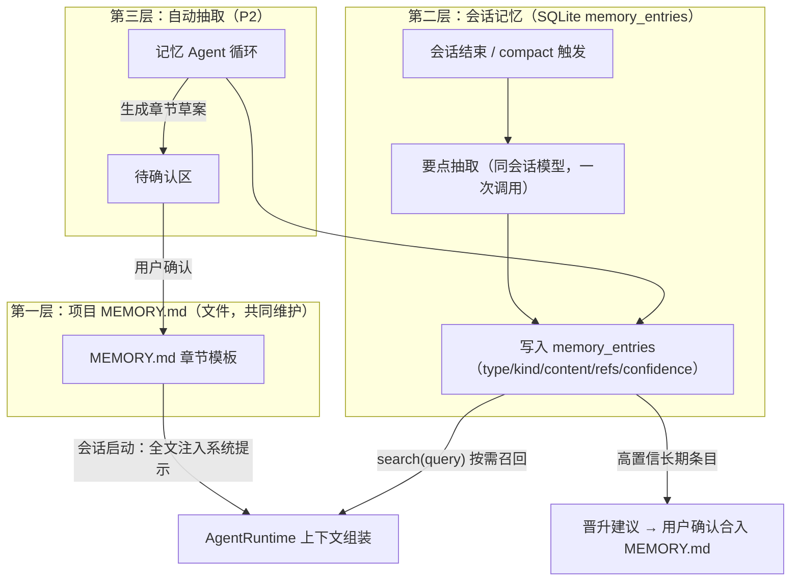

数据流要点：
- 启动注入是**同步轻量**的（读一个文件，保障冷启动 ≤ 2s 基线）；memory_entries 不在启动时全量注入，只经 `search()` 按需进入上下文。
- compact 时调用第二层抽取：被压缩掉的历史正是抽取素材，抽取完成先于历史替换（或并行，以快照为准），保证「压缩丢上下文、记忆兜底」。
- 三层之间单向晋升：entries →（用户确认）→ MEMORY.md；不存在自动反向覆盖。

### 7.3 对外接口

```typescript
// packages/memory/src/service.ts
export interface MemoryEntry {
  id: string;
  workspaceId: string;
  kind: "decision" | "convention" | "pitfall" | "preference" | "todo";
  content: string;                 // 单句要点，≤200 字
  refs?: string[];                 // 关联文件路径 / 会话 id
  confidence: number;              // 0~1
  source: "session-end" | "compact" | "manual" | "memory-agent";
  createdAt: number;
  lastSeenAt: number;              // 重复确认时间（用于淘汰）
}

export interface ProjectMemoryService {
  /** 启动注入：返回 MEMORY.md 渲染文本（含章节骨架兜底）。 */
  loadProjectMemory(workspaceRoot: string): Promise<string>;

  /** 会话结束 / compact 时抽取要点并落盘。 */
  extractFromSession(sessionId: SessionId, transcript: TranscriptSlice[]): Promise<MemoryEntry[]>;

  /** 按需召回：关键词/标签检索；P2 起可切换向量后端，接口不变。 */
  search(query: string, opts?: { kind?: MemoryEntry["kind"]; limit?: number }): Promise<MemoryEntry[]>;

  /** 用户确认后把条目合入 MEMORY.md 指定章节（Agent 不直接写用户章节）。 */
  promoteToProjectFile(entryId: string, section: MemorySection): Promise<void>;

  /** MEMORY.md 增量更新（Agent 专用章节，见模板）。 */
  updateAgentSection(workspaceRoot: string, section: "工作约定" | "当前进行", content: string): Promise<void>;
}

export type MemorySection =
  | "项目概览" | "技术栈与命令" | "工作约定" | "当前进行" | "已知坑" | "Agent 备忘";
```

**MEMORY.md 格式规范**（章节模板，启动时注入的系统上下文即此文件的原文）：

```markdown
# MEMORY.md — <项目名>

## 项目概览
<!-- 人工维护：一段话说清这个项目是什么、为谁服务 -->

## 技术栈与命令
<!-- 人工维护：构建/测试/运行命令，包管理器约定 -->

## 工作约定
<!-- 共同维护：命名规范、分支策略、提交规范、禁做事项 -->

## 当前进行
<!-- Agent 专用：进行中的任务快照，会话结束时可更新 -->

## 已知坑
<!-- 共同维护：环境坑、依赖坑、反复踩过的错误 -->

## Agent 备忘
<!-- Agent 专用：面向后续会话的工作笔记 -->
```

约束：单文件建议 ≤ 300 行；超出时由 Agent 在会话结束时建议归档到 `memory_entries`。模板缺省章节由 `loadProjectMemory` 首次初始化生成。

### 7.4 异常与边界场景

| 场景 | 处理策略 |
| --- | --- |
| MEMORY.md 不存在 / 为空 | 启动时生成模板骨架，注入为空章节说明 |
| MEMORY.md 超大（>300 行） | 启动注入全文仍可接受；同时给出「归档建议」事件，不自动截断 |
| MEMORY.md 被用户手工改动 | 以文件为准（文件是唯一真源）；Agent 写入采用读-改-写，冲突时放弃本次写入并提示 |
| 抽取调用失败（模型/网络） | 记忆落盘跳过本次，会话正常结束；下个会话的 compact 周期可再抽取 |
| 抽取产出重复/矛盾条目 | 写入前按 content 相似度去重；矛盾条目以 lastSeenAt 新者保留并标记 superseded |
| search 无结果 | 返回空数组（不注入占位文本，节省 token） |
| 多窗口同时操作 MEMORY.md | 文件级写锁（workspace 内原子重命名提交）；后写者检测到 mtime 变更即重读再改 |
| 跨项目串味 | 所有查询强制带 workspaceId；服务实例按 workspace 缓存隔离 |
| 自动抽取（P2）产生幻觉条目 | confidence < 0.6 不入召回默认集；晋升 MEMORY.md 必须经用户确认 |
| 会话恢复后重复抽取 | 以 sessionId + checkpoint 幂等去重，同会话只抽取一次 |
| 全局记忆缺失（T5.3） | RAINCODE_HOME/MEMORY.md 缺失或空白 → 全局层整块跳过（无模板骨架，不向每个项目注入空模板） |
| 会话历史检索无结果（T5.3） | 返回空列表占位文本（模型可见「未找到」，不注入假数据）；<3 code point 查询走 LIKE 兜底 |

**检索结果与模型所见一致（T5.3 不变量）**：`memory.search` RPC、`session_search` 模型工具与
系统提示注入共用同一记忆/历史真源与同一检索路径（memory 层 recall.ts；历史层 storage
history-search 的 part 级 FTS + 相对分数地板 top×0.15 + 3x 过取样 + LIKE 兜底），UI 投影与
模型工具面不允许旁路实现。`session_search` 查询时**排除当前会话**（当前回合全文已在模型
上下文中，自指命中会以短文本优势占据 top 位，属纯噪声；已知取舍：compact 后同会话早期原文
不再可经本 API 召回，M6 可议开关）。全局记忆双层注入顺序固定：全局（RAINCODE_HOME/
MEMORY.md）在前、项目（workspace/.raincode/MEMORY.md）在后。L2 条目 `scope` 列为存储位预留
（05 §3.9），跨项目全局条目入召回留后续接线。

---

## 8. 设计权衡与 ZCode 经验对照

| ZCode 经验 | 本设计的采纳方式 |
| --- | --- |
| 亮点：传输无关 RPC + zod 校验 | 内核对传输不可知；`packages/shared` 集中 zod schema；CLI 直连内核、桌面端经 rpc/server 复用同一 runtime |
| 亮点：AgentRuntime 工厂 | `AgentRuntimeFactory` 同时服务 CLI、server、子代理，子代理零新引擎 |
| 亮点：声明式工具副作用元数据驱动权限 | `ToolMetadata` 为权限判定链第一级；MCP 外部工具默认从严合成 |
| 亮点：显式 turn 状态机 + 单写者串行接纳 | TurnPhase 迁移表 + CommandInbox 三类指令分级 + steering 正交通道 |
| 教训：方法级碎片化文件 | 包粒度收敛：沙箱并入 tools、子代理并入 agent-core，不设碎片顶层包 |
| 教训：过度工程 | P0 只做本地受控执行（约束非强隔离），容器/远程执行仅留 `Executor` 接口缝 |
| 教训：状态双写 | 会话历史唯一真源为 JSONL 事件流；checkpoint 为派生快照；MEMORY.md 为记忆唯一真源 |
| 教训：shared 巨石化 | shared 只放 schema/类型/纯函数；行为逻辑一律归属各包 |
| 教训：多泳道进程复杂度 | P0/P1 单进程单泳道；多端经 server 收敛为单写者实例，不做进程池编排 |

## 9. 自检清单（设计完成度）

- [x] 七大模块均包含 (a) 职责边界（含「不做什么」）(b) 状态与数据流（mermaid + 迁移表）(c) 对外接口（TS 签名）(d) 异常与边界场景表。
- [x] 四个状态机（TurnPhase、MCP 连接、后台任务、子代理运行态）均给出状态迁移表。
- [x] 接口归属与 §0.1 包划分一致：turn/inbox/compact/subagent→agent-core；tool/sandbox→tools；mcp→mcp；permission→permission；memory→memory。
- [x] P0/P1/P2 划分在工具清单、MCP、沙箱、记忆各节逐项标注。
- [x] 性能基线落点：冷启动（启动注入仅读文件）、会话恢复（checkpoint+增量重放 ≤1s）、压缩异步不阻塞（§1.2.5）。
