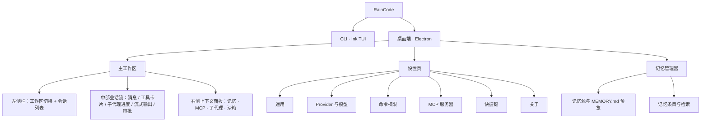

# RainCode UI 设计规范

> 版本 v1.4 · 2026-10-04（v1.0 · 2026-09-24 初稿；v1.1 双端统一；v1.2 思考块与工具卡深化；v1.3 组件化重构与冷重建；v1.4 变更见文末「14. v1.4 变更记录」）
> 适用范围：RainCode 个人代码智能助手——Windows 桌面端（Electron + React 18 + Zustand + Tailwind CSS，shadcn/ui 风格组件）、Web 工作台（React 18 + Zustand + Tailwind CSS）与 CLI 端（readline REPL + ANSI）。
> 配套高保真设计稿见文末「设计稿索引」，四张稿件与本文档 tokens 严格一致。

---

## 1. 设计定位

RainCode 是运行在开发者本机上的个人 AI 编程工作台，功能对齐 Claude Code / Codex，双端形态：

- **CLI（readline REPL + ANSI 富文本）**：键盘驱动、纯文本流、最小装饰，与终端原生美学融为一体（ADR-02 中间形态落地事实）。
- **桌面端**：以「会话流」为中心的三栏工作台，承载 Agent 会话、工具调用、MCP 调用、子代理、沙箱、审批与项目记忆七大能力。

视觉基调：**赤陶磷光工作台（Terracotta Phosphor）**。深青黑底色承接终端经验，主强调色采用赤陶橙——致敬 Claude Code 的品牌血统，同时刻意避开 AI 工具泛滥的蓝紫渐变；界面语言是「精密仪器」而非「营销页面」：1px 线框、等宽铭牌、状态灯点、四角取景框角标。信息密度适中偏高，一切装饰为可读性与状态可判读性服务。

关键词：**本地优先 · 终端血统 · 精密克制 · 状态即界面**。

---

## 2. 设计原则

1. **状态永远是第一公民**。任何时刻用户都能回答三个问题：Agent 在做什么、哪些调用被允许/拒绝、上下文还剩多少。工具卡片、状态灯、审批条、context 用量条都是为此服务的仪器读数，而非装饰。
2. **深色优先，密度适中**。默认深色主题面向长时间编码会话；面板间距与字号按「连续阅读 2 小时不疲劳」校准，正文 13px、行高 1.6，拒绝营销式留白，也拒绝不可喘息的堆砌。
3. **等宽字体承载技术事实**。路径、命令、代码、diff、模型 ID、token 计数一律等宽字体；界面文案用系统无衬线中文栈。两种字体各司其职，禁止混用装饰。
4. **克制动效，只解释状态变化**。动效时长 120–320ms，仅用于：流式输出、审批弹窗入场、Tab 切换、状态灯脉冲。无弹跳、无循环背景动画（光标闪烁与运行中 spinner 除外）。
5. **危险操作必须显式确认**。所有写入/执行类工具调用默认走审批流，审批 UI 必须同时呈现：完整命令、影响范围、风险等级、以及「仅本次 / 本会话 / 始终 / 拒绝」四级决策。CLI 与桌面端语义一致。
6. **本地优先的可信感**。界面明确展示「本地沙箱」「本地索引」等边界信息，网络类操作（MCP 远程服务器、云 Provider）必须有可辨识的标识与状态，不让用户混淆本地与远程边界。

---

## 3. 视觉语言与 Design Tokens

全部 tokens 以 CSS 自定义属性定义，四张设计稿共享同一份 `:root` 块，桌面端实现对应 Tailwind CSS 变量（shadcn/ui 主题注入）。

### 3.1 色板（深色主题 · 默认）

**表面与结构**

| Token | 值 | 用途 |
|---|---|---|
| `--bg-void` | `#0A0E13` | 最深底色：窗口外框、CLI 终端底 |
| `--bg-base` | `#0D1219` | 应用主背景 |
| `--bg-panel` | `#111823` | 左右侧栏、面板 |
| `--bg-card` | `#141C28` | 卡片、消息容器、工具卡片 |
| `--bg-raised` | `#1A2432` | 输入框、代码块、浮起块 |
| `--bg-hover` | `#1C2735` | 列表行 / 菜单项 hover |
| `--bg-selected` | `#24384F` | 选中项 |
| `--bg-popover` | `#161F2C` | 弹层、下拉、对话框 |

**边框**

| Token | 值 | 用途 |
|---|---|---|
| `--border-faint` | `#1A2432` | 极弱分隔（面板内分区） |
| `--border` | `#223042` | 默认线框 |
| `--border-strong` | `#31435A` | 强分隔、hover 边框、聚焦边框基色 |

**文本**

| Token | 值 | 用途 |
|---|---|---|
| `--text-hi` | `#E8EEF5` | 主文本 |
| `--text-mid` | `#A3B3C7` | 次级文本、描述 |
| `--text-low` | `#66798F` | 弱化元数据 |
| `--text-faint` | `#42546A` | 占位符、禁用 |

**品牌强调与状态色**

| Token | 值 | 用途 |
|---|---|---|
| `--accent` | `#E0784F` | 赤陶橙主强调：品牌标记、主按钮、当前会话、Agent 标识 |
| `--accent-hover` | `#F08D63` | 主强调 hover |
| `--accent-dim` | `#A85A3B` | 强调色弱化描边 |
| `--accent-bg` | `rgba(224,120,79,.12)` | 强调色底（选中、徽章底） |
| `--ok` | `#53C383` | 成功、已连接、记忆模块标识 |
| `--warn` | `#E0B354` | 等待审批、重连中、审批模块标识 |
| `--danger` | `#E4655E` | 错误、deny 规则、破坏性操作 |
| `--info` | `#58A6F5` | 信息、MCP 模块标识、远程标识 |
| `--violet` | `#A48AFA` | 子代理模块标识 |
| `--cyan` | `#4EC9D4` | 工具调用模块标识 |
| `--mint` | `#4FCFA0` | 沙箱模块标识 |

**Diff 语义色**（与通用成功/错误色区分，独立 token）

| Token | 值 |
|---|---|
| `--diff-add-bg` / `--diff-add-tx` | `rgba(83,195,131,.12)` / `#6FD79A` |
| `--diff-del-bg` / `--diff-del-tx` | `rgba(228,101,94,.12)` / `#F08A84` |

**七大模块标识色速查**：Agent 会话=赤陶橙 `--accent`；工具调用=青 `--cyan`；MCP=蓝 `--info`；子代理=紫 `--violet`；沙箱=薄荷绿 `--mint`；命令审批=琥珀 `--warn`；项目记忆=绿 `--ok`。

### 3.2 浅色主题策略

浅色为辅助主题，通过同一套语义 token 重映射实现（组件代码不写死色值）。关键映射：

| Token | 浅色值 | 说明 |
|---|---|---|
| `--bg-base` | `#F4F5F7` | 冷灰白主背景 |
| `--bg-panel` / `--bg-card` | `#FFFFFF` | 面板与卡片提亮 |
| `--bg-raised` | `#F0F2F5` | 输入框与代码块 |
| `--border` | `#DCE0E6` | 线框加深一档 |
| `--text-hi` / `--text-mid` / `--text-low` | `#1A2129` / `#4A5768` / `#8291A3` | 文本反转 |
| `--accent` | `#C05B33` | 赤陶橙加深以保对比度（≥4.5:1） |
| `--ok` / `--warn` / `--danger` / `--info` | `#2E9E63` / `#B07F24` / `#C74840` / `#2F7CD6` | 状态色整体加深 |
| `--violet` / `--cyan` / `--mint` | `#7C5CD6` / `#1795A0` / `#239970` | 模块色加深 |

浅色主题不提供 CLI（CLI 遵循终端自身配色）；桌面端与 Web 端均提供「深色 / 浅色 / 跟随系统」三态切换（侧栏品牌头「◐」按钮循环），localStorage 持久化（键 `raincode.theme`），「跟随系统」经 `prefers-color-scheme` 实时重映射。**实现状态（v1.4）**：双端已落地——组件代码零色值改动，仅 `[data-theme="light"]` 块重映射语义 token；规范给出关键映射，其余 token（bg-void/hover/selected/popover、border-faint/strong、text-faint、accent-hover/dim/bg、diff 色、阴影、遮罩、选区色）按同纪律派生（冷灰白阶梯 + 状态色加深 + 阴影/遮罩收敛）；散落组件的硬编码值（`text-void` 主按钮文字 → `--on-accent`、审批遮罩 `bg-black/60` → `--overlay`、选区色 → `--selection-bg`、阴影 → `--shadow-1/2/3`）本轮全部 token 化。产品截图：`picture/web-chat-light.png` / `picture/desktop-chat-light.png`。

### 3.3 字体

| Token | 值 | 用途 |
|---|---|---|
| `--font-ui` | `"Segoe UI Variable Text", "Segoe UI", "Microsoft YaHei UI", "PingFang SC", sans-serif` | 界面文案（本地优先，不引网络字体） |
| `--font-mono` | `"Cascadia Code", "Cascadia Mono", Consolas, "Microsoft YaHei UI", monospace` | 代码、路径、命令、diff、模型 ID、TUI 全部内容（v1.1：等宽栈补 CJK 字体——裸 `monospace` 兜底会让中文落宋体，与代码块中西混排冲突） |

### 3.4 字号阶梯

| Token | 值 | 行高 | 用途 |
|---|---|---|---|
| `--fs-xl` | 18px | 1.4 | 页面级标题（如「设置」） |
| `--fs-lg` | 15px | 1.5 | 区块标题、对话框标题 |
| `--fs-md` | 13px | 1.6 | 正文默认、消息正文、列表主文 |
| `--fs-sm` | 12px | 1.5 | 次级说明、Tab 标签、按钮文字 |
| `--fs-xs` | 11px | 1.5 | 徽章、元数据、状态条 |
| `--fs-2xs` | 10px | 1.4 | 极弱角标（窗口计数、耗时） |
| `--fs-code` | 12.5px | 1.55 | 代码块、diff、TUI（等宽专用） |

规则：中文正文不低于 13px（`--fs-md`）；`--fs-2xs` 仅用于非关键角标；字重只用 400 / 500 / 600 三档，标题用 600，标签用 500，避免 Bold。

### 3.5 间距 / 圆角 / 阴影 / 动效

**间距**（基数 4px）：`--sp-1: 4px` · `--sp-2: 8px` · `--sp-3: 12px` · `--sp-4: 16px` · `--sp-5: 20px` · `--sp-6: 24px` · `--sp-8: 32px`。节奏约定：图标与文字 4px、控件内边距 8px、列表行 12px、卡片内边距 16px、对话框内边距 20–24px、区块之间 32px。

**圆角**：`--r-sm: 4px`（徽章、代码行内、标签）→ `--r-md: 6px`（按钮、输入框、菜单项）→ `--r-lg: 10px`（卡片、消息容器、工具卡片）→ `--r-xl: 14px`（对话框、弹层容器）。嵌套规则：内层圆角必须小于外层且逐级递减。

**阴影**（克制，优先用底色分层）：

| Token | 值 | 用途 |
|---|---|---|
| `--shadow-1` | `0 1px 2px rgba(0,0,0,.40)` | 卡片 |
| `--shadow-2` | `0 4px 16px rgba(0,0,0,.45)` | 弹层、下拉 |
| `--shadow-3` | `0 12px 40px rgba(0,0,0,.55)` | 模态对话框 |

**动效**：`--t-fast: 120ms`（hover、按压）· `--t-med: 200ms`（Tab 切换、折叠展开、审批条入场）· `--t-slow: 320ms`（对话框、面板显隐）· 缓动统一 `--ease: cubic-bezier(.2,.8,.3,1)`。循环动画仅限：光标闪烁（1.1s steps）、运行中 spinner（0.9s linear）、等待审批状态灯脉冲（1.6s ease）。

**减动效偏好（v1.1 落地）**：`prefers-reduced-motion: reduce` 下光标闪烁、状态灯脉冲、shimmer、入场动效全部收敛为静态——状态可判读性不得依赖动效（§2.4）。双端 CSS 同构实现（desktop `global.css` / web `index.css`）。

**标志性视觉细节**：主内容面板四角绘制 1px「取景框角标」（corner ticks，长 8px），用于主工作区中部会话流、审批对话框与 CLI 面板边框——这是 RainCode 的识别符号，呼应「精密观测仪器」隐喻，其余面板一律普通 1px 线框，避免滥用。

---

## 4. 信息架构与导航结构



导航规则：

- 桌面端为**单窗口多视图**：主工作区为默认视图，设置与记忆管理器以视图切换（非新窗口）进入，`Esc`/返回按钮回到主工作区。
- 会话数据、记忆、MCP 配置为**本地单源**：CLI 与桌面端共享同一份 `~/.raincode/` 数据，双端切换无同步成本（TUI 稿中「会话已恢复」即体现这一点）。
- 右侧上下文面板四个 Tab 常驻（可折叠），是七大模块中「记忆 / MCP / 子代理 / 沙箱」的常驻入口；「工具调用」入口在中部会话流卡片内，「命令权限审批」入口在会话流审批态 + 设置页权限规则。

---

## 5. CLI TUI 布局设计

### 5.1 布局示意

```
┌┄┄┄┄┄┄┄┄┄┄┄┄┄┄┄┄┄┄┄┄┄┄┄┄┄┄┄┄┄┄┄┄┄┄┄┄┄┄┄┄┄┄┄┄┄┄┄┄┄┄┄┄┄┄┄┄┄┄┄┄┄┐
┆  ✦ RainCode v0.3.2 · 会话 #a3f2 已恢复（3 条消息）             ┆
┆                                                                ┆
┆  ❯ 你 · 14:32                                                  ┆
┆    重构 src/session/manager.ts 的错误处理，把裸 throw 换成     ┆
┆    Result 类型，跑通全部测试                                    ┆
┆                                                                ┆
┆  ✦ RainCode · sonnet-4.5                                       ┆
┆    我先查看现有实现，再统一错误路径。                           ┆
┆    ⚙ Read    src/session/manager.ts · 120 行            ✓ 0.4s ┆
┆    ⚙ Grep    "throw new Error" · 8 处命中               ✓ 0.2s ┆
┆    ⚙ Edit    src/session/manager.ts                    ⋯ 运行中┆
┆    ⧉ 子代理 ×3 并行 · 测试生成  [████████░░░░] 67%             ┆
┆                                                                ┆
┆  ┌─ ⚠ 权限确认 ──────────────────────────────────────────────┐ ┆
┆  │  Bash · npm test                                          │ ┆
┆  │  $ npm test -- --filter session                           │ ┆
┆  │  风险：中 · 在本地沙箱中执行                               │ ┆
┆  │  [1] 仅本次允许  [2] 本会话允许  [3] 始终允许  [4] 拒绝   │ ┆
┆  │  输入序号，或 y 允许 / n 拒绝 › ▌                          │ ┆
┆  └───────────────────────────────────────────────────────────┘ ┆
┆                                                                ┆
├┄┄┄┄┄┄┄┄┄┄┄┄┄┄┄┄┄┄┄┄┄┄┄┄┄┄┄┄┄┄┄┄┄┄┄┄┄┄┄┄┄┄┄┄┄┄┄┄┄┄┄┄┄┄┄┄┄┄┄┄┄┤
┆  › 输入消息，/ 唤起命令，@ 引用文件              ▌            ┆
├┄┄┄┄┄┄┄┄┄┄┄┄┄┄┄┄┄┄┄┄┄┄┄┄┄┄┄┄┄┄┄┄┄┄┄┄┄┄┄┄┄┄┄┄┄┄┄┄┄┄┄┄┄┄┄┄┄┄┄┄┄┤
┆  sonnet-4.5 · ctx 8% ▏██░░░░░░░░ · 12.4k tok · ¥0.04 · main ✓ ┆
└┄┄┄┄┄┄┄┄┄┄┄┄┄┄┄┄┄┄┄┄┄┄┄┄┄┄┄┄┄┄┄┄┄┄┄┄┄┄┄┄┄┄┄┄┄┄┄┄┄┄┄┄┄┄┄┄┄┄┄┄┄┄┘
```

分区说明：

- **消息流**（主体，随终端滚动）：用户消息以 `❯` 提示符 + 昵称行开头；助手消息以 `✦` 标记 + 模型名开头；工具调用压缩为单行 `⚙ 工具名 · 参数摘要 · 状态 · 耗时`，成功 `✓` 绿、运行中 `⋯` 青闪烁、失败 `✗` 红、等待审批 `⚠` 琥珀。
- **审批块**（琥珀边框内嵌块，阻塞消息流）：完整命令、风险等级与沙箱信息、四个数字选项，等待输入时行尾光标闪烁；决策后审批块折叠为单行结果（`⚠ Bash · npm test · 本会话允许 ✓`）。
- **输入区**（底栏上方 1 行起）：`›` 提示符 + 闪烁光标；支持 `/` 命令面板与 `@` 文件引用的行内补全列表。
- **状态栏**（底栏 1 行）：模型名、context 用量（数字 + 12 格进度条）、token 计数、本次会话花费、git 分支；审批等待时状态栏追加琥珀色 `⏸ 等待审批`。

### 5.2 审批交互规范（CLI）

- 默认聚焦在审批块内，数字键 `1–4` 或 `y`（=允许本次）/ `n`（=拒绝）/ `Esc`（=拒绝）均可决策；`Tab` 在多审批排队时切换到下一条。
- 决策结果即时回显并折叠；选择「始终允许」时同步写入桌面端「命令权限」规则列表（双端一致）。
- 审批期间 Agent 暂停，状态栏出现 `⏸`；连续 3 条审批走「队列」呈现，避免刷屏。

### 5.3 快捷键表（CLI）

| 按键 | 行为 | | 按键 | 行为 |
|---|---|---|---|---|
| `Enter` | 发送消息 | | `/` | 唤起命令面板 |
| `Shift+Enter` | 输入换行 | | `@` | 引用文件/目录 |
| `Esc` | 中断生成 / 拒绝审批 | | `1–4` | 审批选项直选 |
| `↑` / `↓` | 输入历史翻阅 | | `y` / `n` | 审批 允许/拒绝 |
| `Ctrl+C` | 中断当前任务 | | `Tab` | 补全 / 审批间跳转 |
| `Ctrl+L` | 清屏保留会话 | | `Ctrl+R` | 搜索历史会话 |
| `Ctrl+T` | 折叠/展开全部工具行 | | `Ctrl+S` | 打开最近记忆速览 |

---

## 6. 桌面端逐界面详述

### 6.0 全局布局尺寸标注

| 区域 | 尺寸 | 说明 |
|---|---|---|
| 应用标题栏 | 高 40px | 品牌标记 + 项目名/路径面包屑 + 窗口控制（Windows 风格），`--bg-void` 底 |
| 左侧栏 | 宽 264px，可折叠至 56px | 折叠态仅保留图标：新建、会话搜索、设置 |
| 中部会话流 | 自适应，内容列最大 760px 居中 | 超宽屏不无限拉伸阅读列，保证行长短句舒适 |
| 右侧上下文面板 | 宽 300px，可折叠 | 四 Tab 常驻；折叠后以右侧竖条图标组唤起 |
| 输入区 | 高 108–132px（自适应换行） | 底部弱化提示行 20px |
| 面板间距 | 0px（贴边拼合）+ 1px 边框 | 三栏以 `--border-faint` 分隔，不用留白分隔，保持仪器感 |
| 对话框 | 宽 520px（审批）/ 640px（通用） | 垂直居中，遮罩 `rgba(6,9,14,.62)` |

### 6.1 主工作区（稿件 01）

三栏布局：左侧栏 264px 固定（可折叠至 56px 图标态）· 中部会话流自适应 · 右侧上下文面板 300px（可折叠）。

**左侧栏**：顶部工作区切换器（当前项目名 + 路径）；「新建会话」主按钮；会话列表（时间分组：今天/昨天/更早），每项含标题、相对时间、消息数徽章，当前会话用 `--accent-bg` 底 + 左侧 2px 橙色指示条；底部为模型选择器与 token/context 用量条。

**中部会话流**（核心，带四角取景框角标）：从上到下依次为——

1. **消息气泡**：用户消息右对齐浅橙底（`--accent-bg`）气泡；助手消息左对齐卡片，含 `✦ RainCode` 署名行与模型标签；支持行内代码、代码块、Markdown。
2. **思考块（v1.2）**：助手消息内、正文之前——`✻ 思考过程 · N 字` 单行开关（violet 标识 + 2px violet 左边线），流式期间自动展开实时呈现（文本 italic 弱化 + 尾部 48px 渐隐 mask），`message.completed` 后自动折叠（用户可再展开）；reasoning 与正文在 reducer 层独立累积（`delta.type=reasoning`），CLI 侧对应 `RAINCODE_CLI_SHOW_REASONING` stderr 通道。**v1.3 增补**：reasoning 自协议 v1.13 随 assistant 行落盘，冷重建（宿主重启 / 换端接续）后思考块照常恢复，折叠态呈现与实时收束口径一致。
3. **工具调用卡片**：结构为「状态灯 + glyph + 等宽工具名 + 参数摘要 + 耗时 + 展开箭头」。折叠态一行；展开态含参数区与结果预览（文本 / diff / 表格三种渲染），底部操作行：复制、重跑、在编辑器打开。五种状态：`pending`（琥珀脉冲灯）、`running`（青色旋转灯）、`success`（绿灯）、`error`（红灯 + 错误摘要）、`needs-approval`（琥珀边框 + 内嵌审批条）。沙箱执行的调用带 `mint` 色「沙箱」徽标；MCP 调用带 `info` 蓝色「MCP·服务器名」徽标。
4. **子代理进度卡**（紫色标识）：主代理派发的并行子任务列表，每行子代理名 + 当前动作 + 迷你进度条；可展开查看子代理各自的消息流缩略；全部完成后折叠为一行汇总。
5. **流式输出**：生成中的助手消息尾部为 1×16px 橙色光标块（闪烁）；未完成段落底部呈现一行 shimmer 扫过的占位文本「正在生成…」。
6. **权限审批弹窗态**（模态叠加）：遮罩 `rgba(6,9,14,.62)` + `--shadow-3` 对话框（`--r-xl`，带取景框角标）。内容：风险徽章（低/中/高）、工具名与完整命令（等宽、可复制）、影响文件列表、四级决策按钮「仅本次允许（主按钮）/ 本会话允许 / 始终允许 / 拒绝（danger 幽灵按钮）」、「记住此选择并写入权限规则」复选框。键盘 `1–4` 直选，`Esc`=拒绝。
7. **输入区**：底部输入框（`--bg-raised`，聚焦边框转 `--accent-dim`），支持 `/` 命令面板、`@` 文件引用、模型快切；右侧发送主按钮，生成中变为「停止」方块按钮；下方一行弱化提示（当前模型 · context 用量）。

**右侧上下文面板**（Tab：记忆 | MCP | 子代理 | 沙箱，激活 Tab 底部 2px 模块色指示条）：

- **记忆 Tab**（默认，绿色标识）：MEMORY.md 摘要卡（条目数 + 最近更新时间 +「打开管理器」链接）、检索框、最近记忆条目列表（类型徽章：项目约定 / 用户偏好 / 命令速查 / 架构决策，含来源会话号与引用次数）。
- **MCP Tab**（蓝色标识）：已连接服务器列表（名称、状态灯、工具数、传输方式 stdio/SSE），点击展开工具清单；底部「管理服务器」跳设置页。
- **子代理 Tab**（紫色标识）：当前运行中子代理实时列表（名称、任务、耗时、token 消耗）与历史派发记录。
- **沙箱 Tab**（薄荷绿标识）：沙箱总开关、当前模式（只读/工作区可写/完全离线）、资源限制读数（CPU/内存/网络）、最近被拦截操作列表。

### 6.2 设置页（稿件 02）

左侧垂直导航（6 组）：通用 / Provider 与模型 / 命令权限 / MCP 服务器 / 快捷键 / 关于。右侧内容区每块均为「区块标题 + 卡片」结构，改动即时保存并显示「已保存」弱化提示。

- **Provider 与模型**：当前 Provider 卡片（名称、状态灯、默认模型徽章）；表单：API Key（掩码显示 + 显示切换 + 测试连接按钮）、Base URL、模型选择下拉、上下文窗口读数、温度与最大输出滑杆；「添加自定义 Provider」次按钮。
- **命令权限**：规则表（模式 allow/ask/deny 彩色徽章 + 等宽规则表达式 + 作用域 + 来源[手动/会话决策] + 删除）；顶部「新建规则」与模式说明；危险示例（`rm -rf` deny）必须置顶展示。
- **MCP 服务器**：服务器卡片列表（名称、传输方式、状态灯、工具数、启停开关、编辑/删除）；「添加服务器」卡片含 JSON 配置预览；连接失败态给出重试按钮与错误摘要。

### 6.3 记忆管理界面（稿件 03）

三栏：左侧记忆源列表（MEMORY.md / 项目约定 / 用户偏好 / 命令速查 / 架构决策，各含条目数）+「新建记忆」；中部 MEMORY.md 预览（Markdown 渲染：标题、列表、行内代码、引用块，顶部含文件路径与「在编辑器打开」）；右侧条目面板（顶部检索框 + 类型过滤 chips，条目列表含类型徽章、摘要两行截断、来源「会话 #id 自动提取 / 手动」、引用次数、置顶图钉与删除）。检索命中时条目内关键词以 `--accent-bg` 高亮。

### 6.4 工具调用卡片规范（核心组件）

工具调用卡片是会话流中出现频率最高的组件，也是「工具调用 / MCP / 沙箱」三个模块的共同载体，单列规范。

**结构**（自上而下）：

```
┌──────────────────────────────────────────────────────┐
│ ● 工具名(mono)  〔徽标〕 参数摘要…        耗时/状态 ▸ │  ← 折叠头 32px
├──────────────────────────────────────────────────────┤
│  参数区（等宽代码块）                                  │  ← 展开态
│  结果预览区（文本 / diff / 表格 三选一渲染）           │
│  ──────────────────────────────────────────          │
│  复制 diff · 在编辑器打开 · 撤销此修改                 │  ← 操作行
└──────────────────────────────────────────────────────┘
```

**五种状态**（折叠头状态灯 + 边框语义）：

| 状态 | 状态灯 | 附加呈现 |
|---|---|---|
| `pending`（排队） | 琥珀脉冲 | 折叠头置灰，无操作行 |
| `running` | 青色旋转/脉冲 | 耗时实时跳动；结果区可显示实时 stdout |
| `success` | 绿色常亮 | 耗时定格；可展开 |
| `error` | 红色常亮 | 展开态附 stderr 全文（等宽红调），操作行加「重试」 |
| `needs-approval` | 琥珀脉冲 + 琥珀边框 | 卡片内嵌审批条（简版），或唤起全局审批弹窗（完整态） |

**三种结果渲染**：

1. **文本**：`--bg-raised` 等宽代码块，超 30 行折叠为「显示全部 N 行」。
2. **diff**：逐行 `--diff-add-bg/--diff-del-bg` 底色，行首 `+/-` 符号；文件头显示 `+N −M` 统计。
3. **表格**（结构化返回，如 MCP 查询）：`--bg-raised` 表头 + 斑马纹行，单元格等宽字体，水平可滚动。

**徽标系统**：`〔沙箱〕`（mint）表示沙箱内执行；`〔MCP·服务器名〕`（info 蓝）表示远程 MCP 调用；`〔子代理〕`（violet）表示由子代理发起。徽标位于工具名右侧，等宽小字，颜色即第 3.1 节模块标识色。

**v1.2 细则（实现层落地，双端 + CLI 同一语言）**：

- **glyph 表**（与 CLI `theme.glyphFor` 同源，状态灯右侧、cyan 色）：`◇` MCP 工具（`mcp__*`）· `◈` 子代理派发（agent）· `✓` todo 读写 · `✱` 检索类（read/grep/glob）· `←` 写入类（write/edit）· `$` bash · `⚙` 兜底。
- **参数摘要 v2**（折叠头 mono 列，`summarizeInput` 按工具域提炼主参数，拒绝原始 JSON 墙）：bash → `$ 命令`（多行折叠单行）；grep/glob → `"模式" · 范围`；read/write/edit → 路径；web_fetch → URL；agent → `profile · task`；skill → `/name`；未知形状回退紧凑 JSON；统一 120 字符省略号截断。
- **状态底色 tint**：折叠头底色随状态微调——pending `warn/5%`、running `cyan/5%`、error `danger/5%`，ok/denied 保持 `--bg-card`；配合 2px 左边框构成双通道状态编码。
- **结果预览 diff 着色**：结果含结构化 diff 标记（`diff `/`@@ `/`--- `/`+++ `）或 +/- 行成对出现时逐行着色（`--diff-add-tx`/`--diff-del-tx`，`@@` 行 info 蓝）；markdown 列表等普通文本不误判。
- **输出截断提示**：`truncated` 时结果标题行追加琥珀「输出已截断（完整内容落会话事件流）」。

### 6.5 通用组件规范

- **按钮层级**：主按钮（`--accent` 底，每个视图最多 1 个）→ 次按钮（`--border-strong` 描边）→ 幽灵按钮（hover 才显底）→ 危险按钮（`--danger` 文字/描边，仅 deny、删除类）。高度 32px，内边距 16px。
- **徽章/标签**：`--r-sm` 圆角、`--fs-2xs`、1px 描边 + 8% 透明度底；语义色复用状态色，禁止无语义装饰色。
- **状态灯**：8px 圆点，四态（绿常亮 / 青脉冲 / 琥珀脉冲 / 红常亮）全局唯一语义，出现在工具卡、MCP 列表、沙箱面板、会话列表。
- **Tab**：文字 Tab + 底部 2px 模块色指示条；激活态不加底色填充，靠指示条 + 字重 500 表达。
- **开关**：30×16px，开态使用所属模块标识色（沙箱 mint / MCP info / 通用 accent），不用统一绿色。
- **空态**：面板级空态 = 一行说明 + 一个动作链接；页面级空态（首启动）= ASCII 纹样 + 主按钮引导，二者不用插画位图。
- **kbd 快捷键芯片（v1.2）**：快捷键提示行中的按键用 `.kbd` 芯片呈现（等宽 10px、1px 描边 + 下边加重 2px、`--bg-raised` 底），如审批弹窗「快捷键 `1`–`4` 直选 · `Esc` 拒绝」、斜杠面板「`↑``↓` 选择 · `Tab` 补全 · `Enter` 执行 · `Esc` 关闭」。
- **代码围栏复制（v1.2，v1.3 修订为头行式）**：围栏升级为「头行 + 主体」整体容器（1px 描边圆角）——头行（`--bg-panel` 底、下缘 1px 分隔）左侧语言芯片（`​```ts` 首行语言标签，mono faint 小字；无标签显示 `text`），右侧常驻「复制」按钮（1.5s「已复制」反馈；clipboard API 优先，非安全上下文（file://）回退 `execCommand`）。

---

## 7. 交互状态与异常态规范

| 状态 | 规范 |
|---|---|
| 空态 | 会话列表空：插画级 ASCII 纹样 +「新建第一个会话」引导；记忆空：说明文案 + 示例条目灰态 |
| 加载 | MCP/沙箱面板加载：骨架条（`--bg-raised` 微 shimmer，320ms）；不使用全屏 spinner |
| 流式中 | 助手消息尾光标闪烁；输入区发送钮变「停止」；工具卡 running 状态灯旋转 |
| 审批中 | Agent 暂停、消息流顶部出现琥珀「等待你的确认」横条；审批弹窗唯一可交互焦点（其他区域禁用） |
| 错误 | 工具卡 error 红灯 + 可展开错误详情（stderr 全文等宽渲染）；助手消息失败给出「重试」按钮；网络断开在标题栏显示 `--danger` 圆点 +「离线」徽章 |
| 沙箱拦截 | 沙箱 Tab 与对应工具卡同时出现 `--mint` 拦截记录，内容含被拦命令与原因 |
| MCP 连接失败 | 服务器行状态灯红 + 「重连中…」琥珀文案 + 重试按钮；相关工具调用卡片提示「服务器不可用」 |
| 未配置 Provider | 输入区置灰 + 引导条「先配置模型 Provider →」跳设置页 |
| 审批超时 | 审批弹窗保持等待不自动关闭；CLI 中超过 10 分钟提示「仍在等待，Ctrl+C 可中断」；中断后工具卡标记为「已取消」灰态 |
| token/context 超限 | context 条超过 80% 变琥珀、95% 变红；触顶时 Agent 自动总结压缩上下文并在消息流顶部提示「上下文已压缩」 |
| 会话恢复失败 | 启动时显示「会话文件损坏，已隔离至 sessions/orphan/」+ 可跳转目录；不阻塞新建会话 |
| Provider 限流（429） | 会话流顶部蓝色横条「模型限流中，将于 Ns 后自动重试」+ 手动重试按钮；子代理块内则逐个暂停再恢复 |
| 磁盘空间不足 | 标题栏持久琥珀徽章「本地空间不足」，禁止新的会话写入但可只读浏览 |

**CLI 与桌面端状态一致性**：工具卡状态灯 ⇄ TUI 行内符号（`✓ ⋯ ✗ ⚠`）、审批四级决策 ⇄ 数字选项、context 用量条 ⇄ 状态栏进度块、沙箱拦截记录 ⇄ `✂` 行——两端共享同一状态机与同一份配色语义，任何一端产生的决策（如「始终允许」）实时同步到另一端。

---

## 8. 国际化策略

- 默认 `zh-CN`，预留 `en-US`；文案全部走 i18n key（`workspace.session.new` 形式），设计稿以中文呈现。
- 布局容错：按钮与 Tab 设 `min-width` 并允许 1.6 倍文案膨胀不破版；会话标题、规则表达式等长文本用单行截断 + title 提示，不依赖截断保布局。
- 中英切换仅影响文本层，不改变语义：状态灯颜色、模块标识色、图标含义不变；`--fs-md` 下中文 13px / 英文保持 13px，不单独缩放。
- 术语表（中 → 英固定对照）：会话 Session · 工具调用 Tool Call · 子代理 Subagent · 沙箱 Sandbox · 审批 Approval · 项目记忆 Memory · 上下文 Context。技术词（Provider、MCP、token、diff）中英混排时不翻译。

### 8.1 键盘可达性

键盘是开发者的第一交互路径，与 CLI 的纯键盘操作保持同等地位：

- 审批弹窗打开即获得焦点环，`1–4` 直选、`Esc` 拒绝、`Tab` 在按钮组间循环；焦点环使用 `--border-strong` + 1px 外扩，不隐藏。
- 主工作区核心路径全程无鼠标可达：`Ctrl+N` 新会话 → 输入 → `Enter` 发送 → `1–4` 审批 → `Ctrl+J` 展开上下文面板。
- 列表（会话、记忆条目、规则表）支持 `↑↓` 移动 + `Enter` 进入，`Delete` 触发删除确认。
- 状态不得仅用颜色表达：状态灯旁始终伴随文字或符号（`✓ ⋯ ✗ ⚠`），满足色觉障碍可判读。

### 8.2 文案风格

- 界面文案短句化，动词开头（「新建会话」「复制 diff」）；中文不混用全角/半角标点体系，代码、路径、命令一律半角。
- 错误文案 = 「发生了什么 + 用户能做什么」，例如「postgres 连接失败（ECONNREFUSED）——请确认数据库已启动，或点击重试」。
- 数字与单位遵循 GB 规范：token 计数 `12.4k`，金额 `¥0.04`，耗时 `0.4s / 2m14s`，时间相对化（「3 分钟前」）。

---

## 9. 设计稿索引

| 文件 | 内容 | 覆盖要点 |
|---|---|---|
| `ui-mockups/01-desktop-workspace.html` | 主工作区完整态 | 三栏布局、消息气泡、工具卡（折叠/展开/diff 预览/沙箱与 MCP 徽标）、子代理进度卡、流式光标、权限审批弹窗叠加态、右侧记忆/MCP/子代理/沙箱四 Tab |
| `ui-mockups/02-desktop-settings.html` | 设置页 | Provider/模型表单与测试连接、权限规则列表（allow/ask/deny）、MCP 服务器管理（连接态/失败态） |
| `ui-mockups/03-desktop-memory.html` | 记忆管理器 | MEMORY.md 预览、记忆源列表、条目列表（来源/引用/置顶）、检索高亮 |
| `ui-mockups/04-cli-tui.html` | CLI TUI 视觉示意 | 模拟终端窗口、消息流与工具行、审批块数字选项交互、子代理进度、状态栏与 context 条 |

稿件为单文件自包含（内联 CSS + 少量原生 JS 的 Tab/折叠/检索演示），浏览器直接打开即可预览，无构建依赖。浅色主题未单独出稿（双端已实现，见 3.2 实现状态与 `picture/*-chat-light.png` 产品截图）。

阅读建议：先看 `01` 建立三栏骨架与状态语言的印象，再用 `04` 对照 CLI 的同构语义；`02`/`03` 分别对应配置态与知识态界面。评审时以第 3 节 tokens 为基准核对色值与字号。

---

## 10. 交付自检清单

- [x] tokens 文档（3.1–3.5）与四张稿件 `:root` 块逐值一致（表面 8 项、边框 3 项、文本 4 项、强调与状态 10 项、diff 4 项、字号 7 项、间距 7 项、圆角 4 项、阴影 3 项、动效 4 项）。
- [x] 七大模块操作入口：Agent 会话（左栏列表+输入区）、工具调用（会话流卡片）、MCP（右栏 Tab+设置页）、子代理（右栏 Tab+进度卡）、沙箱（右栏 Tab+卡片徽标）、命令审批（审批弹窗+CLI 审批块+设置权限规则）、项目记忆（右栏 Tab+记忆管理器）。
- [x] 权限审批：桌面弹窗四级决策与 CLI 数字选项/y-n 交互均已覆盖且语义一致。
- [x] 全文中文；仅创建任务要求的 5 个文件；未修改 ZCode 目录；未写产品实现代码。
- [x] 四张稿件均为单文件自包含，仅使用上述 tokens 色值，无外部网络依赖（字体走 Windows 系统栈）。
- [x] 异常态覆盖：空态 / 加载 / 流式中 / 审批中 / 工具错误 / MCP 失败 / 沙箱拦截 / 限流 / 超限（第 7 节）。

---

## 11. v1.1 变更记录（2026-10-04 · UI 重设计轮）

本轮为 v1.0 规范的**实现深化与双端统一**，token 色值零变更（四张稿件与 §3.1 仍逐值一致），变更集中于实现层：

1. **Web 工作台对齐本规范（本轮主项）**：Web 端自 T3.8 时期的 `ink-*` 简化盘（GitHub-dark 系硬编码色）整体迁移至 §3.1 token 体系——语义色 Tailwind 映射与桌面端同源（web `tailwind.config.cjs` / `index.css` ↔ desktop `tailwind.config.js` / `global.css`）。按端最小实现口径不变（04 §2.3）：各端独立 CSS 与映射，不抽公共 renderer 包；「统一令牌属设计系统立项」的 M5+ 候选在本轮以「同值异实现」方式落地，抽包仍留待第三端或令牌治理立项。
2. **组件精修（双端）**：取景框角标自规范落地为 `.corner-ticks` utility（主会话流内容列 + 审批弹窗，识别符号不滥用）；工具卡增模块徽标（`mcp__<server>__<tool>` → info「MCP·server」、`agent` → violet「子代理」，§3.1 模块标识色）；审批弹窗增顶部琥珀色带「等待你的确认 · 权限审批」（含风险徽章右置）；侧栏增品牌头（✦ RainCode）与面板入口模块标识点；Web 端补齐空态 ASCII 引导、助手消息 ✦ 署名行与 model 标签、代码围栏 1px 边框、会话列表相对时间。
3. **动效体系落地**：入场动效 `anim-fade` / `anim-rise`（200ms，视图切换与弹窗）、shimmer 加载占位、streaming 光标与状态灯脉冲沿用 §3.5 口径；`prefers-reduced-motion` 全覆盖（§3.5 减动效偏好）。
4. **字体栈修订（§3.3）**：`--font-mono` 去掉 `"JetBrains Mono"` 与裸 `monospace` 兜底，补 `"Microsoft YaHei UI"`——等宽上下文中的中文不再落宋体（deepseek-harness 同款教训）。
5. **三参照仓借鉴来源**：ZCode（中性色纪律、token 优先、CJK 字体防落宋体）、MiMo-Code（reduced-motion 降级、空态 ASCII、审批卡信息分层）、deepseek-harness（审批卡「色带+等宽命令+决策按钮」范式、两层 token 思路、shimmer/mask 细节）；见 [docs/research/2026-10-04-m5-reference-repos.md](research/2026-10-04-m5-reference-repos.md) 与三仓 UI 调研（ZCode `packages/ui/src/styles.css` / MiMo `tui/context/theme/*.json` / dsh `ui-theme/styles/`）。
6. **浅色主题**：§3.2 维持映射规范预留，双端均未实现，登记 M6+ 候选。
7. **验收留存**：门禁 typecheck 14 项目 / lint 12 warning 基线 / architecture 0 违规 / 单测 250 / walkthrough-web 19 断言 / walkthrough-desktop 14 断言全绿；CDP 截图 7 张（Web 会话流/审批/记忆/扩展 + 桌面会话流/审批/扩展）人工核对通过。

---

## 12. v1.2 变更记录（2026-10-04 · UI 重设计二轮：思考块与工具卡生产级深化）

本轮在 v1.1 双端统一基础上深化「状态即界面」，对标三参照仓组件细节（MiMo Thought 折叠头 / dsh ReasoningRow 渐隐与 DiffBlock / CLI glyph 语言），token 色值仍零变更：

1. **思考块（ReasoningBlock，双端）**：`delta.type=reasoning` 此前被端层 reducer 丢弃（协议 v1.x `message.delta` text/reasoning 双类型自 T2.x 即有，CLI 经 stderr 已消费）——双端 reducer 补 reasoning 独立累积（reasoning 先行到达时新建流式项 text 空串起步；同一流式消息内与 text 交替各自累积；completed 收束保留 reasoning），+10 单测/端锁定。UI：`✻ 思考过程 · N 字` 单行开关（violet + 2px 左边线），流式自动展开（italic 弱化 + 48px 渐隐 mask），完成后自动折叠可再展开（MiMo/ZCode 的 running→completed 自动收束语义）。
2. **工具卡 v2（双端同构）**：glyph 表与 CLI `theme.glyphFor` 同源（◇ MCP / ◈ 子代理 / ✓ todo / ✱ 检索 / ← 写入 / $ bash / ⚙ 兜底——三端同一视觉语言）；参数摘要 v2（`summarizeInput` 按工具域提炼主参数：bash `$ 命令` / grep·glob `"模式" · 范围` / 路径族 / URL / `profile · task` / `/name`，120 字符截断，拒绝 JSON 墙）；状态底色 tint（pending warn / running cyan / error danger 各 5%）与 2px 左边框构成双通道状态编码；结果预览 diff 行着色（结构化标记或 +/- 成对才启用，markdown 列表不误判）+ `truncated` 截断提示。
3. **组件搭配补全（双端）**：代码围栏右上角复制按钮（clipboard 优先 + execCommand 回退，1.5s「已复制」反馈）；快捷键提示行 kbd 芯片（`.kbd`：等宽 10px + 下边加重），审批弹窗与斜杠面板两处先行。
4. **验收留存**：门禁 typecheck / lint 12 warning 基线 / architecture 244 文件 0 违规 / 单测 270（+20：desktop session-view 10 + web session-view 10 新测试文件）；walkthrough-web 19/19、walkthrough-desktop 14/14；CDP 截图 8 张（思考块+围栏复制 / read 工具卡 ok 态展开 / MCP 审批弹窗 / MCP 徽标 ok 态，双端各四）人工核对通过——首跑修出截图脚本自身两缺陷（read mock 用 `file_path` 不符工具 schema、目标文件未种入致 ENOENT 假红，均非产品缺陷）。

---

## 13. v1.3 变更记录（2026-10-04 · UI 重构轮：组件化重构 + 冷重建补全 + 产品截图）

本轮为「进一步优化重构 + 产品介绍截图」专项：呈现层组件化与 memo 化、截图验收反哺修出两处冷重建缺陷（token 色值仍零变更）：

1. **呈现层组件化（双端，行为零变更）**：markdown 渲染自 ChatFlow（web）/ MessageBubble（desktop）抽出为独立 `Markdown.tsx`（行内 + 块级 + CodeFence，memo 化）；web 端补齐 `MessageBubble.tsx` 与桌面端同构（用户气泡 / 助手卡片 + 署名 + ReasoningBlock + 流式光标）；`MessageBubble` / `Markdown` / `ToolCard` 双端 `React.memo` 化——长会话流式期间仅活动消息重渲染，历史消息与工具卡不随转渲染。走查 DOM 契约零破坏（walkthrough-web 19/19、walkthrough-desktop 14/14 复归全绿）。
2. **CodeFence v1.3（双端同构）**：围栏自「悬浮复制按钮」升级为「头行 + 主体」整体容器——头行左侧语言芯片（fence 首行语言标签，mono faint；无标签 `text` 兜底）+ 右侧常驻复制按钮（§6.5 修订）。
3. **冷重建补全（截图验收反哺，双端真缺陷）**：产品截图脚本以「回合先跑、页面后开」路径驱动，暴露 `session.resume` 冷重建两处退化——①工具卡参数摘要裸 `JSON.stringify`（活路径已用摘要 v2，恢复后退化 JSON 墙）；②思考块丢失（reasoning 为瞬态 delta 不落盘）。修复：重建逻辑抽纯函数 `rebuildItemsFromHistory`（双端各自实现，单测锁定）统一消费摘要 v2；协议 v1.13 additive `MessageRecord.reasoning`（turn-loop 累积随 assistant 行落盘，中断残留半行同口径）——思考块自此跨宿主重启 / 换端接续保留（06 §7.5 v1.13）。
4. **产品截图管线（README picture/ 素材）**：新增 `scripts/product-shots-web.mts` / `scripts/product-shots-desktop.mts`（`pnpm shots:web` / `shots:desktop`）——真实入口（`raincode web` 宿主 + 构建产物 electron）+ mock LLM 脚本回放（推理流 / markdown / 并行只读工具 / MCP 审批 / write 审批）+ CDP 语义导航与 `Page.captureScreenshot`，产出 12 张真实渲染截图入库 `picture/` 并嵌入 README（产品一览 / 双端节 / 折叠详情）。截图即验收：web-chat（思考块 + 摘要 v2 + 语言芯片三重确认）/ web-approval（kbd 芯片）/ desktop-tools（read 卡展开 + 耗时）等人工核对通过。
5. **验收留存**：门禁 typecheck 14 项目 / lint 12 warning 基线 / architecture 251 文件 0 违规 / protocol:check 58 方法 21 事件（v1.13 gen 同步）/ 单测 278（+8：双端 rebuildItemsFromHistory 3+3 + agent-core round-helpers 2）；walkthrough-web 19/19、walkthrough-desktop 14/14。

---

## 14. v1.4 变更记录（2026-10-04 · 浅色主题落地轮：§3.2 预留 → 双端实现）

本轮将自 v1.1 起登记 M6+ 候选的**浅色主题**落地双端（ZCode 双主题 token 纪律参照），深色主题 token 色值零变更：

1. **浅色主题双端实现（§3.2）**：组件代码零色值改动——Tailwind 语义色全部映射 CSS 变量（v1.1 打下的地基），浅色仅经 `[data-theme="light"]` 块重映射 token。规范给出关键映射（bg-base/panel/card/raised、border、text 三档、accent、ok/warn/danger/info、violet/cyan/mint），其余按同纪律派生：冷灰白阶梯（`--bg-hover #ECEEF2` / `--bg-selected #E0E6EE`）、边框两档加深、`--text-faint #A9B4C2`、accent 三态（hover `#CF6C43` / dim `#A94F2C` / bg 10%）、diff 色浅底加深（add-tx `#1E7A4B` / del-tx `#A83B34`）、阴影/遮罩大幅收敛（`--shadow-3` 由 `rgba(0,0,0,.55)` → `rgba(15,23,42,.16)`）。`:root` 补 `color-scheme: dark`（浅色块 `light`）——原生滚动条 / 表单控件随主题。
2. **硬编码值 token 化（双端，深色视觉零变更）**：主按钮文字 `text-void`（14 处）→ 语义别名 `text-on-accent`（`--on-accent`：深色 `#0A0E13` / 浅色 `#FFFFFF`——`--bg-void` 在浅色下转浅灰，不能再兼任「accent 表面文字」语义）；审批弹窗遮罩 `bg-black/60` → `.overlay-mask`（`--overlay`：深色 `rgba(6,9,14,.62)` 规范原值 / 浅色 `.45`）；`::selection` → `--selection-bg`；Tailwind `boxShadow 1/2/3` 硬编码 → `--shadow-1/2/3` token。
3. **三态主题切换（双端同语义，各端独立实现不抽公共包）**：侧栏品牌头「◐」按钮循环 深色 → 浅色 → 跟随系统；`theme.ts` 纯函数面（`resolveTheme` / `nextTheme` / 校验与存取）+ DOM 薄封装（`applyTheme` 落 `<html data-theme>`），localStorage 键 `raincode.theme` 双端同名同值；「跟随系统」经 `prefers-color-scheme` 监听实时重映射（main.tsx 渲染前应用防闪色）；偏好持久化、损坏值回退深色（§2.2 深色优先）。Web 端 theme 状态入 `WebState.theme`（`initialWebState(themePref)`），桌面端同构入 `DesktopState.theme`。
4. **产品截图 +2**：`shots:web` / `shots:desktop` 各补一张浅色主题对照（`web-chat-light.png` / `desktop-chat-light.png`，导航态直接切 `data-theme` 截后还原），README 嵌入；双端 14 张（web 8 + desktop 6）。
5. **验收留存**：门禁 typecheck 14 项目 / lint 12 warning 基线 0 error / architecture 255 文件 0 违规 / 单测 290（+12：双端 theme.test.ts 各 6——解析 / 循环 / 持久化纯函数面）；walkthrough-web 19/19、walkthrough-desktop 14/14（DOM 契约零破坏，桌面走查首跑「插件再激活」偶发超时复跑即绿）；双端构建通过；浅色截图人工核对（侧栏白底反转 / accent 橙加深对比 / 思考块 violet / 围栏头行 / 表格与工具卡 tint 全组件重映射正常）。
