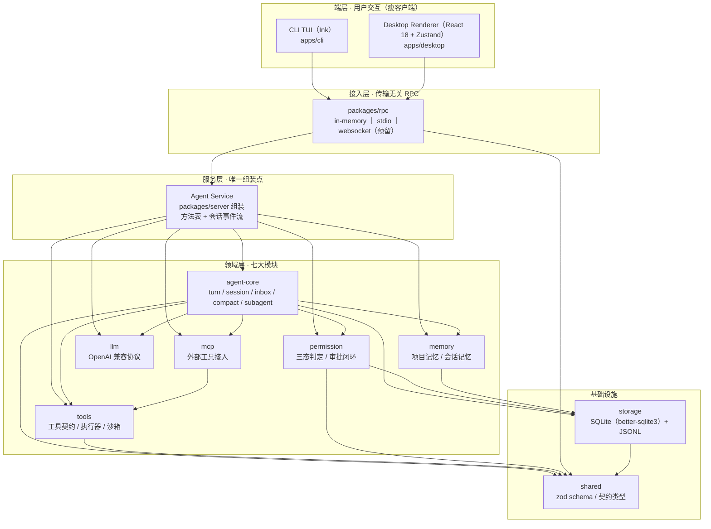
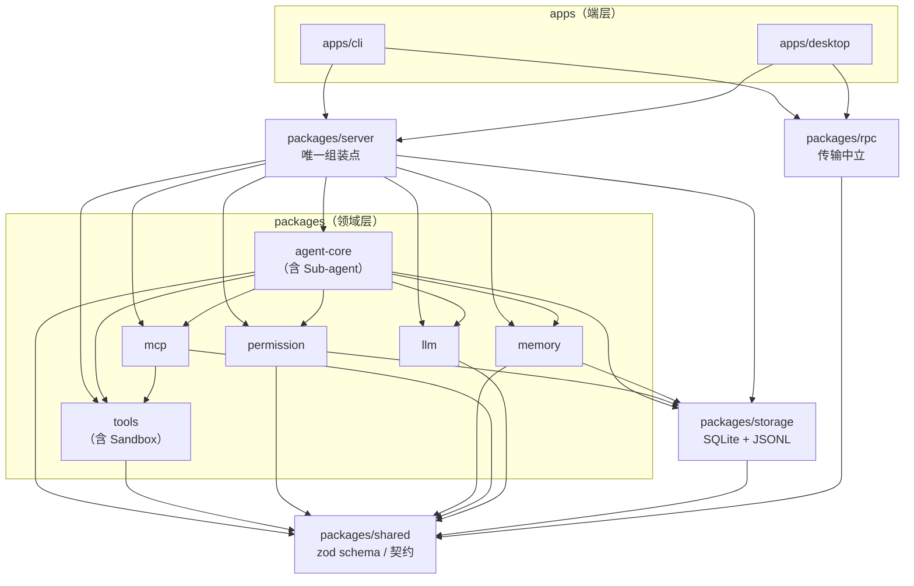
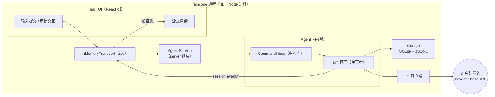
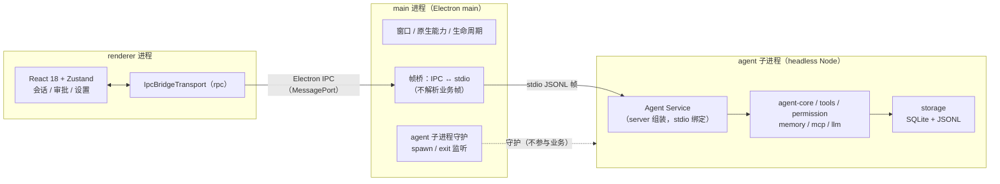

# RainCode 系统架构设计（04-architecture）

| 项目 | 内容 |
| --- | --- |
| 文档版本 | v1.0 |
| 发布日期 | 2026-09-24 |
| 文档状态 | 正式定稿 |
| 关联文档 | 01-PRD（产品基线：模块、优先级、NFR-1~7）· 02-module-design（七大模块详设）· 03-ui-design（双端 UI 规范） |

> 本文回答「系统如何组织」：分层、包划分与依赖方向、进程模型、RPC 传输、配置体系与架构治理。
> **包划分的唯一权威来源是 02-module-design §0.1「模块-包归属表」与 §0.2「依赖方向图」**，本文原样采用其结论，不新增、不合并任何包；模块内部的状态机、接口与边界场景见 02，本文不重复。
> 术语沿用 02 §0.3：Turn、单写者、CommandInbox、steering、sideEffectScope、三态、Compact。
> 02 文中引用的存储设计已正式落位为 05-database.md（原「03-data-model」编号顺延），本文涉及表名（`permission_rules`、`permission_decisions`、`memory_entries` 等）以 02/05 为准。

---

## 1. 架构总览

### 1.1 分层视图



> 图释：箭头表示**调用流**——请求自上而下（端层 → 接入层 → 服务层 → 领域层 → 基础设施），`session.event.*` 事件自下而上原路返回。**静态依赖方向**以 §2.3 为准（个别箭头在此为调用关系而非 import 关系，如 RPC → SRV 表示服务经 transport 绑定暴露）。

### 1.2 分层职责

| 层 | 职责 | 关键约束 |
| --- | --- | --- |
| 端层（CLI TUI / Desktop Renderer） | 渲染会话事件流、受理用户输入与审批交互、会话选择与设置界面 | 不持有业务事实：审批单、会话状态、todo 真源都在服务层；端层只有未提交草稿与乐观覆盖（对齐 ZCode 教训「UI 局部状态不是服务端事实」） |
| 接入层（rpc） | 提供 `IMessageTransport` 帧抽象与三种绑定（in-memory / stdio / websocket 预留），帧序列化与投递 | 对业务零感知：不解析方法名与 payload 语义；事件顺序保真 |
| 服务层（server） | **唯一组装点**：装配 agent-core + tools + permission + memory + mcp + llm 为 Agent Service；维护方法表（`session.* / turn.* / approval.* / provider.* / mcp.* / memory.*`）与会话事件流出口；多端收敛为单写者 runtime 实例 | 只做组装与协议暴露，不实现领域逻辑；不感知具体传输（transport 绑定发生在端层） |
| 领域层（六大领域包） | 承载七大功能模块（归属见 §2.2）：turn 循环、工具与沙箱、权限、记忆、MCP、模型协议 | 上层可依赖下层，禁止反向；内核对传输不可知（不 import rpc） |
| 基础设施（storage / shared） | storage：SQLite 元数据 + JSONL 会话事件流，唯一持久化出口；shared：zod schema 与跨包契约类型 | storage 之外禁止直接触碰 fs/sqlite；shared 只放 schema / 类型 / 纯函数，禁止行为逻辑（防「shared 巨石化」） |

### 1.3 一次典型请求的纵向链路（CLI）

1. 用户在 Ink TUI 提交输入 → CLI 发起 rpc 请求 `turn.submit`（in-memory 绑定，进程内直调）。
2. server 方法表路由到 agent-core：`CommandInbox` 判级接纳（`turn.new` / `turn.steer` / `session.control`，见 02 §1.2.3）。
3. Turn 进入 `ProcessingInput`：组装上下文——系统提示词 + MEMORY.md 全文注入（读一个文件）+ 历史消息（内存态）+ steering 合并，按 `maxContextTokens` 截断。
4. 消息经 zod 校验后以 JSONL 单条追加落盘（storage），随后向用户配置的 Provider baseURL 发出流式请求（llm）。
5. SSE 流经 llm 归一化，映射为 `session.event.*`（02 §1.2.4 映射表），沿 rpc 事件流推回 TUI 增量渲染。
6. 含工具调用时进入 `ToolSchedule → ToolExecution`：zod 入参校验 → 权限三态判定（ask 则生成审批单推回端层，端层只渲染与回传应答）→ 沙箱受控执行 → 结果聚合回传模型，循环直至 `TurnComplete`。
7. turn 收尾（settle）：事件落盘、追加 checkpoint、todo 状态持久化，回到 `Idle`。

NFR-2（输入→模型请求本地开销 ≤ 300ms）在该链路上的预算分配：

| 环节 | 预算 | 依据 |
| --- | --- | --- |
| 上下文组装（内存操作 + 读 MEMORY.md） | ≤ 100ms | 历史消息常驻内存，启动注入仅读一个文件（02 §7.2） |
| zod 校验 | ≤ 20ms | schema 编译产物缓存，单点校验（§4.3） |
| 消息 JSONL 追加落盘 | ≤ 30ms | 单行追加写，WAL 元数据更新 |
| 请求序列化与发出 | ≤ 50ms | Provider 客户端复用 keep-alive 连接 |
| 余量 | ≥ 100ms | 覆盖 GC 与磁盘抖动 |

### 1.4 性能基线的架构支撑（NFR 映射）

| 编号 | 指标 | 架构支撑措施 |
| --- | --- | --- |
| NFR-1 | CLI 冷启动 ≤ 2s | **单进程内嵌** Agent Service（无子进程 spawn 与握手）；启动关键路径最小化：TUI ready 即可交互，MCP 连接、记忆抽取、会话列表全量加载全部延后异步；依赖按需加载（编译产物直接 require，禁止顶层 await 链）；better-sqlite3 同步打开毫秒级 |
| NFR-2 | 本地开销 ≤ 300ms | §1.3 预算表；组装与落盘均在进程内完成，CLI 路径零 IPC |
| NFR-3 | 工具结果渲染 ≤ 100ms | CLI：事件进程内直调到渲染；桌面端：单跳 stdio 帧转发；UI 按 delta 增量提交，无轮询 |
| NFR-4 | 桌面空载内存 ≤ 500MB | 三进程之和计量（§3.2）；agent 子进程无大常驻缓冲（输出环形缓冲封顶 256KB、SQLite 页缓存限额、不做向量索引库——02 §7.1 明确记忆不做 embeddings 索引）；renderer 会话列表分页加载 |
| NFR-5 | 会话恢复 ≤ 1s | 「末尾 checkpoint + 增量重放」（02 §1.2.2）：每 turn 收尾追加 checkpoint 行，恢复只重放尾部增量；SQLite 元数据索引会话列表 |
| NFR-6 | 压缩异步零阻塞 | auto-compact 为独立异步任务，与 turn 循环解耦（02 §1.2.5）；`epoch` 单调校验防旧写覆盖；压缩期间输入与工具结果进保留区 |
| NFR-7 | 崩溃 100% 可恢复 | **JSONL 追加写是会话唯一事实源**，落盘粒度单条消息；checkpoint 是可重建的派生快照（状态无双写：真源唯一）；任意强杀后重放重建内存态，悬挂 tool_call 以 `isError=true` 补齐 |

---

## 2. monorepo 包划分与依赖方向

### 2.1 包清单

pnpm monorepo，`apps/*` 为可执行端，`packages/*` 为库包。

| 包 | 层 | 职责 | 可依赖 | 不可依赖 |
| --- | --- | --- | --- | --- |
| `apps/cli` | 端层 | Ink TUI、命令行参数解析、审批交互、会话选择与恢复 | `server`、`rpc`、`shared` | 任何领域包 / storage 的直接 import（内核与工具只能经 server 组装、经 rpc 调用） |
| `apps/desktop` | 端层 | Electron 壳：main（窗口 / 原生 / 子进程守护）、renderer（React UI）、agent 子进程宿主 | `server`（headless 入口）、`rpc`、`shared` | 领域包内部实现；renderer 侧严禁 import 任何 Node-only 包 |
| `apps/web` | 端层 | 浏览器工作台（React18 + Vite）：会话流 / 审批 / Provider 设置 / 管理面板（记忆 / 扩展 / 斜杠 / 用量，T4.5 对齐桌面端） | `rpc`（web 客户端）、`shared`（schema 类型，dev 依赖仅类型） | `server`（经 `raincode web` 宿主 WS 接入）、任何 Node-only 包、`apps/*` |
| `packages/server` | 服务层 | Agent Service 唯一组装点：装配内核与领域服务、方法表、会话事件流、headless 入口 | `agent-core`、`tools`、`permission`、`memory`、`mcp`、`llm`、`storage`、`shared` | `rpc`（传输绑定发生在端层）、任何 `apps/*` |
| `packages/agent-core` | 领域层 | Turn 循环、TurnPhase 状态机、CommandInbox、会话生命周期、auto-compact、Sub-agent（02 §1 / §4） | `llm`、`tools`、`permission`、`memory`、`mcp`、`storage`、`shared` | `rpc`（内核对传输不可知）、`server`、`apps/*` |
| `packages/tools` | 领域层 | 工具契约与注册表、执行器、内置工具集、进程级沙箱（02 §2 / §5） | `shared` | `permission`（经端口注入）、`agent-core`、`llm`、`mcp`、`storage`、`rpc`、`server`、`apps/*` |
| `packages/permission` | 领域层 | 五级判定链、bash 命令级求值、审批闭环、规则与审计持久化（02 §6） | `storage`、`shared` | `tools`、`agent-core`、`llm`、`mcp`、`memory`、`rpc`、`server`、`apps/*` |
| `packages/memory` | 领域层 | MEMORY.md 注入、会话记忆抽取与召回（02 §7） | `storage`、`shared` | `llm`（经端口注入）、`agent-core`、`tools`、`permission`、`mcp`、`rpc`、`server`、`apps/*` |
| `packages/mcp` | 领域层 | MCP server 连接管理、工具适配与命名空间注册（02 §3） | `tools`、`shared` | `permission`、`agent-core`、`llm`、`storage`、`memory`、`rpc`、`server`、`apps/*` |
| `packages/llm` | 领域层 | OpenAI 兼容协议适配、SSE 归一化、Provider 预设与工具 schema 编码 | `shared` | 一切领域包与会话/工具语义（02 规则：只做协议适配） |
| `packages/storage` | 基础设施 | SQLite（better-sqlite3，WAL）元数据 / 规则 / 记忆条目 + JSONL 会话事件流 + checkpoint | `shared` | 一切领域包与上层 |
| `packages/shared` | 基础设施 | zod schema 单一事实源、跨包契约类型、纯函数 | （无——底座，仅三方 zod） | 任何 RainCode 包 |
| `packages/rpc` | 接入层 | 帧协议、`IMessageTransport` 抽象、三种绑定、请求-响应关联 | `shared` | 领域包、`storage`、`server`、`apps/*`（业务语义不可见） |

**端层组件复用策略（T4.5 定，policy 先行）**：多端 UI 采用**按端最小实现**，不抽公共 renderer 子包——复用的正确粒度是**协议与方法表 + 会话状态机语义**（06 同一方法表；session-view 同构 reducer），而非组件树。理由：双端设计令牌不同（desktop 自有 tailwind 主题 `bg-panel/text-hi/dot` 等，web 为 `ink-*` 简化盘），统一令牌属设计系统立项且有回归已验收桌面 UI（UI-4）之险；新包还需 managedOnly 登记与双端构建接线。若未来出现第三端或令牌统一立项（M5+ 候选），再抽 `packages/renderer`——预留缝而非提前抽象。管理面板（记忆 / 扩展 / 斜杠 / 用量）双端同构消费同一服务面，验收口径：四面板服务面 smoke（smoke:web 用例 D）+ 桌面 GUI 走查（walkthrough-desktop）。

### 2.2 模块归属对应（与 02-module-design §0.1 逐条一致）

下表原样采用 02 §0.1 的模块-包归属表，是七大功能模块与 monorepo 包之间映射的唯一依据：

| # | 模块 | 主归属包 | 代码子域 | 优先级 | 一句话职责 |
| --- | --- | --- | --- | --- | --- |
| 1 | Agent Core（Agent 内核） | `packages/agent-core` | `src/turn`、`src/session`、`src/inbox`、`src/compact` | P0 | Turn 循环、状态机、串行接纳、流式桥接、上下文压缩 |
| 2 | Tool System（工具调用系统） | `packages/tools` | `src/registry`、`src/executor`、`src/handlers/*` | P0 | 工具契约、注册表、执行器、内置工具集 |
| 3 | MCP Integration（MCP 调用） | `packages/mcp` | `src/manager`、`src/transport` | P1 | 外部 MCP server 接入，统一注册进工具系统 |
| 4 | Sub-agent Manager（子代理管理） | `packages/agent-core` | `src/subagent` | P1 | 子代理 profile 解析、隔离会话派生、事件镜像 |
| 5 | Execution Sandbox（沙箱执行环境） | `packages/tools` | `src/sandbox` | P0（本地）/ P2（容器） | 进程级受控执行：路径约束、超时、输出预算、后台任务 |
| 6 | Permission Control（命令权限控制） | `packages/permission` | `src/evaluator`、`src/rules`、`src/approval` | P0 | 三态判定、bash 命令级规则、审批闭环、审计 |
| 7 | Project Memory（项目记忆系统） | `packages/memory` | `src/project-file`、`src/session-memory`、`src/recall` | P1 | MEMORY.md 注入、会话记忆抽取与召回 |

两点延续性说明（与 02 §0.1 注记一致，本文重申为架构约束）：

- **刻意不新增顶层包**：不设独立的 `sandbox`、`subagent` 包——ZCode 的教训是包粒度碎片化导致依赖图失控。沙箱内聚于 `tools`（它是工具执行的约束层），子代理内聚于 `agent-core`（复用同一内核工厂）。
- **归属表之外的包**（`server`、`rpc`、`storage`、`shared`、`llm`）是平台与基础设施包，不承载七大模块，因此不存在「模块重分配」问题；它们的存在只为让上表七个模块能以正确的方向组装。

### 2.3 依赖方向图



与 02 §0.2 依赖方向图的对应关系：

- **原样保留的边**：`server→agent-core`、`agent-core→{llm,tools,permission,memory,mcp,storage}`、`mcp→tools`、`permission→storage`、`memory→storage`、`{agent-core,tools,permission}→shared` 全部与 02 一致。
- **CLI→agent-core 的落地方式**：02 图中 `apps/cli → packages/agent-core` 表达「CLI 单进程内嵌内核」的逻辑关系；物理上该内嵌服务由 `packages/server` 统一组装（server 唯一组装点规则，见 §2.4），CLI 经 in-memory transport 调用，故在静态依赖图上表现为传递依赖（`cli → server → agent-core`），语义不变。
- **细化的边**（02 图的必要补全，不改变方向）：
  - `server→{tools,permission,memory,mcp,llm,storage}`：组装 `RuntimeConfig` 所需（02 §1.3 的配置项由 server 装配注入）；
  - `cli/desktop→rpc`：端层持有 transport 客户端；
  - 其余领域包→`shared`：契约类型与 schema 的统一真源（02 已列三条代表边，此处泛化为规则）。
- **拓扑序**（分层编号，层号小者被依赖）：`shared`(0) → `{storage, rpc, llm, tools}`(1) → `{permission, memory, mcp}`(2) → `agent-core`(3) → `server`(4) → `apps/*`(5)。该序无环，是 §6 治理检查的判定基准。

### 2.4 依赖规则（铁律）

1. **上层依赖下层，禁止反向**：按 §2.3 拓扑序单向依赖；领域包永不 import `server` 或 `apps/*`；内核不反向依赖端层。
2. **shared 与 storage 是被依赖底座**：`shared` 只放跨包 zod schema、契约类型与纯函数，禁止行为逻辑（防 ZCode「shared 巨石化」）；`storage` 是唯一持久化出口，任何包不得绕过它直接使用 fs/SQLite（MEMORY.md 文件读写经 memory 包、会话流经 storage 统一封装）。
3. **rpc 是传输中立层**：帧协议归 rpc；业务方法与事件 payload 的 zod schema 归 shared（端层 renderer 需要它们但不能 import Node-only 的 server）。领域包与内核**禁止 import rpc**——内核对传输不可知。
4. **server 是唯一组装点**：`AgentRuntimeFactory` 的装配（工具注册、权限绑定、记忆服务、MCP 管理、Provider 客户端）只发生在 server。CLI、桌面 agent 子进程、子代理三者都领取「组装好的服务」，禁止各自拼装内核依赖，杜绝第二组装点。
5. **端口注入替代跨包静态依赖**：两处运行期依赖以注入完成，避免新增静态边——
   - `tools` 的 `ToolExecutor` 执行权限判定时，经执行上下文注入 `PermissionEvaluator` 端口（端口类型在 shared，server 装配时绑定 permission 实现）；
   - `memory` 的会话抽取需要模型调用时，经装配注入 `Summarizer` 端口（同理）。
6. **跨包只从 publicEntrypoints 导入**：禁止深导入（deep import）；契约类型真源在 shared，`tools` 对外 re-export `ToolMetadata` 等类型以保持 02 §2.3 的导入路径，避免双写。
7. **禁止循环依赖**：以 §6 的 policy YAML 与 CI 检查强制执行，违规即阻断合入。

---

## 3. 进程模型

### 3.1 CLI：单进程内嵌



要点：

- **一个进程承载全部**：TUI、rpc 绑定、Agent Service、内核、存储、Provider 客户端同进程。请求-响应是进程内直调，事件是进程内回调——NFR-1/NFR-2 的开销结构因此最优。
- **启动顺序**：进程启动 → 依赖按需加载 → SQLite 打开（同步、毫秒级）→ Ink 首帧渲染（TUI ready）→ 异步补齐：会话列表、MCP 连接、记忆抽取。TUI ready 前不做任何网络探测与重活。
- **单进程的故障面**：进程崩溃即整体退出。兜底是 NFR-7：会话事实在 JSONL 逐条落盘，重启后 `--resume` 从 checkpoint 续接，零丢失。

### 3.2 桌面端：三泳道



三泳道职责与通道：

| 泳道 | 职责 | 不做什么 | 对外通道 |
| --- | --- | --- | --- |
| main | 窗口与原生能力、生命周期调度、agent 子进程守护、帧转发 | **不承载业务状态**：不解析业务帧、不保存会话/审批事实（对齐 ZCode「main 只做转发」边界） | renderer 侧 Electron IPC（MessagePort）；agent 侧 stdio |
| renderer | React UI：会话流渲染、审批弹窗、Provider 设置、MCP 面板 | 不 import 任何 Node-only 包；不持有业务事实（草稿与乐观覆盖除外） | 经 `IpcBridgeTransport` 收发 rpc 帧 |
| agent 子进程 | 与 CLI 完全相同的 Agent Service（同一 server 组装函数 + stdio 绑定），承载全部业务与持久化 | 不接触窗口系统 | stdio（stdin/stdout，JSONL 帧编码） |

通道细节：业务 rpc 帧在 renderer 与 agent 子进程之间**端到端透传**——renderer 的 `IpcBridgeTransport` 把帧交给 main，main 原样写入 agent 子进程 stdin；反方向同理。main 只做字节转发与子进程生命周期管理，因此协议演进与 main 无关。

### 3.3 生命周期

| 生命周期事件 | 策略 |
| --- | --- |
| agent 子进程拉起 | 首个会话打开时 spawn（P1 简化，不做启动预热） |
| 空闲回收 | **不主动回收**：个人单机场景下回收收益（少量内存）低于重连与状态重建成本；P2 如引入再评估 |
| 主进程退出 | 级联终止 agent 子进程（OS 级进程树终止，main 不依赖领域包实现）；未收尾的 turn 由 JSONL 兜底，下次 `--resume` 续接 |
| agent 子进程崩溃 | main 监听 exit，UI 显式提示；会话数据零丢失（NFR-7），重启子进程后恢复会话 |
| renderer 刷新 / 重开 | agent 子进程不受影响；renderer 重连后补推未决审批单与会话事件（沿用 02 §6.4 的客户端重连补推机制） |

### 3.4 为何桌面端拆 agent 子进程而 CLI 不拆

| 维度 | 桌面端（拆） | CLI（不拆） |
| --- | --- | --- |
| 宿主生命周期 | renderer 刷新 / 崩溃 / 导航频繁，若 Agent 运行在 renderer 内，刷新即杀死运行中的 turn；拆出后 agent 独立存活，刷新只丢 UI 态 | 终端进程生命周期稳定，无「刷新」概念；崩溃兜底由会话恢复承担 |
| 原生模块 ABI | better-sqlite3 无法在 contextIsolation 的 renderer 中运行；放 main 则把原生模块绑死在 Electron 的 Node ABI 上（需 electron-rebuild），且 SQLite 同步调用会阻塞窗口消息 | 纯 Node 运行时，无 ABI 冲突；单进程反而减少原生模块加载份数 |
| 职责纯度 | main 必须保持「窗口 + 转发」的轻职责，业务进入 main 会让窗口操作与 turn 循环互相卡顿 | 无第二职责方，不存在争抢 |
| 复用与复杂度 | agent 子进程 = 「无 TUI 的 headless Agent Service」，与 CLI 共用同一 server 组装 + stdio 绑定，**零新增引擎** | 单进程是 ZCode「多泳道进程复杂度」教训的直接采纳：进程模型只在必要时增加 |
| 冷启动 | 桌面端无 NFR-1 硬指标，spawn 一次可接受 | NFR-1 ≤ 2s 硬指标：子进程 spawn + stdio 握手是纯开销，必须省掉 |

结论：**进程边界的判据是宿主生命周期差异与原生模块约束，而非「看起来更架构化」**。CLI 满足不了桌面端的隔离需求时才拆，桌面端没有 CLI 的冷启动压力时才付得起拆的成本。

---

## 4. 传输无关 RPC 设计

### 4.1 帧协议与 IMessageTransport 抽象

rpc 层只关心「帧」：JSON-RPC 2.0 语义（id / method / params / result / error），帧编码由各绑定决定（JSONL / WS 消息）。

```typescript
// packages/rpc/src/transport.ts
export type Unsubscribe = () => void;

export type RpcFrame =
  | { kind: "request";  id: string; method: string; params: unknown }
  | { kind: "response"; id: string; ok: boolean; result?: unknown;
      error?: { code: string; message: string } }
  | { kind: "event";    name: string; payload: unknown };

export interface IMessageTransport {
  /** 发送一帧；transport 不感知业务语义，仅负责序列化与投递。 */
  send(frame: RpcFrame): void;
  /** 订阅到达帧；实现方保证同一会话的事件按产生顺序投递。 */
  onFrame(listener: (frame: RpcFrame) => void): Unsubscribe;
  /** 优雅关闭：flush 待发帧后断开。 */
  close(reason?: string): Promise<void>;
  readonly isClosed: boolean;
  readonly kind: "in-memory" | "stdio" | "websocket";
}
```

客户端与服务端适配器（签名示意）：

```typescript
// packages/rpc/src/client.ts —— 请求-响应模式：id 关联 + 超时 + 事件订阅
export interface RpcClient {
  call<T>(method: string, params: unknown): Promise<T>;
  onEvent(name: string, listener: (payload: unknown) => void): Unsubscribe;
}

// packages/rpc/src/server.ts —— 服务端绑定：方法表（schema + handler）与事件出口
export interface RpcServiceBinding {
  transport: IMessageTransport;
  methods: Record<string, {
    schema: z.ZodTypeAny;                                   // 入口单点校验（§4.3）
    handler: (params: unknown, ctx: CallContext) => Promise<unknown>;
  }>;
  publish(event: { name: string; payload: unknown }): void; // session.event.* 出口
}
```

### 4.2 两种通信模式

| 模式 | 方向 | 语义 | 例子 |
| --- | --- | --- | --- |
| 请求-响应 | 端层 → 服务层 | `id` 关联的同步等待，带超时与结构化错误码 | `session.create`、`turn.submit`、`approval.respond`、`provider.switch` |
| 事件流 | 服务层 → 端层 | 单向推送，按会话有序（单写者保证），fire-and-forget | `session.event.text_delta`、`tool_calls_requested`、`subagent_progress`、审批单推送 |

约定：客户端到服务端只有 request；服务端到客户端只有 response 与 event。流式输出不是长驻请求，而是「turn.submit 立即返回受理结果 + 后续事件推送」——这样 CLI 与桌面端的断线重连语义一致（重连后补推未决审批与恢复事件流，见 §3.3）。

### 4.3 zod 校验位置：边界单点校验

```
端层（不校验业务参数，信任本机 UI） ──rpc──▶ server 方法表入口【zod 校验一次】 ──▶ 领域包（不再校验传输结构）
服务层构造事件（schema 构造函数生成，构造期即合法） ──rpc──▶ 端层【dev 模式校验，生产关闭】
```

- **服务端入口单点校验**：每个方法的入参 schema 注册在方法表（`methods[method].schema`），handler 执行前校验一次；schema 真源在 `packages/shared`（zod 单一事实源，PRD §6.2），server 与两端共同引用。
- **事件构造期保证**：事件 payload 由 server 经 shared 的 schema 构造函数生成，出口即合法；客户端校验仅作为开发模式断言（`NODE_ENV=development` 开启），生产关闭以省渲染开销。
- **领域层零传输校验**：进入 agent-core / tools / permission 的数据已合法，领域包只做业务不变量校验（如 TurnPhase 迁移合法性、oldString 唯一匹配），不重复解析传输结构——避免 ZCode 式「层层都查一遍」的过度工程。
- 校验失败统一返回结构化错误（`invalid_params` + schema 摘要），模型可见时附自纠提示（与 02 §2.4 工具入参错误策略同构）。

### 4.4 三种绑定

| 绑定 | Transport 实现 | 物理载体 | 使用场景 | 里程碑 |
| --- | --- | --- | --- | --- |
| in-memory | `InMemoryTransport` | 进程内直调 + 事件回调，零序列化 | CLI 端内嵌 Agent Service（§3.1） | P0 |
| stdio | `StdioTransport` | stdin/stdout，每行一帧 JSONL | 桌面 main ↔ agent 子进程（§3.2）；未来任意 headless 宿主 | P1 |
| websocket | `WebSocketTransport` | WS 文本消息（帧协议与 stdio 完全一致） | Web 界面（raincode web / apps/web 工作台） | ✅ 已落地（T3.8） |

- **renderer ↔ main 桥**不是第四种业务绑定：renderer 侧的 `IpcBridgeTransport` 与 main 的帧桥组合后，逻辑上等价于一条到 agent 子进程的虚拟 stdio——业务帧端到端透传（§3.2）。
- **传输无关的最终验证（T3.8 已落地）**：Agent Service 的方法表与会话事件协议不因传输改变——Web 宿主仅新增 WebSocketTransport 绑定 + 连接级鉴权门（ws.auth）即复用全部 server 能力，帧协议与方法表零改动（02 §8 将其列为 ZCode 亮点的继承项；差异定义见 06 §6.3）。

---

## 5. 配置体系

### 5.1 配置层级与合并规则

```text
优先级（低 → 高）：
  ① 全局     ~/.raincode/config.json
  ② 项目     <workspace>/.raincode/config.json
  ③ 会话级   CLI 参数 / 环境变量（如 RAINCODE_PROVIDER）
```

- **就近覆盖**：② 覆盖 ①，③ 覆盖 ②；对象深合并，数组整体替换。
- **严格 schema**：配置以 zod schema 解析（真源 shared），未知字段拒绝（strict），防拼写错误静默失效；`configVersion` 字段做向前兼容迁移。
- **职责分离**：MCP 服务器清单用独立文件（全局 `~/.raincode/mcp.json` + 项目 `.raincode/mcp.json`，结构见 02 §3.3 `McpServerConfig`）；权限规则持久化在 SQLite `permission_rules` 表而非 config.json（02 §6.3，因其需要 allow-always 的运行期高频写入与优先级合并）。

### 5.2 配置结构与 Provider 四要素

`config.json` 示例（结构示意，非实现代码）：

```json
{
  "configVersion": 1,
  "providers": [
    {
      "id": "deepseek",
      "name": "DeepSeek",
      "baseURL": "https://api.deepseek.com/v1",
      "apiKeyRef": "keyring://raincode/deepseek",
      "model": "deepseek-chat",
      "maxContextTokens": 65536
    },
    {
      "id": "ollama",
      "name": "Ollama (local)",
      "baseURL": "http://127.0.0.1:11434/v1",
      "apiKeyRef": null,
      "model": "qwen2.5-coder:14b",
      "maxContextTokens": 32768
    }
  ],
  "activeProviderId": "deepseek",
  "permissions": { "defaultBehavior": "ask" },
  "compaction": { "thresholdRatio": 0.8, "keepRecentCount": 20 }
}
```

- Provider 四要素 `baseURL + apiKey + model + maxContextTokens` 对应 PRD AC-4；配置文件中 apiKey 位置只存**引用** `apiKeyRef`（见 §5.3）。
- 内置预设 OpenAI / DeepSeek / Kimi / GLM / Ollama 以 preset 内置（预填 baseURL 与推荐 model，`apiKeyRef` 留待用户补填），用户以 `id` 引用或整段自定义。
- 模型运行时切换（AC-11）：`provider.switch` 方法更新 activeProviderId，当前会话可继续（切换只影响后续请求的客户端绑定，会话历史不动）。

### 5.3 敏感信息处理

| 项 | 策略 |
| --- | --- |
| API Key 存储 | 默认存**系统凭据库**（Windows Credential Manager），config.json 只存 `apiKeyRef` 引用；降级路径为本地 secrets 文件（0600 权限，用户显式选择） |
| 运行时生命周期 | llm 包在发请求前解析 `apiKeyRef` 为内存值；不持久化到任何落盘结构 |
| 日志与会话流 | API Key 与凭据类环境变量**不写入**日志、会话 JSONL、审批审计记录——审计输入先过脱敏过滤（02 §3.4 `SECRET_ENV_FILTER`、§6.3 decisions 脱敏） |
| 出网边界 | 出网目标仅限用户显式配置的三类：Provider baseURL、MCP Server、远程执行目标（PRD §6.4 约束）；无遥测上报 |
| 错误信息 | Provider 错误透传前过滤请求头与 URL 中的凭据片段，避免经 `turn_failed` 事件进入会话流 |

### 5.4 config dump：配置静态归并投影（T5.5）

`raincode config dump`（apps/cli/src/commands/config.ts）是配置体系（§5.1~§5.3）的**只读观测面**：不 boot 服务、不产生配置副作用，按归并链静态列层、逐项标来源（dsh dump-config 同纪律）。

- **归并链**：Provider 启动配置域 = 内置默认 → providers 配置文件（`--provider-config` / `RAINCODE_PROVIDER_CONFIG` / `<cwd>/config/providers.local.json`）→ env（`RAINCODE_PROVIDER_*`）→ CLI 参数；全局配置域 = 内置默认 → `<dataRoot>/config.json`（经 `ConfigStore.read()` 同一读路径——dump 与 `config.get` 看到同一份文档）。
- **来源标签**：Provider 四要素逐字段标 `CLI 参数 / env / providers 配置文件 / 内置默认 / 未配置`（`resolveProviderConfig` 的 additive `fieldSources` + `configPath`）；config.json 文档逐字段标 `config.json / 内置默认`。`permissions` / `compaction` 节如实标注「schema 已声明，运行时消费方未接线」——dump 输出与实际生效一致是验收标准（07 §11.2 T5.5）。
- **`--default-only` 损坏诊断**：跳过一切文件读取（config.json / providers 配置文件），只打印内置默认层与环境变量——配置文件损坏时的恢复诊断；正常模式在文件损坏时也尽量打印其余层并输出诊断行（退出码 1）。
- **安全（§5.3 同源）**：明文 key 与凭据类 env（`RAINCODE_PROVIDER_API_KEY` / `RAINCODE_WEB_TOKEN`）值绝不入输出——只显示「已配置/已设置」状态与来源层；单测锁定明文不入输出断言。

---

## 6. 架构治理

借鉴 ZCode 的「策略声明化 + CI 检查」做法：依赖规则不靠约定与 review 记忆，而由机器强制。

### 6.1 策略文件（architecture-policy.yaml）

```yaml
version: 1

global:
  maxFileLines: 500          # 单文件上限（含空行与注释），超限阻断
  forbidCycles: true         # 模块依赖图禁止环（SCC 检测）
  forbidDeepImports: true    # 跨包只允许从 publicEntrypoints 导入
  managedOnly: true          # 未登记目录禁止新增包

modules:
  - id: shared
    roots: [packages/shared/src]
    managed: true
    requires: []                                   # 底座：不依赖任何 RainCode 包
  - id: storage
    roots: [packages/storage/src]
    managed: true
    requires: [shared]
    publicEntrypoints: [packages/storage/src/index.ts]
  - id: rpc
    roots: [packages/rpc/src]
    managed: true
    requires: [shared]
    publicEntrypoints: [packages/rpc/src/index.ts]
  - id: llm
    roots: [packages/llm/src]
    managed: true
    requires: [shared]
    publicEntrypoints: [packages/llm/src/index.ts]
  - id: tools
    roots: [packages/tools/src]
    managed: true
    requires: [shared]
    publicEntrypoints: [packages/tools/src/index.ts]
  - id: permission
    roots: [packages/permission/src]
    managed: true
    requires: [storage, shared]
    publicEntrypoints: [packages/permission/src/index.ts]
  - id: memory
    roots: [packages/memory/src]
    managed: true
    requires: [storage, shared]
    publicEntrypoints: [packages/memory/src/index.ts]
  - id: mcp
    roots: [packages/mcp/src]
    managed: true
    requires: [tools, shared]
    publicEntrypoints: [packages/mcp/src/index.ts]
  - id: agent-core
    roots: [packages/agent-core/src]
    managed: true
    requires: [llm, tools, permission, memory, mcp, storage, shared]
    publicEntrypoints: [packages/agent-core/src/index.ts]
  - id: server
    roots: [packages/server/src]
    managed: true
    requires: [agent-core, tools, permission, memory, mcp, llm, storage, shared]
    publicEntrypoints: [packages/server/src/index.ts]
  - id: app-cli
    roots: [apps/cli/src]
    managed: true
    requires: [server, rpc, shared]
  - id: app-desktop
    roots: [apps/desktop/src]
    managed: true
    requires: [server, rpc, shared]

exceptions: []               # 白名单外豁免必须显式登记并附理由，随 PR 评审
```

### 6.2 检查脚本职责

`architecture:check` 单脚本承担五类检查，输出结构化报告（违规文件、命中规则、修复建议），违规时退出码非零：

| 检查项 | 内容 |
| --- | --- |
| 越权依赖 | 实际 import 关系 ⊆ policy `requires` 白名单（对照 §2.3 拓扑序） |
| 循环依赖 | 模块图强连通分量（SCC）检测，任何非平凡 SCC 即违规 |
| 深导入 | 跨包 import 路径必须命中目标包 `publicEntrypoints`；`exceptions` 中的豁免需指向真实存在的导入，过期即报错 |
| 行数上限 | `maxFileLines: 500` 逐文件检查（对应设计基线「单文件 ≤ 500 行」，比 ZCode 的 400 放宽一档，方向仍是抑制碎片化小文件与巨石大文件两个极端） |
| 包登记 | `managedOnly`：`apps/`、`packages/` 下新目录必须先登记进 policy 才允许合入 |

`--changed` 模式只检查变更文件所在模块，保障本地与 PR 反馈速度；主分支每日跑一次全量。

### 6.3 CI 集成与演进规则

- **三门槛并行**：PR 流水线固定跑 `pnpm typecheck`、`pnpm lint`、`pnpm architecture:check --changed`，任一失败阻断合入。
- **策略即代码**：policy 文件本身的变更必须出现在 PR diff 中并接受评审——放宽依赖白名单、提高行数上限、新增 exceptions 都是有意识的结构决策，不允许「顺手改」。
- **演进节奏**：每个里程碑（M1/M2/M3）收尾时做一次全量检查与孤儿模块清理；新增包前先回答「是否属于七大模块归属表或五类平台包」，两者皆否则禁止建包（§2.2 的防碎片化约束）。
- **生成物防漂移（门禁 6，双生成物）**：`pnpm protocol:check`（T4.3 协议目录）+ `pnpm event-matrix:check`（T5.5 事件矩阵，扩展同管线）逐字节比对 `docs/generated/` 两个生成物——源码扫描面演进后必须 `protocol:gen` / `event-matrix:gen` 再生成随代码提交；事件矩阵另设防漏登记守卫（事件域前缀点分字面量未登记即生成器报错）。

---

## 7. 技术决策记录（ADR）

| 编号 | 决策 | 背景 / 动因 | 代价与缓解 |
| --- | --- | --- | --- |
| ADR-01 | 存储用 better-sqlite3 + JSONL，而非 Prisma 等 ORM | PRD 基线；个人单机场景：同步 API 免连接池、零抽象层、SQLite 单文件嵌入即用；JSONL 追加写是 NFR-7（崩溃 100% 可恢复）的唯一可靠载体——追加语义天然抗强杀 | 原生模块需按平台分发预编译产物（Windows 优先）；schema 演进需手写迁移脚本；缓解：storage 单包封装全部 SQL，其他包只见端口 |
| ADR-02 | TUI 用 Ink（React for CLI），而非纯 readline —— **修订（2026-09-29 实施，2026-10-03 注记）：CLI 实际落地为 readline REPL + ANSI 富文本渲染层（ADR-02 中间形态，见 PROGRESS 2026-09-29「CLI 展示升级」），Ink 降级为后续可选升级路径而非既定承诺** | 会话流式渲染、工具卡片、审批交互是组件化问题，React 的声明式 diff 恰好匹配「事件流 → UI」模型；与桌面端 renderer 共享 React 心智。修订动因：实测冷启动预算下不引入 TUI 框架即达 NFR-1，readline 中间形态已覆盖消息流/工具行/审批块全部交互 | React 运行时带来启动开销，威胁 NFR-1；缓解：按需加载 + TUI ready 后异步补齐（§3.1），预算实测为准。修订后缓解升级为：不引入 React 运行时直接消除该项开销；升级 Ink 前需重新评审 NFR-1 预算（legacy-items L-10 关闭此偏差） |
| ADR-03 | CLI 单进程内嵌 Agent Service，不拆子进程 | NFR-1 冷启动 ≤ 2s 硬指标：子进程 spawn + stdio 握手是纯开销；CLI 无 renderer 刷新/崩溃问题、无 Node ABI 冲突；ZCode 教训「多泳道进程复杂度」——CLI 先单进程 | CLI 进程崩溃即全退；缓解：JSONL 追加写 + checkpoint 使重启恢复零丢失（NFR-7），故障面可控 |
| ADR-04 | 桌面端拆 agent 子进程（main / renderer / agent 三泳道，stdio RPC） | renderer 刷新会杀死运行中的 turn；better-sqlite3 无法进 renderer，放 main 则绑死 Electron Node ABI 且阻塞窗口职责；拆出后 agent 子进程与 CLI 共用同一 server 组装 + stdio 绑定，零新增引擎 | 多一层的 spawn/守护/帧桥复杂度与 NFR-4 内存计量项；缓解：main 不解析业务帧（只转发），生命周期策略从简（§3.3） |
| ADR-05 | 包归属收敛：沙箱并入 tools、子代理并入 agent-core，不设独立顶层包 | ZCode 教训：方法级碎片化包导致依赖图失控、上下文跳跃；沙箱是工具执行的约束层、子代理复用同一内核工厂，都不具备独立包的依赖独立性 | 单包内聚度要求变高；缓解：policy 行数上限 + 包内目录子域（02 §0.1 代码子域）保持可导航性 |
| ADR-06 | server 是唯一组装点，CLI/桌面/子代理共用装配 | 三处各自拼装 RuntimeConfig 会产生三份装配逻辑漂移（工具集、权限绑定、Provider 不一致）；子代理与主代理「零新引擎」的前提就是同一工厂同一装配 | server 成为高扇入模块；缓解：server 只做组装与协议暴露、不做领域逻辑，policy 限制其 requires 白名单防继续膨胀 |
| ADR-07 | zod 边界单点校验 + schema 真源在 shared | PRD §6.2「所有对外数据结构以 zod 为单一事实源」；rpc 跨越进程边界（桌面端）必须有运行时校验；层层重复校验是过度工程 | 校验表需与方法表同步维护；缓解：方法表结构强制携带 schema（§4.1），漏注册即无法暴露方法 |
| ADR-08 | 传输无关 RPC：in-memory / stdio / websocket 三绑定，自研 JSONL 帧协议 | 双端一体（终端会话桌面续接）要求同一服务协议；gRPC/protobuf 对个人工具过重；自研帧协议保持零依赖与可调试性（stdio 可人工 cat 调试） | 帧协议需自行处理粘包（JSONL 逐行天然分帧）、版本演进；缓解：`configVersion`/帧版本字段 + 端到端透传保持 main 不感知版本 |
| ADR-09 | 会话历史唯一真源 = JSONL 事件流，checkpoint 为可重建派生快照 | NFR-7 要求任意强杀零丢失：追加写 > 原地更新；SQLite 存可索引元数据，事件流存全部事实，两者职责不同不构成状态双写（checkpoint 丢了可从 JSONL 全量重建） | 恢复需重放，大历史慢；缓解：「末尾 checkpoint + 增量重放」达成 NFR-5 ≤ 1s |
| ADR-10 | 多 Provider 统一 OpenAI 兼容协议，而非逐家官方 SDK | PRD 基线（AC-3/AC-4）：一套协议接入任意 Provider 含本地 Ollama，模型自由是产品差异化主张；逐家 SDK 会把 llm 包变成 N 个厂商的粘合巨石 | 个别厂商特有能力（原生工具语义、缓存控制等）需在兼容层近似或放弃；缓解：llm 包内以「统一事件 + 归一化差异」收敛（02 §1.2.4 映射表），新增 Provider 只改 llm 包 |
| ADR-11 | 产品更名 NovaCode → RainCode（2026-09-29） | 用户品牌统一决策：个人开源仓库以 RainCode 命名，CLI / 桌面端等后续形态遵循同一命名 | 全仓标识符同步替换（包名 @raincode/*、bin raincode、env RAINCODE_HOME/RAINCODE_PROVIDER_*、数据目录 .raincode、文档与 UI 文案）；PROGRESS §3/§4 历史日志与 docs/benchmarks/ 历史基准报告保留旧名作为当时事实记录，不作回改 |

---

## 8. 自检清单

- [x] **包划分与 02-module-design §0.1 逐条一致**：七大模块归属包、代码子域、优先级原样保留（§2.2）；未新增、未合并任何包；「不设 sandbox/subagent 顶层包」的刻意决策被重申为架构约束。
- [x] **依赖方向无环**：§2.3 拓扑序 `shared(0) → {storage,rpc,llm,tools}(1) → {permission,memory,mcp}(2) → agent-core(3) → server(4) → apps(5)` 单向无环；跨包依赖全部落在 policy `requires` 白名单内（§6.1），由 CI 强制。
- [x] **CLI 与桌面端进程模型均覆盖**：CLI 单进程内嵌（§3.1）、桌面端三泳道（§3.2）及其生命周期（§3.3）与拆分判据（§3.4）。
- [x] **性能基线在架构上有对应支撑**：NFR-1~7 逐条映射到架构措施（§1.4）；NFR-2 进一步给出链路预算分配（§1.3）。
- [x] **与 ZCode 经验的取舍可追溯**：亮点（传输无关 RPC、内核工厂、声明式副作用元数据、显式状态机 + 单写者）全部继承；教训（碎片化文件、过度工程、状态双写、shared 巨石化、多泳道复杂度）分别在 §2.4、§4.3、§2.4/ADR-09、§1.2/§6、§3.4 有对应规避措施。
