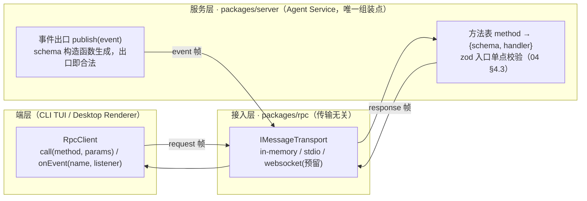
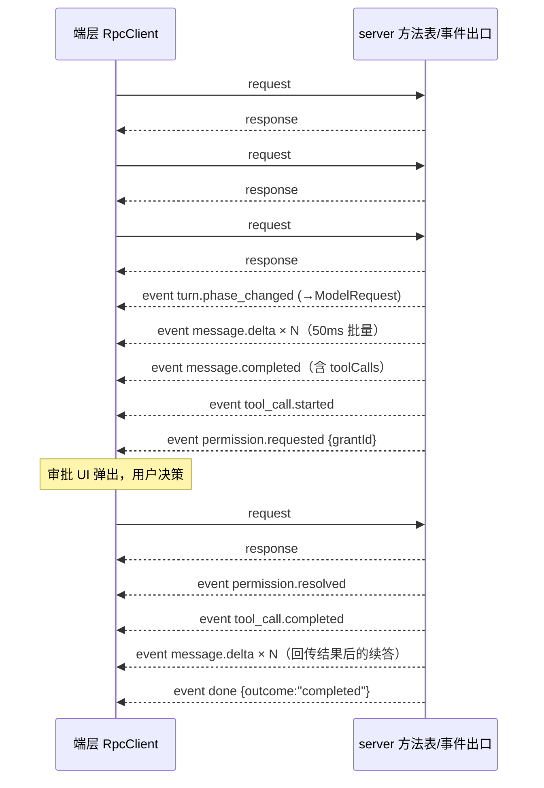
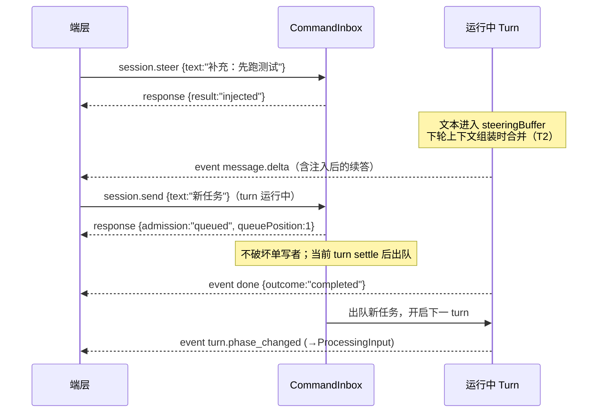

# RainCode API 接口规范（06-api-spec）

| 项目 | 内容 |
| --- | --- |
| 文档版本 | v1.0 |
| 发布日期 | 2026-09-28 |
| 文档状态 | 正式定稿 |
| 协议版本 | protocolVersion `1.0` |
| 关联文档 | 02-module-design（模块接口语义权威）· 04-architecture（§4 传输无关 RPC 设计权威）· 03-ui-design（事件消费方）· 01-PRD（NFR 性能基线） |

> 本文是 04-architecture §4「传输无关 RPC 设计」的协议详细化：定义控制面（请求-响应）方法全集、数据面（事件流）事件全集、错误码、zod schema 组织约定与传输绑定映射。
> 方法语义以 02-module-design 各模块「对外接口」签名为权威；帧结构以 04 §4.1 `RpcFrame` 为权威。本文不重复模块内部设计，只定义「线上契约」。
> 约定：叙述为中文；方法名、事件名、schema 字段、JSON 示例为英文。本文只定义协议，不包含实现代码（TS 类型/schema 签名/JSON 示例除外）。

---

## 1. 协议总览

### 1.1 分层与双面模型

协议分两面：**控制面**（端层 → 服务层的请求-响应，同步等待、带超时与错误码）与**数据面**（服务层 → 端层的事件流，单向推送、fire-and-forget）。两面共用同一条传输连接与同一套 zod schema。



| 模式 | 方向 | 语义 | 约定 |
| --- | --- | --- | --- |
| 请求-响应（控制面） | 端层 → 服务层 | `id` 关联的同步等待，超时产生 `TIMEOUT` | 客户端到服务端**只有 request**；默认客户端超时 10s，个别方法有专属上限（见 §2 各表说明） |
| 事件流（数据面） | 服务层 → 端层 | 单向推送，按会话有序（单写者保证），at-most-once | 服务端到客户端**只有 response 与 event**；无服务端发起的 request，一切主动通知都是 event |

关键约定（继承 04 §4.2）：**流式输出不是长驻请求**。`session.send` 立即返回受理结果，后续内容以事件推送——CLI 与桌面端因此获得一致的断线重连语义（重连后经 `session.resume` 补推快照与未决审批）。

帧方向汇总（谁可以发什么）：

| 帧类型 | 端层可发 | 服务层可发 | 说明 |
| --- | --- | --- | --- |
| `request` | ✓ | ✗ | 服务端不会向端层发起请求；一切主动通知都是 event |
| `response` | ✗ | ✓ | 与 request 一一对应，含成功（`result`）与失败（`error`）两种形态 |
| `event` | ✗ | ✓ | 数据面唯一载体，payload 见 §3；端层按 `name` 分发、按 `seq` 去重 |

### 1.2 帧结构（RpcFrame）

帧结构原样采用 04 §4.1，JSON-RPC 2.0 语义（`id / method / params / result / error`）。错误对象在 04 的 `{code, message}` 基础上细化为 `{code, message, details?}`——`details` 为可选扩展字段，旧解析器忽略未知字段即可，不构成破坏性变更（演进规则见 §7）。

```typescript
// packages/rpc/src/transport.ts —— 与 04 §4.1 逐字段一致
export type RpcFrame =
  | { kind: "request";  id: string; method: string; params: unknown }
  | { kind: "response"; id: string; ok: boolean; result?: unknown;
      error?: { code: string; message: string; details?: unknown } }
  | { kind: "event";    name: string; payload: unknown };
```

三种帧的线上示例：

```json
// request（端层 → 服务层）
{ "kind": "request", "id": "req-000001", "method": "session.send",
  "params": { "sessionId": "s_01J5K8Q7", "input": { "text": "修复 login 模块的空指针" } } }

// response（服务层 → 端层）
{ "kind": "response", "id": "req-000001", "ok": true,
  "result": { "turnId": "t_01J5K9D2", "admission": "started" } }

// event（服务层 → 端层）
{ "kind": "event", "name": "message.delta",
  "payload": { "seq": 42, "sessionId": "s_01J5K8Q7", "ts": 1769587200000,
               "turnId": "t_01J5K9D2", "round": 1,
               "delta": { "type": "text", "text": "我先看一下 " } } }
```

帧结构**不内嵌版本字段**（与 04 §4.1 一致）；协议版本经 `system.ping` 握手协商（§1.4、§7）。`id` 由客户端生成、在连接内唯一（建议 `<prefix>-<自增序号>`）；event 帧无 `id`。

**帧处理规则**（双方实现必须遵守）：

| 规则 | 内容 |
| --- | --- |
| id 关联 | response 帧的 `id` 必须与对应 request 一致；收到未知 id 的 response 丢弃并计数告警（多为超时后的迟到应答） |
| 串行不阻塞 | 客户端**不得**为等待某个 response 而停止处理后续帧——事件与 response 共用通道，阻塞即死锁 |
| 单请求多帧应答 | 一个 request 恰好对应一个 response（成功或失败）；turn 的后续进展全部走 event（04 §4.2 受理即返模式） |
| 顺序 | 服务端保证：对同一 request，response 之前的所有相关事件已先行投递；同一会话事件按 `seq` 有序（§3.3） |
| 畸形帧 | 服务端收到无法解析的帧：可定位 `id` 则回 `PARSE_ERROR` response，否则丢弃 + stderr 告警，不断开连接（单帧错误不升级为传输故障） |

### 1.3 帧编码与传输载体

| 绑定 | transport.kind | 帧编码 | 说明 |
| --- | --- | --- | --- |
| in-memory | `"in-memory"` | 无序列化，进程内对象直传 | 仍执行 zod parse（产生结构副本），保证与跨进程绑定行为一致 |
| stdio | `"stdio"` | 每行一帧 JSONL（`\n` 分隔） | stdout 只承载协议帧；agent 子进程诊断日志走 stderr，避免 02 §3.4 的「非协议输出混入」问题 |
| websocket（预留） | `"websocket"` | 每条 WS 文本消息一帧 | 帧结构与 stdio 完全一致（04 §4.4），差异见 §6.3 |

渲染进程 ↔ Electron main 的 `IpcBridgeTransport` + 帧桥组合**不是第四种绑定**：业务帧端到端透传（04 §3.2），逻辑上等价于一条到 agent 子进程的虚拟 stdio。

### 1.4 版本策略

握手时序：连接建立后客户端首个请求必须是 `system.ping`；在 ping 成功前，服务端对其他方法一律回 `VERSION_MISMATCH`（防止版本错配的请求产生半执行副作用）。

| 项 | 策略 |
| --- | --- |
| 协议版本 | `protocolVersion: "1.0"`（semver 的 `major.minor`）；首个请求应为 `system.ping`，major 不一致返回 `VERSION_MISMATCH`，minor 差异由 `capabilities` 特性列表调和 |
| 能力协商 | `system.ping` 返回 `capabilities: string[]`；新增可选请求字段/新交互特性以 capability 声明，客户端探测后启用（化解 strict 入参与向前兼容的冲突，见 §7.2） |
| 配置版本 | `configVersion` 只管 config.json 结构迁移（04 §5.1），与协议版本独立演进 |
| 帧兼容 | 客户端与服务端都必须忽略帧中的未知字段；未知事件名整体忽略（§7.4） |

---

## 2. 控制面接口

### 2.0 命名约定与 04 示例名对照

方法名格式 `<domain>[.<resource>].<action>`，全小写点分。本文把 04 §1.2 的方法族（`session.* / turn.* / approval.* / provider.* / mcp.* / memory.*`）细化为九个域；04 §1.3/§4.2 中出现的示例方法名对应关系如下，语义不变：

| 04 中的示例名 | 本规范定名 | 说明 |
| --- | --- | --- |
| `turn.submit` | `session.send` / `session.steer` | turn 语义并入 session 域（send=turn.new，steer=turn.steer） |
| `approval.respond` | `permission.respond` | 与模块名 Permission Control 对齐 |
| `provider.switch` | `config.providers.switch` | Provider 管理收敛进 config 域 |

错误码标注约定：本节各表只列该方法的**业务码**（全表见 §4.3）；系统码（§4.2：`PARSE_ERROR`、`INVALID_PARAMS`、`METHOD_NOT_FOUND`、`TIMEOUT`、`TRANSPORT_CLOSED`、`VERSION_MISMATCH`、`CANCELLED`、`INTERNAL`）任意方法均可能返回，不重复标注。

**通用调用约定**（适用于全部控制面方法）：

| 约定 | 内容 |
| --- | --- |
| 超时 | 客户端默认 10s；表中标明专属上限的方法以其为准。超时只表示「应答未在期限内返回」，**不撤销服务端已开始的副作用**——最终状态以事件流与会话真源为准 |
| 幂等性 | 读方法天然幂等；写方法中 `session.cancel`、`session.compact`、`subagent.stop`、`tool.background.kill`、`permission.respond`（多端单消费）设计为幂等，重复调用返回当前状态而非错误 |
| 分页 | 涉及列表的方法统一使用 `page?: { cursor?: string, limit?: number }`（limit 默认 50、上限 200），返回 `{ items, nextCursor? }`；`nextCursor` 缺省表示到底 |
| 附件 | `session.send.attachments` 中 `path` 必须位于 workspaceRoot 内，越界路径在入口校验拒绝（`INVALID_PARAMS`），与沙箱路径约束同源 |
| ID 形态 | 各类 id（SessionId/TurnId/ToolCallId/GrantId/SubagentId/CompactionId/RuleId/EntryId/TaskId）为不透明字符串，约定形如 `<prefix>_<ulid>`（便于日志排查），协议层不作格式强校验 |
| 时间字段 | 所有时间戳为 epoch 毫秒整数（`ts`、`createdAt`、`expiresAt` 等），UTC 语义，展示时区由端层处理 |

### 2.1 session 域（会话与 Turn，对应 02 §1）

会话域是协议的核心：承载 02 §1 的 Turn 循环、CommandInbox 串行接纳与会话生命周期。所有写入类操作受单写者语义约束——同一会话同时只有一个运行中的 turn，运行中输入经 `steer` 注入或经 `send` 排队，绝无并发写。

| 方法 | 请求 params | 返回 result | 业务错误码 | 说明 |
| --- | --- | --- | --- | --- |
| `session.create` | `{ workspaceRoot, title?, providerId?, mode?: "normal"\|"plan"\|"auto-accept" }` | `{ sessionId, state: "Active", createdAt }` | `CONFIG_PROVIDER_NOT_FOUND` | 创建会话（02 C1/C2）：初始化会话目录与 JSONL 事件文件；workspaceRoot 必须为已存在目录 |
| `session.list` | `{ filter?: { state?: "Active"\|"Archived", workspaceRoot?, keyword? }, page?: PageParams }` | `{ items: SessionSummary[], nextCursor? }` | — | SQLite 元数据分页查询；SessionSummary 含 id/title/state/createdAt/lastActiveAt/model/contextUsage |
| `session.resume` | `{ sessionId }` | `{ sessionId, snapshot: SessionSnapshotPayload }` | `SESSION_NOT_FOUND` `SESSION_RESTORE_FAILED` | checkpoint + 增量重放（≤1s，NFR-5）；幂等——会话已 Active 时直接返回当前快照（多端收敛单写者，02 §1.4）；未决审批经 `snapshot.pendingApprovals` 补推（02 §6.4）；`snapshot.history` 全量消息供端层冷重建（v1.3） |
| `session.send` | `{ sessionId, input: { text, attachments?: [{ path, mediaType? }] } }` | `{ turnId, admission: "started"\|"queued", queuePosition? }` | `SESSION_NOT_FOUND` `SESSION_ARCHIVED` `SESSION_QUEUE_REJECTED` | turn.new 指令；**立即返回受理结果，不等待 turn**（NFR-2 协议支撑）；运行中按队列策略接纳（02 §1.2.3），配置为拒绝策略时返回 `SESSION_QUEUE_REJECTED` |
| `session.steer` | `{ sessionId, input: { text } }` | `{ result: "injected"\|"started"\|"queued", turnId? }` | `SESSION_NOT_FOUND` `SESSION_ARCHIVED` | turn.steer：运行中注入 steeringBuffer（不开新 turn）；空闲按 turn.new 处理（`started`）；02 §1.2.3 |
| `session.cancel` | `{ sessionId, turnId?, reason? }` | `{ cancelled, at?: TurnPhase }` | `SESSION_NOT_FOUND` | 触发 T3/T8/T12 迁移；幂等——无运行中 turn 时返回 `cancelled: false` |
| `session.compact` | `{ sessionId }` | `{ compactionId, epoch, alreadyRunning }` | `SESSION_NOT_FOUND` | 手动压缩，异步执行（NFR-6）；in-flight 幂等复用既有 ticket（02 §1.3）；完成/失败经 `compact.completed` |
| `session.archive` | `{ sessionId, force?: boolean }` | `{ archived }` | `SESSION_NOT_FOUND` `SESSION_BACKGROUND_TASKS` | flush + 标记只读（02 C4）；存在运行中后台任务且 `force` 非 true 时拒绝，`details` 附 taskIds（02 §5.4） |
| `session.setMode` | `{ sessionId, mode: "normal"\|"plan"\|"auto-accept" }` | `{ mode }` | `SESSION_NOT_FOUND` | 切协作模式，影响权限判定链层级 2（02 §6.2）；对运行中 turn 的后续判定立即生效；对应 ControlAction.setMode |
| `session.rename` | `{ sessionId, title }` | `{ sessionId, title }` | `SESSION_NOT_FOUND` | 会话重命名（AC-9）；title trim 后 1~200 字符；落库后 `session.list` 自然反映 |
| `session.fork` | `{ sessionId, title? }` | `{ sessionId, parentSessionId, title, messageCount }` | `SESSION_NOT_FOUND` | 从既有会话分叉新会话（AC-9）：复制全量历史消息（落盘）、parent_session_id 回链；源会话运行中 turn 先取消收束；fork 后新会话独立演进，新 RPC 方法（协议补齐 AC-9 契约，实现于 T2.6） |
| `session.usage` | `{ sessionId }` | `{ sessionId, inputTokens, outputTokens, turnsCount, costEstimateUsd? }` | `SESSION_NOT_FOUND` | 会话累计用量与费用估算（AC-10）；costEstimateUsd 仅当 provider 配置单价时返回（input×inputPrice/1M + output×outputPrice/1M，按当前活跃 provider 单价估算，非精确计费） |

### 2.2 permission 域（审批与规则，对应 02 §6）

权限域覆盖审批闭环的「应答半边」（判定半边在 turn 内部自动执行，经事件外露）与规则的 CRUD。规则即判定链层级 3–5 的载体，`respond(always=true)` 是「始终允许」类决策的落规则入口。

| 方法 | 请求 params | 返回 result | 业务错误码 | 说明 |
| --- | --- | --- | --- | --- |
| `permission.respond` | `{ grantId, decision: "allow"\|"deny", always?: boolean, scope?: "session"\|"project"\|"global", answerText?: string }` | `{ resolved, alreadyResolved?, decision?, ruleId? }` | `PERM_GRANT_NOT_FOUND` | 审批闭环应答（02 §6.2）；grantId 单消费——首个 respond 生效，其余返回 `alreadyResolved: true` 与既有决策（02 §6.4）；`always: true` 按 `scope` 落规则（默认 project），对应 UI「本会话/始终允许」四级决策（03 §5.2）；`answerText` 为 ask_user_question 通道（T2.7 P1）的自由文本应答——仅 decision=allow 且 toolName=ask_user_question 有语义，经 `permission.resolved` 事件与等待侧透出（不落 approvals 表）；新增可选请求字段属需探测级（§7.1），capability `permission.respond.answer`（§7.2） |
| `permission.rules.list` | `{ scope?: RuleScope, tool?: string }` | `{ rules: PermissionRule[] }` | — | 列出权限规则；PermissionRule 结构同 02 §6.3 |
| `permission.rules.add` | `{ scope, tool, pattern?, behavior: "allow"\|"deny"\|"ask" }` | `{ rule: PermissionRule }` | `PERM_RULE_INVALID` | pattern 仅对 bash 求值器有意义（非 bash 工具配 pattern 拒绝）；高危根命令的 allow 通配不在此拒绝，由匹配期强制降级 ask（02 §6.4） |
| `permission.rules.remove` | `{ id }` | `{ removed }` | `PERM_RULE_NOT_FOUND` | 即时生效——allow-always 误授权的撤销入口（02 §6.4） |
| `permission.decisions.list` | `{ sessionId?, toolName?, decision?, since?, page? }` | `{ items: PermissionDecisionRecord[], nextCursor? }` | — | 审计只读查询（SQLite `permission_decisions`）；记录含 ts/toolName/decision/matchedBy/grantId/respondLatencyMs，输入为脱敏摘要 |

### 2.3 config 域（配置与 Provider，对应 04 §5）

配置域暴露三级合并后的**生效视图**（读）与按路径的**定点修改**（写）；Provider 四要素的增删与运行时切换在此完成。所有写操作整体过 strict schema 后才落文件，杜绝半写状态。

| 方法 | 请求 params | 返回 result | 业务错误码 | 说明 |
| --- | --- | --- | --- | --- |
| `config.get` | `{ path?: string }` | `{ config, configVersion }` | `CONFIG_PATH_UNKNOWN` | 返回三级合并后的生效配置（04 §5.1 就近覆盖）；凭据只含 `apiKeyRef` 引用，永不含明文 key |
| `config.set` | `{ path, value }` | `{ config, configVersion }` | `CONFIG_INVALID` `CONFIG_PATH_UNKNOWN` | 合并后整体过 strict schema（未知字段拒绝，04 §5.1）再写回对应层级文件 |
| `config.providers.list` | `{}` | `{ providers: ProviderInfo[], activeProviderId }` | — | ProviderInfo：`{ id, name, baseURL, model, maxContextTokens, apiKeyRef?, apiKeyConfigured, inputPricePerMtok?, outputPricePerMtok? }`（Provider 四要素，AC-4） |
| `config.providers.add` | `{ provider: { id?, name, baseURL, model, maxContextTokens, apiKeyRef?, inputPricePerMtok?, outputPricePerMtok? } }` | `{ provider: ProviderInfo }` | `CONFIG_PROVIDER_INVALID` | upsert 语义：id 已存在则整体替换；内置 preset（OpenAI/DeepSeek/Kimi/GLM/Ollama）以 id 引用（04 §5.2）；`inputPricePerMtok`/`outputPricePerMtok` 为 USD/百万 token 的可选单价，用于 `session.usage` 的 AC-10 费用估算 |
| `config.providers.remove` | `{ id }` | `{ removed }` | `CONFIG_PROVIDER_NOT_FOUND` `CONFIG_PROVIDER_ACTIVE` | 删除当前活跃 Provider 须先 `switch` 到其他 Provider |
| `config.providers.switch` | `{ providerId }` | `{ activeProviderId }` | `CONFIG_PROVIDER_NOT_FOUND` | 运行时切换（AC-11）；当前会话可继续，只影响后续请求的客户端绑定，会话历史不动（04 §5.2） |

### 2.4 mcp 域（MCP 接入，对应 02 §3）

MCP 域管理外部 server 的配置与连接生命周期，并把远端工具以命名空间形式（`mcp__<serverKey>__<toolName>`）暴露给端层与模型。连接建立是异步的——add/retry 只返回受理状态，最终状态以 `mcp.server_status_changed` 事件为准。

| 方法 | 请求 params | 返回 result | 业务错误码 | 说明 |
| --- | --- | --- | --- | --- |
| `mcp.servers.list` | `{}` | `{ servers: McpServerStatusEntry[] }` | — | 每项含 `{ serverKey, transport, status: "Disconnected"\|"Connecting"\|"Connected"\|"Reconnecting"\|"Failed", enabled, toolCount?, lastError? }`（02 §3.2 状态机投影） |
| `mcp.servers.add` | `{ config: McpServerConfig, level?: "project"\|"global" }` | `{ serverKey, status }` | `MCP_CONFIG_INVALID` `MCP_SERVER_CONFLICT` | 加载期校验：serverKey 冲突、与内置工具重名即拒绝（02 §3.4）；持久化到对应层级 mcp.json；连接异步建立，状态经 `mcp.server_status_changed` 事件 |
| `mcp.servers.remove` | `{ serverKey }` | `{ removed }` | `MCP_SERVER_NOT_FOUND` | 断连（清理子进程树）+ 注销命名空间工具 + 持久化删除（02 M8） |
| `mcp.servers.retry` | `{ serverKey }` | `{ status }` | `MCP_SERVER_NOT_FOUND` `MCP_CONFIG_INVALID` | Failed → Connecting 的手动重试入口（02 M7；认证类错误不自动重试，02 §3.4） |
| `mcp.servers.setEnabled` | `{ serverKey, enabled }` | `{ serverKey, enabled, status }` | `MCP_SERVER_NOT_FOUND` | 运行时启停（T3.7）：停 = 断连（M8 语义）+ 命名空间工具注销 + mcp.json `enabled: false` 持久化（**配置保留 ≠ remove**，再启不重配）；启 = `enabled: true` 持久化 + 受理即返重连（Disconnected/Failed 均可受理，最终状态经事件） |
| `mcp.servers.health` | `{ serverKey? }` | `{ items: McpHealthReport[] }` | `MCP_SERVER_NOT_FOUND` | 健康检查（T3.7）：Connected server 发 MCP `ping` 实测 RTT（`ok: true` + `latencyMs`）；其余状态只读投影（`ok: false` + status/lastError），**探测不建连、不改状态机**——自动恢复仍由调用超时与 M4 重连链路承担；缺省 `serverKey` 检查全部已注册 server |
| `mcp.tools.list` | `{ serverKey? }` | `{ tools: McpToolDescriptor[] }` | `MCP_SERVER_NOT_FOUND` | 每项含 `{ name: "mcp__<serverKey>__<toolName>", serverKey, description, inputSchema(JSON Schema), available }`；命名规则见 02 §3.3；`available: false` 来自失败隔离标记（M6） |
| `mcp.tools.call` | `{ serverKey, toolName, args, timeoutMs? }` | `{ result: ToolResult }` | `MCP_SERVER_NOT_FOUND` `MCP_TOOL_UNKNOWN` `MCP_UNAVAILABLE` | 与 `tool.call` 同一 ToolExecutor 链路（权限/沙箱语义一致）；默认 60s 超时，超时不杀连接仅本调用报错（02 §3.2） |

### 2.5 subagent 域（子代理，对应 02 §4）

子代理域提供显式派发入口（模型侧则经 `agent` 工具派发，见 02 §4.3）；子代理的执行进展不在此域轮询，一律经 `subagent.*` 事件镜像推送。

| 方法 | 请求 params | 返回 result | 业务错误码 | 说明 |
| --- | --- | --- | --- | --- |
| `subagent.spawn` | `{ sessionId, profile: string \| SubagentProfileInline, task }` | `{ subagentId, status: "Pending"\|"Running", queuePosition? }` | `SESSION_NOT_FOUND` `SUBAGENT_PROFILE_NOT_FOUND` `SUBAGENT_PROFILE_INVALID` `SUBAGENT_TOOLS_EMPTY` | profile 传 name 时按名解析（`.nova/agents/*.md`）；并发上限默认 4，超限排队 Pending（S1）；层级固定为 2——子会话工具投影不含 `agent` 工具（02 §4.1） |
| `subagent.stop` | `{ subagentId, reason? }` | `{ stopped, status }` | `SUBAGENT_NOT_FOUND` | 级联取消（进程树终止，S5/S6）；对终态句柄幂等返回 `stopped: false` |
| `subagent.list` | `{ sessionId? }` | `{ items: SubagentInfo[] }` | — | 每项含 `{ id, profileName, status: "Pending"\|"Running"\|"Completed"\|"Failed"\|"Stopped", startedAt?, usage?, turnsUsed? }` |
| `subagent.profiles.list` | `{}` | `{ profiles: SubagentProfileSummary[] }` | — | 扫描工作区与全局 profile 目录；每项含 `{ name, description, source: "workspace"\|"global", tools?, model?, maxTurns? }`（frontmatter 投影，02 §4.3） |

### 2.6 memory 域（项目记忆，对应 02 §7）

记忆域区分「文件真源」（MEMORY.md，读写均受章节权限约束）与「条目库」（memory_entries，只读检索）。写入范围被刻意收窄为 Agent 专用章节——用户章节的合入只能经 `memory.promote` 由用户确认动作触发。

| 方法 | 请求 params | 返回 result | 业务错误码 | 说明 |
| --- | --- | --- | --- | --- |
| `memory.read` | `{ workspaceRoot }` | `{ content, exists }` | — | MEMORY.md 渲染文本（不存在时返回模板骨架，`exists: false`）；启动注入的数据源（02 §7.3） |
| `memory.write` | `{ workspaceRoot, section: "工作约定"\|"当前进行", content }` | `{ updated }` | `MEMORY_SECTION_FORBIDDEN` `MEMORY_WRITE_CONFLICT` | 仅 Agent 专用章节可写（02 §7.1）；文件级写锁 + 原子重命名提交，检测到并发修改即放弃并报冲突（02 §7.4） |
| `memory.search` | `{ query, kind?, limit? }` | `{ entries: MemoryEntry[] }` | — | 关键词/标签检索；P2 切换向量后端接口不变（02 §7.3）；无结果返回空数组（不注入占位文本） |
| `memory.entries.list` | `{ kind?, source?, since?, page? }` | `{ items: MemoryEntry[], nextCursor? }` | — | SQLite `memory_entries` 只读分页查询；MemoryEntry 结构同 02 §7.3 |
| `memory.promote` | `{ entryId, section: MemorySection }` | `{ promoted }` | `MEMORY_ENTRY_NOT_FOUND` `MEMORY_SECTION_FORBIDDEN` | 条目合入 MEMORY.md 指定章节；**调用本身即用户确认动作**（三层单向晋升，02 §7.2，P2 记忆 Agent 场景的确认入口） |

### 2.7 tool 域（工具系统，对应 02 §2 / §5）

工具域对模型循环外的调用方开放：工具发现（含参数 schema 投影，供 UI 与脚本构造入参）、受限直接调用、后台任务管理。直接调用与 turn 内路径共享同一 ToolExecutor 链路，保证权限、沙箱、预算裁剪行为一致。

| 方法 | 请求 params | 返回 result | 业务错误码 | 说明 |
| --- | --- | --- | --- | --- |
| `tool.tools.list` | `{ source?: "builtin"\|"mcp"\|"plugin" }` | `{ tools: ToolDescriptorInfo[] }` | — | 每项含 `{ name, description, source, metadata: ToolMetadata, parametersSchema(JSON Schema 投影) }`；zod→JSONSchema 投影（02 §2.3） |
| `tool.call` | `{ sessionId?, toolName, input, waitApproval?: boolean, timeoutMs? }` | `{ result: ToolResult }` | `TOOL_UNKNOWN` `TOOL_UNAVAILABLE` `TOOL_PERMISSION_ASK` | **受限直接调用**（UI/脚本路径），走与 turn 内完全相同的 ToolExecutor 链路（zod→权限→沙箱）；`input` 在协议边界透传不深校验，由工具自身 zod 校验、失败以 `ToolResult{isError, error.code:"invalid_input"}` 返回（与模型路径同构）；判定 ask 时 `waitApproval=true`（默认）挂起并推送 `permission.requested` 走审批闭环，`false` 则立即返回 `TOOL_PERMISSION_ASK`；deny 以 `ToolResult.isError` 返回。客户端超时应 ≥ 工具 `timeoutMs` |
| `tool.background.list` | `{ sessionId? }` | `{ tasks: BackgroundTaskInfo[] }` | — | 后台任务 registry 查询（02 §5.3）；每项含 `{ taskId, command, status: "Running"\|"Completed"\|"Failed"\|"Timeout"\|"Killed", startedAt, exitCode? }` |
| `tool.background.kill` | `{ taskId }` | `{ ok, reason? }` | — | 返回 KillOutcome（`not_found`/`not_running`/`ownership_rejected`/`terminated`），幂等不报错（02 §5.4） |
| `tool.background.output` | `{ taskId, tail?: number }` | `{ output, truncated }` | — | 读取任务产出（环形缓冲内容） |

后台任务的发起不经独立方法：由 `bash` 工具的 `runInBackground` 参数在 turn 内或 `tool.call` 中完成（02 §2.3）。

### 2.8 system 域（协议基础设施）

system 域承载握手、版本发现与优雅停机，是唯一与业务无关的域；版本协商与 capability 机制的演进语义见 §7。

| 方法 | 请求 params | 返回 result | 业务错误码 | 说明 |
| --- | --- | --- | --- | --- |
| `system.ping` | `{}` | `{ protocolVersion: "1.0", capabilities: string[], serverTime }` | — | 连接后首个请求：存活探测 + 版本协商 + 能力发现（§1.4、§7） |
| `system.version` | `{}` | `{ protocolVersion, appVersion, configVersion, nodeVersion? }` | — | 详细版本信息，用于诊断与「关于」页 |
| `system.shutdown` | `{ reason? }` | `{ shuttingDown: true }` | — | 优雅停机：取消运行中 turn（outcome=cancelled，reason=shutdown）→ flush 事件与 JSONL → 关闭存储与传输；各绑定语义差异见 §6.2 |

### 2.9 skills 域（技能与斜杠命令，M3 T3.4）

技能 = markdown + frontmatter 提示词模板（`<workspace>/.raincode/skills/<name>.md` 或 `<dataRoot>/skills/<name>.md`，workspace 层先命中生效；字段 `name`（可省，缺省文件名，[a-z0-9-]+）/ `description`（必填）/ `argumentHint`（可选）），正文为提示词模板。展开在 server 侧（`$ARGUMENTS` 占位替换；无占位符且有参 → 参数独立行追加模板末尾），CLI / 桌面端只做 `/name args` 转发，无第二展开点。本域无新事件——turn 事件流与 `session.send` 完全一致（端层复用同一渲染管线）；无新 capability（未装配时调用报 `METHOD_NOT_FOUND`，端层据此探测）。装配期无参数（workspace 技能目录按会话 workspaceRoot 逐会话解析）；CLI in-process 与 stdio 宿主（桌面 agent 子进程）默认装配。

| 方法 | 请求 params | 返回 result | 业务错误码 | 说明 |
| --- | --- | --- | --- | --- |
| `skills.list` | `{ sessionId? }` | `{ items: SkillSummary[] }` | `SESSION_NOT_FOUND` | 技能清单（frontmatter 投影，不含模板正文）：每项含 `{ name, description, source: "workspace"\|"global", argumentHint? }`；提供 `sessionId` 时含该会话 workspace 层（同名 workspace 优先），缺省仅 global 层；**非法文件跳过不阻塞面板**（仅产诊断） |
| `skills.invoke` | `{ sessionId, name, arguments? }` | `{ turnId, admission: "started"\|"queued", queuePosition? }` | `SESSION_NOT_FOUND` `SESSION_ARCHIVED` `SKILL_NOT_FOUND` `SKILL_INVALID` | 斜杠命令受理：按名解析 → 模板展开 → 复用 `session.send` 提交链（requireActive + provider 缺席拒绝 + 受理即返 + usage 旁路）；展开后文本即该 turn 的 user 消息（会话历史可见完整展开） |

### 2.10 与 02 模块接口的映射与不暴露决策

控制面对 02 七大模块对外接口的覆盖逐条核对如下：

| 02 接口 | 协议方法 / 事件 | 说明 |
| --- | --- | --- |
| `SessionLifecycle.create / resume / list / archive` | `session.create / resume / list / archive` | 一一对应 |
| `CommandInbox.enqueue(turn.new)` / `steer` | `session.send` / `session.steer` | 受理即返（04 §4.2） |
| `TurnController.cancel` | `session.cancel` | — |
| `ControlAction.compact / setMode / respond` | `session.compact` / `session.setMode` / `permission.respond` | respond 归审批域 |
| `AgentRuntime.compact`、`CompactionService.maybeCompact / onDone` | `session.compact` + `compact.started / completed` 事件 | 压缩异步事件化 |
| `PermissionService.respond / addRule / removeRule / listRules` | `permission.respond` / `permission.rules.*` | — |
| `PermissionService.onPendingApproval` | `permission.requested` 事件 | — |
| `permission_decisions` 审计表 | `permission.decisions.list` | 只读 |
| `ToolRegistry.list` | `tool.tools.list` | — |
| `ToolExecutor.runBatch` | （turn 内部路径）+ `tool.call` 受限直接调用 | 不暴露 runBatch 原型，避免绕过单写者 |
| `BackgroundTaskRegistry.start / kill / list / readOutput` | bash 工具 `runInBackground` + `tool.background.kill / list / output` | — |
| `McpManager.connect / disconnect / listTools / callTool / status / onStatusChange` | `mcp.servers.add / remove`、`mcp.servers.retry`、`mcp.tools.list / call`、`mcp.servers.list` + `mcp.server_status_changed` 事件 | — |
| `SubagentManager.spawn / stop / list / get / onEvent`、profile 解析 | `subagent.spawn / stop / list`、`subagent.profiles.list` + `subagent.*` 事件 | — |
| `ProjectMemoryService.loadProjectMemory / updateAgentSection / search / promoteToProjectFile` | `memory.read / write / search / promote` | — |
| `ProjectMemoryService.extractFromSession` | （compact 内部自动触发，无独立方法） | 结果经 `memory.entries.list` 查询 |
| `BashRuleEvaluator`、`ProcessTreeTerminator`、`Executor`（P2 容器扩展点） | **不暴露** | 内核/沙箱内部接口，无端层语义 |

### 2.11 典型交互时序

一次「发送 → 审批 → 完成」的完整协议时序（数字为帧到达顺序）：



恢复时序（NFR-5/7 的协议路径）：重连后客户端发送 `session.resume` → 服务端从最近 checkpoint 增量重放 → 单个 response 返回 `session.snapshot`（含 `lastSeq`、尾部 messages、`pendingApprovals`）→ 端层以 snapshot 重建 UI，从 `lastSeq + 1` 继续消费事件。若运行中出现 `seq` 跳号，同样以一次 resume 补偿，协议不提供逐帧重传。

运行中输入的接纳时序（CommandInbox 三分类，02 §1.2.3）：



要点：`steer` 的 `injected`/`queued`/`started` 三态让端层无需猜测输入去向——`injected` 必然汇入当前 turn 的下轮请求；`queued` 的输入在排队/重连期间意图已被固定（`pinLiveInput`，02 §1.2.3），不受后续输入污染。

---

## 3. 数据面事件

### 3.1 事件信封与命名对照

所有事件 payload 继承公共信封 `EventBase`：

```typescript
// packages/shared/src/schemas/common.ts
export const eventBaseSchema = z.object({
  seq: z.number().int().positive(),      // 会话内单调递增，从 1 开始
  sessionId: z.string().optional(),      // 全局事件（如 mcp.server_status_changed、system 级 error）缺省
  ts: z.number(),                        // 服务端产生时刻（epoch ms）
});
```

命名说明：02 §1.2.4 的 `session.event.*` 是 Agent Core **内核事件流**的内部命名；本文定义的是 rpc 线上事件名（`kind: "event"` 的 `name` 字段），两者投影关系：

| 02 内核会话事件 | 本文协议事件 | 关系 |
| --- | --- | --- |
| `session.event.turn_started` | `turn.phase_changed`（→ Streaming） | 等价投影 |
| `session.event.text_delta` / `reasoning_delta` | `message.delta` | 合并，以 `delta.type` 区分 |
| `session.event.tool_call_pending` | `message.delta`（`type: "tool_call"`） | 占位卡片由流式 delta 承载 |
| `session.event.tool_calls_requested` | `message.completed` | message.completed 携带 toolCalls 列表 |
| `session.event.turn_completed` | `done`（outcome=completed） | — |
| `session.event.turn_failed` | `error`（scope=turn）+ `done`（outcome=failed） | — |
| `subagent_progress` | `subagent.progress` | 同构 |
| 审批单推送 | `permission.requested` | 同构 |

### 3.2 事件全表

payload 惯例：所有事件 payload 继承 §3.1 的 `EventBase`；下表只列业务字段。字段中 `round` 为 turn 内模型↔工具往返轮次（对应 02 的 `turn.modelRound`，受 `maxRoundsPerTurn` 默认 32 保护）；`usage` 为 TokenUsage（`{ inputTokens, outputTokens, cachedTokens? }`）。

**A. 消息与 turn 生命周期**

| 事件名 | payload（EventBase 之外） | 触发时机 | 消费方 |
| --- | --- | --- | --- |
| `message.delta` | `{ turnId, round, delta: { type: "text"\|"reasoning", text } \| { type: "tool_call", index, toolCallId?, toolName?, argsPartial } }` | llm 流式块到达（02 §1.2.4 delta 映射） | 会话流增量渲染、工具卡片占位 |
| `message.completed` | `{ turnId, round, message: { role: "assistant", content, toolCalls?: [{ toolCallId, toolName, args }], stopReason: "stop"\|"tool_calls", usage? } }` | 单轮模型响应完成（T6/T7） | 内核（驱动 ToolSchedule）；UI 终稿渲染 |
| `turn.phase_changed` | `{ turnId, from: TurnPhase \| null, to: TurnPhase }` | 状态机每次合法迁移（02 §1.2.1 T1–T15） | 状态灯、运行中 spinner、审批暂停提示 |
| `done` | `{ turnId, outcome: "completed"\|"cancelled"\|"failed", at?: TurnPhase, usage?, rounds? }` | TurnComplete settle 完成（T15 前）——turn 事件突发的终止标记 | 输入框解锁、状态栏收束、队列下一条提示 |
| `error` | `{ scope: "turn"\|"session"\|"system", code, message, recoverable, turnId? }` | turn_failed（T5）、会话级异常、传输层异常上抛；`TOOL_INPUT_RETRY_EXCEEDED`（AC-12 受限重试超限强制收束）也经此事件外露 | 错误呈现（03 UI 错误规范） |
| `session.created` | `{ sessionId, title, workspaceRoot, mode, createdAt, kind?: "main"\|"subagent", parentSessionId? }` | 会话创建/分叉受理（05-database JSONL 头行同名事件的 rpc 投影；`kind`/`parentSessionId` 为 T2.6 可选演进字段——`session.fork` 的新会话回链源会话） | 端层会话列表刷新 |
| `session.snapshot` | `SessionSnapshotPayload`（见下） | 恢复完成、客户端重连补推、seq 缺口补偿 | 端层状态全量重建 |

`SessionSnapshotPayload`：`{ lastSeq, phase, turnId?, model, activeProviderId, contextUsage: { tokens, maxTokens }, messages: MessageRecord[], history?: MessageRecord[], todoState?: TodoItem[], pendingApprovals: PermissionRequestedPayload[] }`。`messages` 只含末尾 checkpoint 之后的增量（NFR-5 ≤1s 的协议投影）；`history` 为可选全量消息（v1.3，冷重建专用：端层无本地历史时以 `history ?? messages` 重建视图；resume 双路径填充、事件投影可省略）；`pendingApprovals` 复用 `permission.requested` 的 payload 主体，实现重连补推未决审批（02 §6.4）。

**B. 工具与权限（审批闭环）**

| 事件名 | payload（EventBase 之外） | 触发时机 | 消费方 |
| --- | --- | --- | --- |
| `tool_call.started` | `{ turnId, toolCallId, toolName, input, metadata: { readOnly, destructive, sideEffectScope, riskLevel }, batchIndex?, batchSize? }` | 进入 ToolExecution 调度（T9；含待审批的调用，审批态由下一事件表达） | 工具卡片创建 |
| `tool_call.progress` | `{ toolCallId, stream?: "stdout"\|"stderr"\|"generic", text?, elapsedMs }` | 长耗时执行周期性产出（500ms 窗口节流） | 卡片内进度与输出尾部 |
| `tool_call.completed` | `{ toolCallId, isError, error?: { code, message }, contentPreview?, truncated, durationMs, display? }` | 单个调用收敛（含被拒/超时；02 ToolResult 投影） | 卡片终态（✓/✗/⚠）；内核聚合（同源消费） |
| `permission.requested` | `{ grantId, turnId?, toolCallId?, toolName, normalizedInput, metadata, mode, matchedBy, reason, expiresAt }` | 判定链输出 ask，生成审批单（02 §6.2 AP 节点） | 审批条/审批弹窗（CLI 数字键 1–4 / 桌面四级决策，03 §5.2） |
| `permission.resolved` | `{ grantId, decision: "allow"\|"deny", always?, scope?, by: "user"\|"timeout"\|"offline", ruleId?, respondLatencyMs, answerText? }` | respond 到达 / 审批超时（默认 120s 视为 deny）/ 客户端离线兜底；`answerText` 为 ask_user_question 通道的用户应答文本（T2.7 P1 可选扩展，出参宽松旧端忽略） | 审批 UI 折叠为单行结果；审计展示 |

审批闭环示例：

```json
{ "kind": "event", "name": "permission.requested",
  "payload": { "seq": 57, "sessionId": "s_01J5K8Q7", "ts": 1769587230000,
    "grantId": "g_01J5KA1", "turnId": "t_01J5K9D2", "toolCallId": "tc_01J5K9F0",
    "toolName": "bash", "normalizedInput": { "command": "rm -rf ./dist" },
    "metadata": { "readOnly": false, "destructive": true, "sideEffectScope": "workspace", "riskLevel": "high" },
    "mode": "normal", "matchedBy": "default", "reason": "未命中任何规则，默认 ask",
    "expiresAt": 1769587350000 } }
```

**C. 子代理 / 压缩 / MCP**

| 事件名 | payload（EventBase 之外） | 触发时机 | 消费方 |
| --- | --- | --- | --- |
| `subagent.spawned` | `{ subagentId, profileName, taskPreview, status: "Pending"\|"Running", queuePosition? }` | spawn 受理（含排队） | 子代理进度卡创建 |
| `subagent.progress` | `{ subagentId, stage: "started"\|"tool"\|"done"\|"failed", toolName?, summary? }` | 02 §4.2 镜像映射表；500ms 窗口合并去重 | 子代理进度卡 |
| `subagent.completed` | `{ subagentId, status: "Completed"\|"Failed"\|"Stopped", summary, usage, turnsUsed }` | 子 turn 终态（S2–S6）；完成通知随后注入主循环 | 进度卡收束 |
| `compact.started` | `{ compactionId, epoch, trigger: "auto"\|"manual" }` | 阈值命中（估算 token ≥ 窗口 80%）或手动触发（02 §1.2.5） | context 用量条「压缩中」态 |
| `compact.completed` | `{ compactionId, epoch, ok, tokensBefore?, tokensAfter?, failure?: { reason } }` | 压缩任务终态：成功写入 epoch+1 checkpoint；失败保留原历史、阈值临时升至 90%（02 §1.2.5） | 用量条刷新与提示 |
| `mcp.server_status_changed` | `{ serverKey, status: "Disconnected"\|"Connecting"\|"Connected"\|"Reconnecting"\|"Failed", toolCount?, error? }` | 02 §3.2 M1–M8 任一迁移（sessionId 缺省的全局事件） | MCP 面板状态灯；不可用工具标记 |

### 3.3 事件投递语义

| 语义 | 约定 |
| --- | --- |
| 顺序性 | 同一会话内事件按产生顺序投递、`seq` 严格单调（单写者保证，02 §1.2.3）；跨会话无顺序保证，端层按 `sessionId` 路由 |
| 可靠性 | 线上为 at-most-once（fire-and-forget），**不做逐帧确认重传**——协议保持 thin；会话事实的唯一真源是 JSONL 事件流（04 ADR-09） |
| 可重放性 | 丢失/重连的补偿手段是 `session.resume` 返回 `session.snapshot`（checkpoint + 尾部增量），而非事件重放；端层检测到 `seq` 跳号即发起 resume，全量对齐后继续消费 |
| 断线补推 | 桌面端 renderer 刷新/重连后：未决审批经 `snapshot.pendingApprovals` 补推，状态经 snapshot 重建（02 §6.4、04 §3.3） |
| 离线审批 | 客户端离线期间产生的 ask：审批单随 JSONL 持久化；重连恢复会话时重新弹出（`pendingApprovals`）；`expiresAt` 在客户端重新可见后才参与超时判定，避免「离线即被超时拒绝」 |
| 幂等消费 | 端层以 `seq` 去重；`permission.respond` 的 grantId 单消费语义保证重复应答无害 |

**多端接入约定**：同一会话允许 CLI 与桌面端同时订阅事件流（服务层收敛为单写者 runtime，02 §1.4），事件向所有订阅端同序广播；但同一 grantId 的审批只能被一个端消费（首个 respond 生效），端层收到 `alreadyResolved` 应以 `permission.resolved` 广播值为准回填 UI。

### 3.4 节流与批量策略

| 事件 | 策略 |
| --- | --- |
| `message.delta` | 批量窗口 ≤ 50ms（stdio / websocket 绑定生效；in-memory 直调不批量）；窗口合并同 turn 同类型 delta |
| `tool_call.progress` / `subagent.progress` | 500ms 窗口合并去重（与 02 §4.4 镜像事件合并策略一致）；终态事件**永不合并、永不丢弃** |
| 其余事件 | 立即投递，不节流 |

flush 边界保证：`message.completed`、`tool_call.*`、`permission.*`、`turn.phase_changed`、`done` 到达时必须先 flush 积压的 delta 再投递自身——保证边界事件不乱序于其前的 delta。抑洪兜底：工具输出环形缓冲 256KB 封顶（02 §5.3），事件洪泛在源头已被裁剪。

### 3.5 性能基线的协议层支撑

| 基线 | 协议层设计 |
| --- | --- |
| NFR-2 输入→模型请求 ≤ 300ms | `session.send` 即返受理（不等待 turn 完成）；上下文组装/落盘的进程内预算见 04 §1.3 |
| NFR-3 工具结果渲染 ≤ 100ms | delta 增量推送 + 批量窗口上限 50ms + flush 边界保证；UI 无轮询 |
| NFR-5 会话恢复 ≤ 1s | `session.resume` = 末尾 checkpoint + 增量重放；`session.snapshot.messages` 仅含尾部增量 |
| NFR-6 压缩异步零阻塞 | `session.compact` 即返 ticket；完成/失败以 `compact.completed` 通知，压缩期间 send/steer/respond 全部可用 |

---

## 4. 错误码

### 4.1 错误结构

```json
{ "kind": "response", "id": "req-000042", "ok": false,
  "error": { "code": "INVALID_PARAMS", "message": "session.send: input.text required",
             "details": { "issues": [ { "path": "input.text", "message": "Required" } ] } } }
```

`code` 为字符串常量（与 04 §4.1 帧 `error.code: string` 对齐），按域分段组织；段号用于本文档编号与测试归类，不进入线上格式。`details` 可选，承载机器可读的补充信息（schema issues、资源 id、诊断 id 等）。错误信息一律先过脱敏（凭据不入 message/details，04 §5.3）。

**端层处理指引**（错误分类 → UI 行为）：

| 分类 | 码示例 | 端层行为 |
| --- | --- | --- |
| 请求可重试 | `TIMEOUT`、`CANCELLED`、`TRANSPORT_CLOSED` | 提示后允许原样重发；副作用类方法重发前先以读方法核对当前状态 |
| 入参可自纠 | `INVALID_PARAMS`、`CONFIG_INVALID`、`MCP_CONFIG_INVALID` | `details.issues` 定位到字段，UI 高亮修正；模型可见场景附 schema 摘要（02 §2.4 同构） |
| 状态类拒绝 | `SESSION_ARCHIVED`、`SESSION_BACKGROUND_TASKS`、`CONFIG_PROVIDER_ACTIVE` | 先执行前置动作（恢复会话 / 处理后台任务 / 切换 Provider）再重试，不机械重发 |
| 资源缺失 | 各域 `*_NOT_FOUND` | 刷新本地缓存视图后提示；不可自动重建的引导用户检查配置 |
| 环境类失败 | `SESSION_RESTORE_FAILED`、`MCP_UNAVAILABLE` | 展示 details 诊断信息，会话数据以 JSONL 真源兜底（NFR-7）；MCP 状态以事件恢复为准 |

### 4.2 系统码（段 0，传输与协议层）

| 码 | 含义 | details 典型内容 |
| --- | --- | --- |
| `PARSE_ERROR` | 帧不是合法 JSON 或不符合 RpcFrame 结构 | 行号 / 解析偏移 |
| `INVALID_PARAMS` | 方法表入口 zod 校验失败（04 §4.3 单点） | `{ issues: [{ path, message }] }` + schema 摘要 |
| `METHOD_NOT_FOUND` | 方法未注册（客户端可据此降级） | — |
| `TIMEOUT` | 请求-响应超时（客户端侧默认 10s） | method、elapsedMs |
| `TRANSPORT_CLOSED` | 传输已关闭后仍尝试收发 | transport.kind |
| `VERSION_MISMATCH` | `system.ping` 协议主版本不兼容 | 双方 protocolVersion |
| `CANCELLED` | 服务端处理被取消（shutdown / 会话取消） | reason |
| `INTERNAL` | 未分类服务端错误 | 诊断 id（日志关联） |

### 4.3 业务码（段 1–9，按域分段）

| 段 | 码 | 含义 |
| --- | --- | --- |
| 1 session | `SESSION_NOT_FOUND` | 会话 id 不存在 |
| 1 session | `SESSION_ARCHIVED` | 会话已归档只读，拒绝写入类操作 |
| 1 session | `SESSION_QUEUE_REJECTED` | 队列策略为拒绝且会话运行中（02 §1.2.3） |
| 1 session | `SESSION_BACKGROUND_TASKS` | 归档被后台任务阻塞（details 附 taskIds） |
| 1 session | `SESSION_RESTORE_FAILED` | JSONL/checkpoint 损坏，恢复失败（details 附损坏位置） |
| 2 permission | `PERM_GRANT_NOT_FOUND` | grantId 不存在或已过隔离清理期 |
| 2 permission | `PERM_RULE_INVALID` | 规则非法（如非 bash 工具配 pattern） |
| 2 permission | `PERM_RULE_NOT_FOUND` | 规则 id 不存在 |
| 3 config | `CONFIG_INVALID` | 配置未通过 strict schema（details 附 issues） |
| 3 config | `CONFIG_PATH_UNKNOWN` | get/set 的 path 不存在 |
| 3 config | `CONFIG_PROVIDER_INVALID` | Provider 四要素缺失或非法 |
| 3 config | `CONFIG_PROVIDER_NOT_FOUND` | providerId 不存在 |
| 3 config | `CONFIG_PROVIDER_ACTIVE` | 目标 Provider 正在使用，禁止删除 |
| 4 mcp | `MCP_CONFIG_INVALID` | McpServerConfig 校验失败 |
| 4 mcp | `MCP_SERVER_CONFLICT` | serverKey 冲突或与内置工具重名（02 §3.4） |
| 4 mcp | `MCP_SERVER_NOT_FOUND` | serverKey 未配置 |
| 4 mcp | `MCP_UNAVAILABLE` | server 处于 Failed/Disconnected（失败隔离标记） |
| 4 mcp | `MCP_TOOL_UNKNOWN` | 命名空间下无此工具 |
| 4 mcp | `MCP_TIMEOUT` | callTool 超时（默认 60s，连接保持） |
| 5 subagent | `SUBAGENT_PROFILE_NOT_FOUND` | profile 名无法解析 |
| 5 subagent | `SUBAGENT_PROFILE_INVALID` | frontmatter 字段非法 / 白名单含不可用工具且全空（02 §4.4） |
| 5 subagent | `SUBAGENT_NOT_FOUND` | subagentId 不存在 |
| 5 subagent | `SUBAGENT_TOOLS_EMPTY` | 过滤后工具白名单为空，拒绝派发 |
| 6 memory | `MEMORY_SECTION_FORBIDDEN` | 试图写用户专属章节（02 §7.1 边界） |
| 6 memory | `MEMORY_WRITE_CONFLICT` | 并发修改检测，写入放弃（02 §7.4） |
| 6 memory | `MEMORY_ENTRY_NOT_FOUND` | entryId 不存在 |
| 7 tool | `TOOL_UNKNOWN` | 工具名不存在（02 §2.4 `unknown_tool` 的直接调用投影） |
| 7 tool | `TOOL_UNAVAILABLE` | MCP 工具所在 server 不可用（`mcp_unavailable` 投影）；ask_user_question 无交互通道（headless fail-safe，02 §2.4）同码收敛 |
| 7 tool | `TOOL_PERMISSION_ASK` | 判定为 ask 且 `waitApproval=false`（或客户端不可达走 deny 兜底，02 §2.4） |
| 7 tool | `TOOL_SSRF_BLOCKED` | web_fetch 目标命中内网/环回/保留段黑名单（含重定向跳板），直接拒绝并注明原因（02 §2.4 SSRF 防护） |
| 7 tool | `TOOL_INPUT_RETRY_EXCEEDED` | 单 turn 内工具参数校验失败次数超限（受限重试上限 3），强制收束 |
| 9 skills | `SKILL_NOT_FOUND` | 技能名无法解析（未命中 / 名字非法含路径逃逸形态 / 文件读取失败） |
| 9 skills | `SKILL_INVALID` | 技能文件校验失败（缺 frontmatter / 缺 description / name 非法）；清单路径跳过、调用路径报错 |
| 8 system | — | system 域无专属业务码；停机中再收请求返回 `CANCELLED` |

> 区分原则：**turn 内工具执行失败是数据不是协议错误**——模型路径与 `tool.call` 直接调用一律以 `ToolResult{isError, error}` 返回（`invalid_input` / `timeout` / `ambiguous_match` / `permission_denied` 等，见 02 §2.3/§2.4）；协议错误只表达「调用本身未能被受理或执行」。

---

## 5. zod schema 组织约定

schema 真源在 `packages/shared`（zod 单一事实源，04 §4.3 / PRD §6.2），按域分文件组织，服务层方法表与两端共同引用：

| 文件（`packages/shared/src/schemas/`） | 内容 | 关键导出 | 预估规模 |
| --- | --- | --- | --- |
| `common.ts` | RpcFrame、EventBase、RpcError、PageParams/PageResult、ID 类型（SessionId/TurnId/GrantId/SubagentId 等不透明字符串）、协议版本常量 | `rpcFrameSchema` `eventBaseSchema` `rpcErrorSchema` | ~150 行 |
| `session.ts` | session 域方法入参/出参、TurnPhase、SessionSummary、MessageRecord、SessionSnapshotPayload | `sessionSchemas` | ~300 行 |
| `events-turn.ts` | 数据面 turn 事件 payload：message.delta/completed、tool_call.*、turn.phase_changed、done、error | `*EventPayloadSchema` + 事件构造函数 | ~250 行 |
| `permission.ts` | permission 域方法 + PermissionRule/Verdict + permission.* 事件 payload | `permissionSchemas` | ~220 行 |
| `config.ts` | config 域方法 + ProviderConfig + ConfigDocument（config.json schema） | `configSchemas` | ~180 行 |
| `mcp.ts` | mcp 域方法 + McpServerConfig + mcp.server_status_changed payload | `mcpSchemas` | ~180 行 |
| `subagent.ts` | subagent 域方法 + SubagentProfile + subagent.* 事件 payload | `subagentSchemas` | ~160 行 |
| `memory.ts` | memory 域方法 + MemoryEntry/MemorySection | `memorySchemas` | ~140 行 |
| `skill.ts` | skills 域方法（技能清单/斜杠命令受理）+ SkillSummary | `skillSchemas` | ~50 行 |
| `tool.ts` | tool 域方法 + ToolMetadata/ToolResult/ToolDescriptor | `toolSchemas` | ~180 行 |
| `system.ts` | system 域方法 + capabilities 列表 | `systemSchemas` | ~60 行 |
| `index.ts` | `METHOD_SCHEMAS`（method → {request, response}）与 `EVENT_SCHEMAS`（name → payload）注册表；事件构造函数 re-export | `METHOD_SCHEMAS` `EVENT_SCHEMAS` | ~120 行 |

命名与形态规范：

| 规则 | 内容 |
| --- | --- |
| 方法 schema 命名 | `<Domain><Action>ParamsSchema` / `<Domain><Action>ResultSchema`（如 `SessionSendParamsSchema`） |
| 事件 schema 命名 | 事件名点分转驼峰 + `EventPayloadSchema`（`message.delta` → `MessageDeltaEventPayloadSchema`） |
| 入参严格 | 请求 params 使用 `z.strictObject`——未知字段拒绝，产生 `INVALID_PARAMS`（对齐 04 §5.1 配置严格策略） |
| 出参宽松 | result 与事件 payload 使用默认 `z.object`（strip）——新增可选字段被旧端忽略，支撑 §7 演进 |
| 枚举兜底 | 端层对 schema 枚举的未知值必须有兜底渲染分支（展示原文），允许服务端先行扩展枚举 |
| 禁止行为逻辑 | schema 文件只放 schema、纯类型与事件构造函数，禁止业务行为（04 §2.4 铁律 2，防「shared 巨石化」） |
| 文件内依赖 | 各域文件只允许 import `common.ts`（EventBase/PageParams/ID 类型）与本域被引用的标量定义；域间禁止互相 import（session 不引 permission、tool 不引 mcp），复用结构提升到 `common.ts` |
| 域间复用结构 | `ToolMetadata`、`ToolResult`、`PermissionRule`、`MemoryEntry` 等跨域出现的结构单点定义：属主域定义、引用方经 `common.ts` re-export 或直接引用属主文件，禁止复制第二份 |
| 行数治理 | 单文件 ≤ 500 行（04 §6.1 `maxFileLines`）；逼近上限时按方法族/事件族继续拆分（如 `session.ts` → `session-methods.ts` + `session-snapshot.ts`），拆分不改变 `index.ts` 注册表形态 |

schema 定义形态示例（`session.ts` 与 `events-turn.ts` 各一，示意非实现）：

```typescript
// session.ts —— 方法入参 strict / 出参宽松；命名 <Domain><Action>ParamsSchema
export const sessionSendParamsSchema = z.strictObject({
  sessionId: z.string(),
  input: z.object({
    text: z.string().min(1),
    attachments: z.array(z.object({ path: z.string(), mediaType: z.string().optional() })).optional(),
  }),
});
export const sessionSendResultSchema = z.object({
  turnId: z.string(),
  admission: z.enum(["started", "queued"]),
  queuePosition: z.number().int().optional(),
});

// events-turn.ts —— 事件 payload 继承 EventBase，并提供出口构造函数
export const messageDeltaEventPayloadSchema = eventBaseSchema.extend({
  turnId: z.string(),
  round: z.number().int(),
  delta: z.union([
    z.object({ type: z.enum(["text", "reasoning"]), text: z.string() }),
    z.object({ type: z.literal("tool_call"), index: z.number().int(),
               toolCallId: z.string().optional(), toolName: z.string().optional(),
               argsPartial: z.string().optional() }),
  ]),
});
export function buildMessageDeltaEvent(input: MessageDeltaInput): MessageDeltaEventPayload { /* 填充 seq/ts 后返回 */ }
```

边界单点校验位置（呼应 04 §4.3）：

```
端层（不校验业务参数，信任本机 UI）──rpc──▶ server 方法表入口【引用本清单 schema，zod 校验一次】──▶ 领域包（不再校验传输结构）
服务层构造事件（shared 事件构造函数生成，构造期即合法）──rpc──▶ 端层【dev 模式断言，生产关闭】
```

`METHOD_SCHEMAS` 注册表是方法表的数据源：方法未登记 schema 即无法在 server 暴露（04 ADR-07 的强制机制）；`EVENT_SCHEMAS` 保证事件出口即合法，客户端校验仅为开发期断言。

---

## 6. 传输绑定映射

### 6.1 绑定总览（与 04 §4.4 一致）

| 绑定 | transport.kind | 物理载体 | 帧编码 | 使用场景 | 里程碑 |
| --- | --- | --- | --- | --- | --- |
| in-memory | `"in-memory"` | 进程内直调 + 事件回调 | 无序列化 | CLI 单进程内嵌 Agent Service（04 §3.1） | P0 |
| stdio | `"stdio"` | stdin/stdout | 每行一帧 JSONL | 桌面 main ↔ agent 子进程（04 §3.2）；任意 headless 宿主 | P1 |
| websocket | `"websocket"` | WS 文本消息 | 每条消息一帧（与 stdio 帧一致） | Web 界面 | P2 预留 |

### 6.2 同一接口在 CLI 与桌面端的行为映射

**方法名、zod schema、错误码、事件名在两绑定下完全一致**——差异仅在帧编解码与投递策略，这是「传输无关」的验收标准：

| 维度 | CLI · in-memory | 桌面端 · stdio |
| --- | --- | --- |
| 方法调用路径 | `RpcClient.call` → 进程内直调 handler | `call` → request 帧 → stdin 行 → server 方法表 → response 帧经 stdout 回 |
| zod 校验 | 同一方法表入口执行（parse 产生结构副本，行为与跨进程一致） | 同左（stdin 到达字节 → JSON parse → zod 校验一次） |
| 事件投递 | `publish` → 进程内回调（微任务异步），零序列化开销 | `publish` → JSONL 帧写 stdout；`message.delta` 走 50ms 批量窗口 |
| 顺序保证 | 单写者天然保序 | stdout 单写者 FIFO 保序（帧通道内不乱序） |
| 渲染进程桥 | 不适用 | renderer `IpcBridgeTransport` ↔ main 帧桥 = 虚拟 stdio，业务帧端到端透传，main 不解析 |
| 断线与恢复 | 不存在断线 | renderer 刷新 → 桥重建 → `session.resume` 补推 snapshot 与未决审批；agent 子进程崩溃 → main 重启子进程 → resume（数据零丢失，NFR-7） |
| 超时语义 | 本地调用同样走客户端超时（防 handler 悬挂） | 同左；另有 stdio 半开检测（进程死亡 → `TRANSPORT_CLOSED`） |
| `system.shutdown` | flush 事件 + 关闭存储 → 进程退出 | `{shuttingDown}` 帧 → stdout flush → 子进程 exit 0；main 级联终止兜底（04 §3.3） |
| 调试方式 | 断点直调 | stdio 帧可人工 cat/重放（ADR-08 可调试性） |
| 性能关注点 | NFR-1 冷启动 ≤2s（零握手）、NFR-2 ≤300ms（零 IPC） | NFR-3 ≤100ms（单跳帧转发）、NFR-4 内存 ≤500MB（批量窗口降低帧率） |

同一请求在两绑定下的线上形态对比（以 `session.cancel` 为例）：

```text
CLI（in-memory）：RpcClient.call("session.cancel", { sessionId })
  → 进程内直调方法表 handler（zod parse 后执行）→ Promise resolve 为 result
  ——无字节序列化，帧仅作为内存对象存在。

桌面端（stdio）：renderer 生成 request 帧
  → IpcBridgeTransport（IPC MessagePort）→ main 帧桥原样转发
  → agent 子进程 stdin 行："{"kind":"request","id":"req-000007","method":"session.cancel","params":{"sessionId":"s_01J5K8Q7"}}\n"
  → 方法表校验执行 → stdout 行：{"kind":"response","id":"req-000007","ok":true,"result":{"cancelled":true,"at":"Streaming"}}\n
  ——main 全程只做字节转发，不解析 method 与 params。
```

### 6.3 websocket 预留差异说明

帧协议与方法表**零改动**（04 §4.4：验证「传输无关」的试金石），仅以下差异需要在 P2 落地时补充定义：

1. 连接生命周期由 WS 管理：无 JSONL 行概念，消息边界即帧边界；
2. 心跳与空闲断开策略、重连退避参数（协议层已有 snapshot 补偿语义，无需新增方法）；
3. 鉴权握手（跨网络必须增加 token 校验，P2 定义 capability `ws.auth`）；
4. 客户端与 server 不再同生共死：端层**必须**完整实现 seq 缺口检测 → resume 补偿路径，不能假设进程内回调的可靠性；
5. 批量窗口默认开启且可经环境变量调大，适配广域网带宽。

---

## 7. 协议演进规则

### 7.1 兼容性分类

| 类别 | 变更内容 | 版本动作 |
| --- | --- | --- |
| 向后兼容 | 新增方法、新增事件名、新增错误码、新增**可选** result/事件字段、新增 capability | minor + 1 |
| 需探测 | 新增可选**请求**字段、既有方法的新交互行为——以 capability 声明，客户端经 `system.ping` 探测后启用（strict 入参下，旧 server 会拒绝不认识的字段，故必须先探测） | minor + 1 + capability 登记 |
| 破坏性 | 删除/重命名字段或方法、可选改必填、收窄类型或语义、删除事件/错误码、修改枚举值语义 | major + 1，经 `VERSION_MISMATCH` 显式拒绝 |

### 7.2 向后兼容原则

capability 命名约定：`<domain>.<feature>`（小写点分），登记于 `system.ping` 响应。v1.0 内置列表：

```json
{ "capabilities": [
  "session.steer",            // session.steer 方法可用
  "session.attachments",      // session.send 支持附件
  "subagent.spawn",           // 子代理域可用（P1 落地前置位）
  "mcp.transport.http",       // MCP HTTP transport 可用（P1）
  "memory.promote",           // 记忆晋升接口可用
  "permission.respond.answer" // permission.respond 支持可选 answerText（ask_user_question 通道，T2.7 P1）
] }
```

未列出的能力（如 P2 的 `ws.auth`、容器执行相关能力）在落地时追加；客户端对未知 capability 一律忽略。

向后兼容四原则：

1. **只增不删**：字段与方法一旦发布即冻结标识；废弃走 §7.3 流程，不物理删除；
2. **未知容忍**：所有端忽略帧与 payload 中的未知字段、忽略未知事件名；服务端对未知方法返回 `METHOD_NOT_FOUND` 供客户端降级；
3. **宽松出参、严格入参**：出参/事件 strip 模式允许服务端先行增字段；入参 strict 模式的演进冲突一律经 capability 化解；
4. **枚举先行**：服务端可先行扩展枚举值，端层必须为未知枚举值保留兜底分支。

### 7.3 字段新增与废弃流程

**新增**（PR checklist）：

1. 修改 `packages/shared/src/schemas/` 对应域文件（可选字段 / 新方法 / 新事件）；
2. 同步更新本文对应表格与示例（文档与 schema 不一致视为评审不通过）；
3. 涉及请求字段或新行为时登记 capability（`system.ping` 返回列表）；
4. 补充 fixture 示例；minor 版本号 +1，追加 §7.5 变更记录。

**废弃**：

1. schema JSDoc 标注 `@deprecated`，本文表格标注「废弃于 vX.Y，替代方式为 …」；
2. 保留期 ≥ 1 个里程碑（M 周期），期间服务端照常响应、事件照常发送；
3. 仅在下一个 major 版本物理删除；capability 同步移除。

### 7.4 事件流演进

新事件名追加即为兼容；payload 只增可选字段；废弃事件先**停发**一个里程碑（端层不得再依赖）再从 `EVENT_SCHEMAS` 移除。

### 7.5 变更记录

| 协议版本 | 日期 | 变更 |
| --- | --- | --- |
| 1.0 | 2026-09-28 | 初版：八域控制面 43 方法、数据面 17 事件、错误码分段、schema 分域组织、三绑定映射 |
| 1.1 | 2026-09-29 | T2.6 内核增强：新增 `session.rename` / `session.fork` / `session.usage` / `config.providers.switch` 四方法（向后兼容，minor+1）；Provider 增可选单价字段 `inputPricePerMtok`/`outputPricePerMtok`（AC-10 估算口径）；`session.created` 事件增可选 `kind`/`parentSessionId`；tool 域新增错误码 `TOOL_INPUT_RETRY_EXCEEDED`（AC-12 受限重试上限 3） |
| 1.2 | 2026-09-29 | T2.7 P1 工具（minor+1）：`permission.respond` 增可选请求字段 `answerText`（ask_user_question 通道应答文本；需探测级，登记 capability `permission.respond.answer`）+ `permission.resolved` 事件增可选 `answerText`；tool 域新增错误码 `TOOL_SSRF_BLOCKED`（web_fetch SSRF 黑名单拒绝，02 §2.4）；内置工具清单新增 `web_fetch` / `ask_user_question`（02 §2.3 P1，经 tool.tools.list 可见） |
| 1.3 | 2026-09-29 | 桌面端走查修复（minor+1，只增不改）：`SessionSnapshotPayload` 增可选 `history`（全量消息数组）——冷重建专用（桌面端首次打开 / renderer 刷新时端层无本地历史可拼，`messages` 尾部增量口径对已收束会话为空会导致恢复视图空白）；`session.resume` 幂等路径（Active 会话）与冷恢复路径均填充该字段，`session.snapshot` 事件投影可省略。协议规模不变（45 方法 / 18 事件） |
| 1.4 | 2026-09-29 | T3.4 技能与斜杠命令（minor+1）：新增 skills 域 2 方法 `skills.list` / `skills.invoke`（§2.9，装配期缺省不启用；CLI 与 stdio 宿主默认装配）——技能 = markdown+frontmatter 提示词模板双源加载（workspace 优先），展开在 server 侧（`$ARGUMENTS` 替换/无占位符追加），turn 事件流与 `session.send` 复用；错误码新增段 9：`SKILL_NOT_FOUND` / `SKILL_INVALID`。协议规模 47 方法 / 18 事件 |
| 1.5 | 2026-09-29 | T3.7 MCP 服务器管理（minor+1）：mcp 域新增 2 方法 `mcp.servers.setEnabled`（运行时启停——停 = 断连 + 工具注销 + mcp.json `enabled` 持久化，配置保留可再启；启 = 受理即返重连）与 `mcp.servers.health`（Connected server 主动 MCP ping 实测 RTT，其余状态只读投影，探测不改状态机）。协议规模 49 方法 / 18 事件 |

---

## 8. 自检清单

- [x] **控制面覆盖 02 模块接口全集**：§2.10 映射表逐条核对七大模块对外接口；`BashRuleEvaluator`/`ProcessTreeTerminator`/`Executor` 等内核内部接口的不暴露决策已注明。
- [x] **数据面覆盖状态机与审批闭环关键节点**：TurnPhase 每次迁移（`turn.phase_changed`）、turn 终态（`done`/`error`）、审批闭环（`permission.requested` → `permission.respond` 单消费 → `permission.resolved`，含超时/离线兜底）、子代理镜像（02 §4.2 映射表同构）。
- [x] **帧结构与 04 §4.1 一致**：RpcFrame 三种 kind 逐字段一致；唯一细化是 error 增加可选 `details`（兼容扩展，已在 §1.2 声明）。
- [x] **绑定映射完整**：in-memory / stdio 逐维度对照（§6.2），方法/schema/错误码绑定无关；websocket 预留差异单列（§6.3）；renderer↔main 虚拟 stdio 已说明。
- [x] **性能基线有协议层支撑**：NFR-2/3/5/6 分别落在受理即返、delta 批量+flush 边界、snapshot 增量补偿、压缩事件化（§3.5）。
- [x] **schema 治理可执行**：11 个分域文件预估均 < 500 行，超限拆分规则明确（§5）；`METHOD_SCHEMAS`/`EVENT_SCHEMAS` 注册表呼应 04 §4.3 单点校验与 ADR-07 强制机制。
