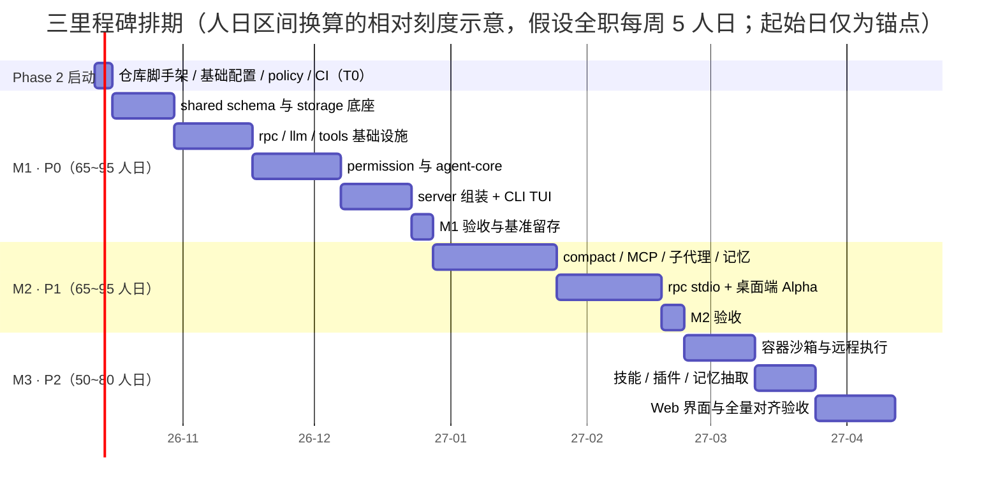
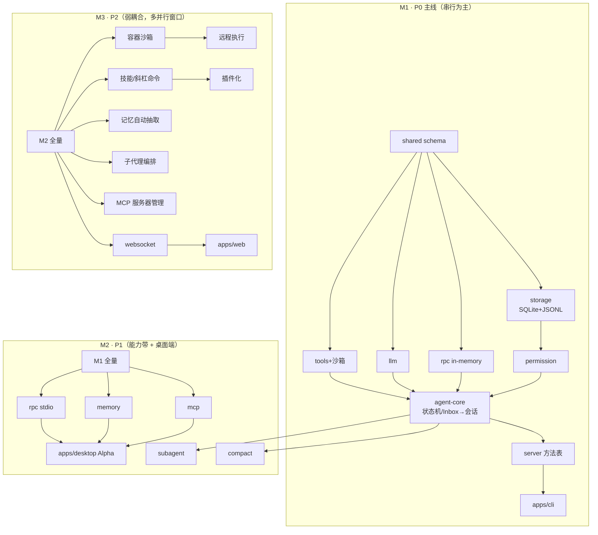

# RainCode 项目开发计划（07-dev-plan）

| 项目 | 内容 |
| --- | --- |
| 文档版本 | v1.2 |
| 发布日期 | 2026-09-28（v1.1 修订 2026-10-03 · v1.2 增补 2026-10-04） |
| 文档状态 | 正式定稿（Phase 1 规划阶段收尾交付物）；v1.1 增补 §10 M4 排期（M3 收官后，见 §10.1 背景说明）；v1.2 增补 §11 M5 排期（M4 收官后三仓调研，见 §11.1 背景说明） |
| 关联文档 | 01-PRD（范围/里程碑/NFR 权威）· 02-module-design（模块详设）· 03-ui-design（双端 UI 规范）· 04-architecture（包划分/进程/RPC/治理）· 05-database（存储设计）· 06-api-spec（协议全集，本计划基线 43 方法 / 17 事件，M3 收官演进至 54 方法 / 19 事件，M4 缺陷修复批次增至 55 方法（v1.11），见 06 §7.5）· [legacy-items](legacy-items.md)（遗留项台账）· [调研：deepseek-harness](research/2026-10-03-deepseek-harness.md) / [调研：M5 三仓参照系](research/2026-10-04-m5-reference-repos.md) |

> 本文档是 Phase 1（规划）的收尾交付物：将六份设计文档的交付范围收敛为单人可执行的三里程碑开发计划，并给出 Phase 2（开发实施）的启动清单。**里程碑划分、P0/P1/P2 范围、NFR 验收口径均以 01-PRD 为唯一基线**；任务分解的包归属、依赖方向以 02 §0.1 / 04 §2 为准；协议接线范围以 06-api-spec 的 8 域 43 方法 / 17 事件为准（该口径为规划时点基线；M3 全量落地后演进为 54 方法 / 19 事件）。排期以「人日」计，不承诺绝对日期。

---

## 1. 计划总览

### 1.1 排期假设（单人开发）

- **人力模型**：单人开发者；全职投入按每周 5 人日计，业余投入按每周 2~3 人日计。所有估算为**区间（min~max）**，含配套单测与文档同步，不含长假与不可抗中断，允许 ±20% 波动。
- **基准环境**：Windows 10/11 + Node.js ≥ 20 + pnpm；开发机即验收基准机（01-PRD §6.1）。
- **节奏约束**：每 2 周产出一个可运行增量；每里程碑预留 3~5 人日验收缓冲（已计入任务表）；里程碑收尾执行一轮全量 NFR 基准测量并留存数据。
- **迭代顺序（已确认）**：Agent 内核 → CLI → 桌面端；Web 界面最后（P2）。

### 1.2 三里程碑时间轴



### 1.3 每里程碑一句话目标

| 里程碑 | 优先级 | 一句话目标 | 工作量估算 |
| --- | --- | --- | --- |
| M1 | P0 | **单进程 CLI 打通日常可用闭环**——在真实仓库里独立修完一个 Bug，人工只参与审批 | 65~95 人日（全职约 3~4.5 个月） |
| M2 | P1 | **能力补全 + 第二端**——长会话不爆（压缩）、外部工具能接（MCP）、任务能委派（子代理）、经验能留下（记忆），桌面端与 CLI 共享同一大脑 | 65~95 人日（全职约 3~4.5 个月） |
| M3 | P2 | **七模块全量对齐**——隔离可升级（容器沙箱）、工作流可封装（技能/命令）、能力可插拔（插件）、执行可远程（SSH/WSL）、补齐 Web 界面 | 50~80 人日（全职约 2.5~4 个月） |

全程合计约 **180~270 人日**；全职约 8~12 个月，业余（每周 2~3 人日）约 1.5~2 年。M3 含预定义裁剪次序（见 §6 风险 7），必要时压缩至 4 项核心交付。

---

## 2. M1 详细计划（P0：Agent 内核 + CLI 可用）

### 2.1 目标与范围清单（按包/模块拆分）

**目标 = P0 全量**（01-PRD §5 标 P0 的功能点）：AC-1~6 / AC-8、TL-1~3、ES-1、PC-1~2、UI-1~2；对应 06-api-spec 中 **22 个 P0 方法**（system 3 + session 8[除 compact] + permission 2[respond / decisions.list] + config 5[get / set / providers.list / add / remove] + tool 4[tools.list / background.list / kill / output]）与 **12 个 P0 事件**。

| 包 / 模块 | M1 交付范围 | 对应功能点 |
| --- | --- | --- |
| `packages/shared` | P0 域 schema（common / session / events-turn / permission / config / tool / system）+ METHOD_SCHEMAS / EVENT_SCHEMAS 注册表（P0 子集） | 协议契约（06 §5） |
| `packages/storage` | `001_init.sql`（P0 表：workspaces / sessions / tool_calls / approvals / permission_decisions / settings / schema_migrations）+ JSONL 追加写 + checkpoint + 恢复流程 | AC-5 / AC-8、NFR-5/7 |
| `packages/rpc` | RpcFrame 帧协议、InMemoryTransport、RpcClient / ServiceBinding | 04 §4（in-memory 绑定） |
| `packages/llm` | OpenAI 兼容 Chat Completions + SSE 归一化、工具 schema 编码、五内置预设（OpenAI/DeepSeek/Kimi/GLM/Ollama） | AC-2 / AC-3 / AC-4 |
| `packages/tools` | ToolRegistry / ToolExecutor / ToolMetadata、本地受控执行沙箱（cwd 限定、超时、输出环形缓冲、后台任务、进程树安全终止）、内置工具 bash / read / write / edit / glob / grep / todo_write / todo_read | TL-1 / TL-2 / ES-1 |
| `packages/permission` | 五级判定链（M1：metadata + 协作模式 + 会话内存规则 + 默认 ask）、bash argv 求值与只读白名单、审批闭环（四级决策、grantId 单消费）、决策审计落盘 | PC-1 / PC-2 / TL-3 |
| `packages/agent-core` | TurnPhase 状态机（T1~T15）、TurnController、CommandInbox（三分类 + steering）、会话生命周期（create / resume / list / archive）、checkpoint 增量重放、上下文组装与截断 | AC-1 / AC-5 / AC-6 / AC-8 |
| `packages/server` | Agent Service 唯一组装点、P0 22 方法接线、事件出口 | 04 §2.4 铁律 4 |
| `apps/cli` | Ink TUI（消息流 / 工具行 / 审批块 / 输入区 / 状态栏）、`raincode` 与 `--resume` 等参数、快捷键、Markdown 渲染 | UI-1 / UI-2 |

### 2.2 任务分解表

| 任务 | 产出物 | 依赖 | 预估人日 | 验收方式 |
| --- | --- | --- | --- | --- |
| T1.1 仓库脚手架与工程基线 | pnpm monorepo、tsconfig（strict）/ eslint / vitest、architecture-policy.yaml（04 §6.1 原样落地）、CI 骨架 | — | 3~4 | CI 首次全绿；`pnpm architecture:check` 通过 |
| T1.2 shared schema（P0 域） | P0 域 schema 文件 + 注册表；strict 入参 / 宽松出参 | T1.1 | 4~6 | schema 单测（合法 / 非法样例、strict 拒绝未知字段） |
| T1.3 storage：SQLite + JSONL | 001_init、WAL PRAGMA、JSONL 追加写 + checkpoint fsync + 恢复（seek/重放/半行截断/悬挂 tool_call 补齐/对账） | T1.2 | 6~8 | 单测：追加/重放/epoch 守卫/截断；强杀恢复用例通过 |
| T1.4 rpc：帧协议 + in-memory 绑定 | RpcFrame、InMemoryTransport、RpcClient / ServiceBinding | T1.2 | 3~4 | 集成测试：call/event 往返、超时、畸形帧不致命 |
| T1.5 llm：OpenAI 兼容接入 | SSE 归一化（02 §1.2.4 映射）、工具 schema 编码、五预设、指数退避重试 | T1.2 | 5~8 | fixture 合同测试；≥2 个 Provider 真实连通冒烟 |
| T1.6 tools：注册表 + 执行器 + 本地沙箱 | ToolRegistry / ToolExecutor、本地受控执行（超时终止、环形缓冲 256KB、后台任务 registry、Windows 进程树安全终止） | T1.2 | 8~10 | 单测：预算裁剪、超时杀树、kill 所有权校验、输出洪泛 |
| T1.7 tools：内置工具集 | bash / read / write / edit / glob / grep / todo_write / todo_read（先读后写快照、edit 唯一匹配） | T1.6 | 4~6 | 每工具行为单测 + 02 §2.4 异常表逐条用例 |
| T1.8 permission：判定链 + 审批闭环 | metadata 快速通道、模式判定（normal/plan/auto-accept）、会话内存规则、默认 ask、bash argv 求值 + 只读白名单 + 高危降级、审批单/审计落盘 | T1.3 | 6~9 | 判定链优先级矩阵单测；审批闭环集成测试（含超时视为 deny） |
| T1.9 agent-core：状态机 + Inbox | TurnPhase 迁移表 + IllegalPhaseTransitionError、TurnController、CommandInbox（turn.new / turn.steer / session.control + steeringBuffer） | T1.4 / T1.5 / T1.6 / T1.8 | 8~12 | T1~T15 全迁移组合单测；非法迁移抛错；steering 注入用例 |
| T1.10 agent-core：会话生命周期与上下文组装 | create / resume（checkpoint + 增量重放）/ list / archive、上下文组装与 maxContextTokens 截断、系统提示词装配 | T1.9 | 5~7 | 恢复基准 ≤1s；NFR-7 强杀恢复 100% |
| T1.11 server：组装点 + 方法表 | Agent Service 装配（唯一组装点）、P0 22 方法 + 12 事件接线 | T1.9 / T1.10 | 4~6 | in-memory 端到端集成：send → 工具 → 审批 → done |
| T1.12 cli：Ink TUI | 消息流 / 工具行 / 审批块（四级决策）/ 输入区 / 状态栏、`--resume`、快捷键、Markdown 渲染、启动关键路径最小化 | T1.11 | 8~12 | 按 03 §5 交互规范手动走查；NFR-1 冷启动基准 |
| T1.13 M1 验收与基准留存 | bench:start / send / render / resume 脚本、崩溃恢复测试集、真实仓库 Bug 修复样例 | 全部 | 3~5 | §2.4 验收清单全绿 |

M1 小计：**65~95 人日**。

### 2.3 关键路径说明

M1 是串行依赖最重的一段（内核未成型前 CLI 无从谈起）：

```text
shared schema → storage ─┐
             → rpc      ─┤→ permission ─→ agent-core（状态机/Inbox → 会话/组装）→ server → cli
             → llm      ─┤
             → tools    ─┘
```

- **拓扑依据**：04 §2.3 拓扑序 `shared(0) → {storage, rpc, llm, tools}(1) → permission(2) → agent-core(3) → server(4) → apps(5)`。
- **串行硬约束**：agent-core 依赖全部四个一级包（Inbox 要 rpc 的回调语义、turn 要 llm 流事件、ToolSchedule 要 tools、工具前置判定要 permission），因此 T1.9 之前没有真正的并行主线；T1.3~T1.6 四个包之间无相互依赖，可按任意顺序交替（见 §5 并行窗口）。
- **风险前置**：T1.3（恢复流程）与 T1.6（Windows 进程树终止）是 M1 两大技术不确定点，安排在关键路径前段尽早验证；T1.5 的 Provider 差异用 fixture 前置消化，不阻塞 turn 循环开发。
- **首个纵向切片**：T1.9 完成后立即打通「ping → 纯文本对话（无工具）」的 walking skeleton，先验证端到端再补工具与审批。

### 2.4 验收清单（M1）

**工程门槛（CI 与本地一致，任一失败不进入验收）**：

```bash
pnpm typecheck              # tsc --noEmit，strict
pnpm lint                   # eslint + import 边界规则
pnpm test                   # vitest 全量单测 + 集成
pnpm architecture:check --changed   # 04 §6 治理五检查
```

**性能基线（测量方式引用 01-PRD §6.1，Windows 基准机）**：

| 项 | 命令 | 标准 |
| --- | --- | --- |
| NFR-1 CLI 冷启动 | `pnpm bench:start`（TUI ready 打点，20 次中位数） | ≤ 2s |
| NFR-2 输入→模型请求本地开销 | `pnpm bench:send`（取 P95） | ≤ 300ms |
| NFR-3 工具结果本地渲染延迟 | `pnpm bench:render`（工具完成→渲染完成，P95，CLI 侧） | ≤ 100ms |
| NFR-5 会话恢复 | `pnpm bench:resume`（1 万条消息样本会话） | ≤ 1s |
| NFR-7 崩溃可恢复 | `pnpm test:e2e -- crash-recovery`（会话中随机时刻强杀 ×20，重启校验 JSONL 完整性与 message_count 一致） | 通过率 100% |

**功能手动验收场景（对照 01-PRD §7.1）**：

1. 五 Provider 连通矩阵：OpenAI / DeepSeek / Kimi / GLM / Ollama 各 ≥1 模型完成一次真实任务。
2. 工具集逐个用例：八内置工具正反用例（含 edit 多处匹配报错、write 未先 read 被拦截、输出超预算截断标记）。
3. 三态审批闭环：allow 直接执行 / ask 四级决策（仅本次/本会话/始终/拒绝）/ deny 拒绝；allow-always 会话内生效；审批记录经 `permission.decisions.list` 可查。
4. 长任务中断续做：20+ 工具调用任务中 Ctrl+C 中断 → `raincode --resume` 恢复 → 续做到完成。
5. **端到端任务样例**：在真实开源仓库中，Agent 独立完成「修复一个含复现步骤的 Bug」全流程（定位 → 修复 → 测试 → 汇报），人工仅审批。
6. 治理核对：无新增未登记包、无越权依赖、无超 500 行文件。

---

## 3. M2 详细计划（P1：压缩 / MCP / 子代理 / 记忆 + 桌面端 Alpha）

### 3.1 目标与范围清单

**目标 = P1 全量**：AC-7 / AC-9~12、TL-4~5、MI-1~3、SB-1~2、ES-2、PC-3~5、MR-1~2、UI-3；协议新增 **21 个方法**（session.compact、permission.rules.* 3 个、config.providers.switch、tool.call、mcp 域 6、subagent 域 4、memory 域 5）与 **5 个事件**（subagent.* 3、compact.* 2、mcp.server_status_changed），累计 43 方法 / 17 事件全量接线。

| 包 / 模块 | M2 交付范围 | 对应功能点 |
| --- | --- | --- |
| `packages/agent-core` | auto-compact（阈值触发、异步不阻塞、epoch 单调、保留区、失败重试上调）；Sub-agent（profile 解析、同工厂派生、并发槽 4、事件镜像、`agent` 工具）；会话重命名/归档/分叉、Token 用量与成本统计、模型运行时切换、结构化输出校验受限重试 | AC-7 / AC-9~12、SB-1~2 |
| `packages/mcp`（新包） | stdio / http / sse 三 transport、连接状态机（M1~M8）、工具适配命名空间 `mcp__<serverKey>__<toolName>`、失败隔离、`mcp.json` 配置加载 | MI-1~3 |
| `packages/memory`（新包） | MEMORY.md 三层记忆（注入 / 会话记忆抽取 / FTS5 trigram 检索 / promote 晋升）、Agent 专用章节写入 | MR-1~2 |
| `packages/permission` | project / global 规则持久化与优先级合并、危险命令识别强制 ask | PC-3~4（PC-5 审计查询 M1 已接线） |
| `packages/tools` | 结果截断与分页回看、只读工具并行、路径越界检测升级 ask、`web_fetch`（SSRF 防护）与 `ask_user_question` | TL-4~5、ES-2 |
| `packages/rpc` | StdioTransport（JSONL 帧）、半开检测 | 04 §4.4（P1 绑定） |
| `packages/shared` | 新增 mcp / subagent / memory schema 域 + 5 个新事件 schema | 06 §5 |
| `packages/storage` | `002_p1_tables.sql`：permission_rules、memory_entries + memory_fts、mcp_servers、subagent_runs | 05 §3 / §5 |
| `apps/desktop` | Electron 三泳道（main 帧桥 / renderer / agent 子进程）、React 18 + Zustand + Tailwind：会话管理、工作区选择、权限审批弹窗、Provider 设置，与 CLI 共享 `~/.raincode/` | UI-3 |

### 3.2 任务分解表

| 任务 | 产出物 | 依赖 | 预估人日 | 验收方式 |
| --- | --- | --- | --- | --- |
| T2.1 auto-compact | CompactionService、阈值 80% 触发、epoch 守卫、保留区（系统提示 + 最近 20 条）、失败阈值上调 90% | M1 | 6~8 | NFR-6 专项用例；压缩后任务连续性人工样例 |
| T2.2 mcp 包 | 三 transport、连接状态机、工具适配与命名空间注册、失败隔离与重连退避 | M1 | 10~13 | stdio + HTTP 各接入 ≥1 真实 server；M1~M8 状态迁移单测 |
| T2.3 子代理 | profile 解析校验、spawn / 并发槽 / 级联取消、事件镜像（500ms 合并）、`agent` 工具注册 | M1 | 8~11 | 「多子任务委派 + 结论回传」样例；主上下文无子任务中间过程污染校验 |
| T2.4 memory 包 | MEMORY.md 模板初始化与注入、会话结束/compact 抽取落盘、FTS5 trigram 检索 + LIKE 兜底、promote 单向晋升 | M1 / T2.1 | 8~11 | 抽取幂等 / 去重 / superseded 单测；新会话记忆生效与 `--resume` 续做场景 |
| T2.5 permission 持久化与危险命令 | project/global 规则 CRUD、层级合并、高危根命令禁止通配 allow | M1 | 3~5 | 规则优先级合并矩阵单测；002 迁移回放测试 |
| T2.6 内核增强（AC-9~12） | 会话重命名/归档/分叉、逐请求 token 统计与费用估算、`config.providers.switch`、结构化输出校验失败受限重试 | M1 | 5~8 | 各自单测 + CLI / 协议冒烟 |
| T2.7 工具增强与 P1 工具 | 输出预算裁剪分页、只读并行调度、路径越界检测、web_fetch / ask_user_question | M1 | 5~7 | 各自单测（含 SSRF 黑名单、越界升级 ask） |
| T2.8 rpc stdio + server headless | StdioTransport、headless 入口、session.snapshot 补推（未决审批 / seq 缺口补偿） | M1 | 3~5 | stdio 帧人工 cat 调试验证；断线重连补推用例 |
| T2.9 桌面端 Alpha | Electron 三泳道骨架、会话流 / 工具卡 / 审批弹窗 / Provider 设置 / 工作区选择、electron-builder Windows 打包 | T2.8 | 16~22 | 03 §6 逐界面走查；双端同一会话数据、审批记录两端一致 |
| T2.10 M2 验收与基准留存 | NFR-4 / NFR-6 测量留存、MCP / 子代理 / 记忆验收样例 | 全部 | 3~4 | §3.4 验收清单全绿 |

M2 小计：**65~95 人日**（其中桌面端 Alpha 约 1/4~1/3）。

### 3.3 关键路径说明

- **主线**：T2.1 → T2.2 → T2.3 → T2.4 为内核能力带（互相独立，可交替但都前置 T2.9 的真实数据联调）；T2.8 是桌面端硬前置（stdio 绑定 + headless 入口），必须在 T2.9 启动前完成。
- **桌面端策略**：T2.9 前半段（Electron 骨架 + mock rpc 的纯 UI）可与 T2.2/T2.3 并行交替（§5 并行窗口），后半段接真实 stdio 联调。
- **协议收口**：M2 结束时 43 方法 / 17 事件全量接线完成，capability 列表同步更新（`subagent.spawn` / `mcp.transport.http` / `memory.promote` 等转为已落地）。

### 3.4 验收清单（M2）

**工程门槛**：同 §2.4 四命令（typecheck / lint / test / architecture:check）。

**性能基线（引用 01-PRD §6.1）**：

| 项 | 命令 / 方式 | 标准 |
| --- | --- | --- |
| NFR-4 桌面端空载内存 | `pnpm bench:mem:desktop`（三进程 process.memoryUsage 汇总 + 任务管理器交叉验证，空载 5 分钟） | ≤ 500MB |
| NFR-6 压缩异步不阻塞 | `pnpm test -- compact-nonblocking`（压缩窗口内注入输入与工具调用探测用例，断言零排队等待；纳入回归） | 专项用例通过 |
| NFR-1/2/5 回归 | 复跑 `bench:start / send / resume` | 不劣化（±10% 内） |

**功能手动验收场景（对照 01-PRD §7.2）**：

1. auto-compact：长会话自动触发；压缩期间输入 / 工具 / 审批均可用；压缩后上下文连续性人工验收通过。
2. MCP：stdio 与 HTTP 各 ≥1 真实 server，其工具纳入三态权限控制（外部工具默认从严）；断连重连与失败隔离演示。
3. 子代理：至少一次「多子任务委派 + 结论回传」，主上下文无中间过程污染；并发超限排队可见。
4. 记忆：MEMORY.md 新会话注入生效；会话记忆跨会话延续；`--resume` 续做可用；promote 晋升需用户确认。
5. 桌面端 Alpha 四项（会话管理 / 工作区 / 审批弹窗 / Provider 设置）走查；CLI 里开始的会话在桌面端打开即续接，「始终允许」决策双端同步。
6. 端到端样例：MCP 工具参与的真实任务样例（如接入文件系统 MCP server 完成一次跨目录重构）。

---

## 4. M3 详细计划（P2：沙箱容器 / 技能 / 插件 / 远程执行 + 全量对齐）

### 4.1 目标与范围清单

**目标 = P2 全量**：ES-3~5、MR-3~4、TL-6~7、SB-3~4、MI-4、UI-4~5；M3 收尾时以 01-PRD §4.2 对比矩阵 RainCode 列为核对表逐项确认落地。

| 包 / 模块 | M3 交付范围 | 对应功能点 |
| --- | --- | --- |
| `packages/tools/src/sandbox` | Docker 容器 Executor、WSL Executor（`Executor` 工厂扩展点，M1 已留缝）、文件系统 / 网络隔离策略、不可用时回退 local 告警 | ES-3~4 |
| `packages/tools/src/sandbox` | SSH / WSL 远程工作区执行，本地审计记录保留 | ES-5 |
| `packages/tools` | 技能与斜杠命令扩展体系（技能包加载、`/` 命令面板接入、≥3 官方示例技能）；插件化（加载 / 启停 / 生命周期，source=plugin） | TL-6~7 |
| `packages/memory` | 记忆 Agent 自动抽取循环（confidence 阈值、幻觉防线）、晋升草案待确认区 | MR-3 |
| `apps/desktop` | 记忆管理界面、MCP 面板 / 用量统计等能力补齐 | MR-4、UI-4 |
| `packages/agent-core` | 子代理并行编排与结果汇聚、角色模板预置（评审员 / 测试专员） | SB-3~4 |
| `packages/mcp` | 服务器配置化管理、启停、健康检查与异常恢复 | MI-4 |
| `packages/rpc` | WebSocketTransport（帧协议零改动；鉴权 capability `ws.auth`、心跳重连参数补定义） | 06 §6.3 |
| `apps/web`（新端，需先登记 policy） | Web 会话工作台，复用桌面端组件策略与服务协议 | UI-5 |

### 4.2 任务分解表

| 任务 | 产出物 | 依赖 | 预估人日 | 验收方式 |
| --- | --- | --- | --- | --- |
| T3.1 Docker / WSL 容器沙箱 | `docker` / `wsl` Executor、隔离策略（文件系统 / 网络）、回退 local 与 kind 标记 | M1 沙箱缝 | 8~11 | 启用后越界操作被拦截用例；不可用回退告警用例 |
| T3.2 远程执行 | SSH / WSL 远程工作区执行、审计本地保留 | T3.1 | 6~9 | 端到端样例：远程仓库修改 → 远程测试 → 结果回传 |
| T3.3 记忆自动抽取 + 管理界面 | 记忆 Agent 循环、confidence < 0.6 不入默认召回、晋升确认流、桌面记忆管理器 | T2.4 | 6~9 | 抽取幂等 / 去重 / 矛盾标记单测；MR-4 界面走查 |
| T3.4 技能与斜杠命令 | 技能包规范与加载器、`/` 命令面板接入、3 个官方示例技能 | M1 工具体系 | 5~8 | 示例技能端到端执行；用户自定义技能加载用例 |
| T3.5 插件化 | 插件加载 / 启停 / 生命周期、工具注册 source=plugin、≥1 示例插件 | T3.4 | 6~9 | 示例插件发布与加载用例；插件故障不拖垮内核 |
| T3.6 子代理编排增强 | 并行编排汇聚、角色模板 | T2.3 | 4~6 | 并行委派汇聚用例（多子代理结果合并） |
| T3.7 MCP 服务器管理 | 配置化管理、启停、健康检查、自动恢复 | T2.2 | 3~5 | 健康检查 / 异常恢复用例 |
| T3.8 Web 界面 | WebSocketTransport 绑定 + `ws.auth`、Web 会话工作台、seq 缺口 → resume 补偿路径 | T2.8 | 10~14 | 浏览器端到端会话 + 断线重连快照补偿用例 |
| T3.9 桌面端补齐 + 全量对齐验收 | UI-4 各界面、4.2 对比矩阵逐项核对、NFR-1~7 全量重测留存 | 各项 | 4~6 | §4.4 验收清单全绿 |

M3 小计：**50~80 人日**。

### 4.3 关键路径说明

- M3 各任务之间耦合最弱（都建立在 M1/M2 稳定地基上），是三里程碑中**并行窗口最多**的一段；真正的串行约束只有 T3.2 依赖 T3.1（远程执行复用 Executor 抽象）、T3.5 依赖 T3.4（插件复用技能加载的注册机制）。
- **裁剪次序（若需压缩）**：T3.8 Web 界面 → T3.5 插件化 → T3.6 编排增强 → T3.7 服务器管理，先后裁撤；T3.1~T3.4 为 M3 不可裁核心。
- T3.8 落地同时是对「传输无关 RPC」设计的最终验证（帧协议与方法表零改动），其验收含协议层回归。

### 4.4 验收清单（M3）

**工程门槛**：同 §2.4 四命令。

**性能基线**：NFR-1~7 全量重测（引用 01-PRD §6.1）；附加约束：远程执行场景下 NFR-2 本地区间开销仍 ≤ 300ms。

**功能手动验收场景（对照 01-PRD §7.3）**：

1. Docker / WSL 沙箱可选启用，启用后文件系统与网络隔离策略生效（越界操作被拦截的用例通过）；未安装运行时降级为「工作目录约束 + 三态控制」并明示。
2. 用户自定义技能与斜杠命令被 Agent 加载执行；官方 ≥3 示例技能。
3. 插件机制可用并发布 ≥1 示例插件。
4. SSH / WSL 远程执行端到端任务（远程修改 → 远程测试 → 结果回传），本地审计记录完整。
5. Web 界面可用（会话、审批、恢复补尝路径）。
6. 记忆自动抽取产出经确认晋升 MEMORY.md；桌面端记忆管理器可查看 / 编辑 / 清除。
7. **全量对齐**：01-PRD §4.2 对比矩阵 RainCode 列逐项打勾；七大模块能力清单（§5 各表）逐条核对为已交付。

---

## 5. 任务依赖与并行策略

### 5.1 依赖图（按里程碑着色的主线）



### 5.2 单人开发并行策略

单人无真并行，**并行窗口 = 可交替推进的独立任务对**（A 卡壳或等待反馈时切 B，保持每日有效产出）：

| 窗口 | 可交替任务对 | 交替条件 |
| --- | --- | --- |
| W1（M1 前段） | T1.3 storage ↔ T1.5 llm | 两包互不依赖；llm 的 fixture 测试不依赖存储 |
| W2（M1 中段） | T1.6/T1.7 tools ↔ T1.8 permission | permission 仅依赖 storage；tools 仅依赖 shared |
| W3（M2 前段） | T2.2 mcp ↔ T2.4 memory ↔ T2.3 subagent | 三个能力带互相独立，按周轮换防倦怠 |
| W4（M2 中段） | T2.9 桌面端 UI（mock rpc）↔ T2.2/T2.3 收尾 | Electron 骨架与纯 UI 可先行，后段接 stdio 联调 |
| W5（M3 全段） | T3.1 容器（底层）↔ T3.4 技能（上层）↔ T3.3 记忆抽取 | 三者分属不同包，互不阻塞 |

**不可交替的硬串行段**：T1.9 agent-core（依赖四包齐备）→ T1.11 server → T1.12 cli，是 M1 冲刺段；T2.8 → T2.9 后半段（真实 stdio 联调）同理。

### 5.3 每周节奏建议

- **周一~周四**：推进当期主任务；每个任务先写失败测试再实现（状态机 / 求值器 / schema 类逻辑尤其实用 TDD）。
- **周五**：固定「回归日」——跑四命令门槛 + 当期 NFR 基准脚本 + 更新变更记录（06 §7.5 式）；保持 main 分支随时可运行。
- **每 2 周**：产出一个可演示增量（如「能流式对话」「能审批执行 bash」），录屏或笔记留档，维持动力与可回溯性。
- **每里程碑收尾**：全量 `architecture:check` 与孤儿清理（04 §6.3）、NFR 全量测量留存、协议 capability 列表核对。

---

## 6. 风险清单与缓解

| # | 风险 | 概率 | 影响 | 缓解措施 |
| --- | --- | --- | --- | --- |
| 1 | **Windows 平台兼容**：进程树终止（PID 复用误杀）、路径规范化（大小写 / 短路径名 / 分隔符）、shell 差异（cmd vs PowerShell）导致沙箱与工具行为不稳定 | 高 | 高 | 不引入 node-pty（P0 用 child_process + 受控 shell）；进程树按 root identity（pid + startTime）校验所有权（02 §5.3）；路径规范化（realpath / 小写 / 8.3 展开）单点实现 + Windows 用例矩阵；CI 使用 windows-latest runner，全程不出现「只在 Linux 测过」的代码 |
| 2 | **上下文成本与压缩质量**：长会话 token 成本失控；压缩摘要丢失关键上下文导致任务断链 | 中 | 高 | 阈值 / 保留条数可配（默认 80% / 20 条）；压缩失败保留原历史并上调阈值重试（02 §1.2.5）；建立压缩质量回归样例集（压缩前后任务连续性对比）；逐请求 token 统计与费用估算（AC-10）让成本可见 |
| 3 | **OpenAI 兼容协议的 Provider 差异**：各家 tool call 格式 / reasoning 字段 / SSE 分块 / 限流行为不一致，归一化层出现漏网差异 | 高 | 中 | llm 包收敛为「统一事件 + 归一化差异」单层（02 §1.2.4）；每 Provider 建立合同测试 fixture（含 tool call 往返、断流续接）；不支持的特有能力显式降级并在事件中标注，禁止静默吞掉；M1 验收强制五 Provider 真实连通 |
| 4 | **MCP 生态兼容**：第三方 server 质量参差（stdio 脏输出、启动即崩、schema 不可表达），拖垮主进程或产生误调用 | 中 | 中 | 复用官方 SDK + 严格帧解析，脏数据丢弃并告警（02 §3.4）；失败隔离——单 server 故障只标记其命名空间工具 unavailable；JSON Schema 转 zod 不可表达处降级 `z.unknown()` 并保留原 schema 校验；外部工具默认从严（needsApproval=true） |
| 5 | **Electron 打包与体积 / 内存**：三进程内存超 NFR-4；better-sqlite3 原生模块 ABI 与 electron-rebuild 纠缠；安装包膨胀 | 中 | 中 | agent 子进程为纯 Node 运行时（SQLite 不进 renderer / main，ADR-04 天然规避 ABI 冲突）；renderer 禁 Node-only 包 + 会话列表分页；输出环形缓冲封顶 256KB、不做向量索引库；NFR-4 计量纳入 M2 每周回归；electron-builder 引入放在 T2.9 后段，避免早期打包噪音 |
| 6 | **单人开发可持续性**：节奏中断、动力衰减、关键路径任务（agent-core）久攻不下导致弃坑 | 高 | 高 | 以人日区间而非绝对日期排期，允许 ±20% 波动；每 2 周可运行增量 + 录屏留档提供正反馈；核心四链路（Agent Core / Tool / Permission / 会话持久化）自 M1 起自动化回归，中断复工后不易倒退；并行窗口机制保证每日有可用产出 |
| 7 | **范围蔓延**：对齐 Claude Code 功能全集的诱惑（hooks、IDE 扩展、后台守护、更多端）不断插入排期 | 高 | 中 | 以 01-PRD 功能点编号为唯一范围账本——新能力必须先登记为 P1/P2 条目并修订 PRD 后才可排期；M3 对齐口径锁定为 §4.2 对比矩阵而非社区功能全集；M3 预定义裁剪次序（§4.3），超支时裁 Web / 插件 / 编排而非压缩质量 |
| 8 | **zod schema 演进破坏会话兼容**：schema 变更导致旧 JSONL 会话无法恢复、双端协议错配 | 中 | 高 | JSONL 行信封带 `v` 版本字段 + schema 版本化向前兼容（05 §4.2）；协议按 06 §7 演进规则（只增不删、capability 探测、major 不一致显式 VERSION_MISMATCH）；破坏性存储迁移走重建表 + 自动备份（05 §6）；恢复测试集包含上一版本 fixture 会话 |
| 9 | **审批与执行竞态**：审批通过后命令内容已变、多端重复应答同一审批单 | 中 | 中 | 沙箱以审批时快照的归一化命令执行，不一致即拒绝（approve-what-runs，02 §5.4）；grantId 单消费——首个 respond 生效，其余返回 alreadyResolved（06 §2.2）；审批单超时视为 deny，turn 不悬挂 |

---

## 7. 验证与质量策略

### 7.1 分层验证策略

| 层 | 工具 / 范围 | 时机 |
| --- | --- | --- |
| typecheck | `tsc --noEmit`，全仓 strict | 每次提交（CI 三门槛之一） |
| lint | eslint + import 边界规则（辅助 policy） | 每次提交 |
| 单测 | vitest：纯逻辑域优先全覆盖——TurnPhase 迁移表全组合、CommandInbox 判级、bash argv 求值器、判定链优先级矩阵、schema strict/strip、JSONL 恢复重放、epoch 守卫、压缩幂等 | 随任务（TDD 优先） |
| 集成测试 | in-memory rpc 端到端：send → 工具调用 → 审批 → done；stdio 绑定往返；断线重连补推 | 每任务收尾 + 周五回归 |
| E2E | headless server + fixture 会话：崩溃强杀恢复（NFR-7）、1 万条消息恢复（NFR-5）、压缩非阻塞探测（NFR-6） | 每周五 + 里程碑验收 |
| 基准脚本 | bench:start / send / render / resume / mem:desktop（口径=01-PRD §6.1 测量方式） | 周五回归 + 里程碑留存 |
| 手动验收 | Provider 真实连通矩阵、真实仓库任务样例（M1 Bug 修复 / M2 MCP 样例 / M3 远程执行样例）、03-ui-design 界面走查 | 里程碑验收 |

### 7.2 架构治理接入 CI

- **三门槛并行**：`pnpm typecheck` + `pnpm lint` + `pnpm architecture:check --changed`，任一失败阻断合入（04 §6.3）；主分支每日跑一次全量。
- **policy 即代码**：`architecture-policy.yaml` 随仓库入库，其变更必须出现在 PR diff 中接受评审（放宽白名单 / 提高行数上限 / 新增 exceptions 都是有意识的结构决策）。
- **检查项**：越权依赖（import ⊆ requires 白名单）、SCC 循环检测、深导入（仅 publicEntrypoints）、单文件 ≤ 500 行、新目录必须先登记（managedOnly）——M2 新增 `packages/mcp`、`packages/memory`，M3 新增 `apps/web` 时均需先改 policy 再建包。
- **里程碑收尾**：全量检查 + 孤儿模块清理 + `exceptions` 有效性核对（过期豁免即报错）。

### 7.3 性能指标测量方法

全部引用 **01-PRD §6.1 性能指标基线表**的口径与测量方式，不另行定义：NFR-1 取 20 次中位数、NFR-2/3 取 P95、NFR-4 为三进程空载 5 分钟之和并以任务管理器交叉验证、NFR-5 使用 1 万条消息样本会话、NFR-6/7 为约束型专项用例。每个里程碑发布前执行一轮并留存数据（`docs/benchmarks/m<N>-<date>.md`），与上一轮对比不劣化（±10% 内）方可通过。

---

## 8. Phase 2 启动清单（开发实施前置）

### 8.1 仓库初始化步骤（对应任务 T1.1，预估 3~4 人日）

1. **monorepo 脚手架**：`pnpm init` + `pnpm-workspace.yaml`（`apps/*`、`packages/*`）；按 04 §2.1 清单建空包骨架（shared / storage / rpc / llm / tools / permission / memory / mcp / agent-core / server + apps/cli），每个包先只含 `src/index.ts` 与 package.json——memory / mcp / desktop 骨架可 M2 激活，但目录与 policy 同步登记。
2. **基础配置**：根 tsconfig（strict、NodeNext、project references）、eslint（含 import 规则）、prettier、vitest workspace、`.gitignore`、`engines.node >= 20`；验证 better-sqlite3 在 Windows 预编译安装成功（原生模块风险前置排除）。
3. **policy YAML 落地**：`architecture-policy.yaml` 按 04 §6.1 原样落地；实现 `architecture:check` 脚本（先支持越权依赖 / 深导入 / 行数三类，SCC 与 managedOnly 随后补齐）。
4. **CI 流水线**：GitHub Actions——`windows-latest` 为主 runner（Windows 优先策略），流水线 = typecheck + lint + `architecture:check --changed` + vitest；打标签触发时追加基准脚本冒烟。
5. **文档与版本**：docs/ 六文档入库；约定版本号与协议 `protocolVersion 1.0`、`configVersion 1` 的对应关系。

### 8.2 第一步开发任务推荐顺序（walking skeleton 优先）

1. `shared/common.ts`：RpcFrame / EventBase / PageParams / ID 类型 + 注册表骨架（06 §5）——一切包的地基。
2. `storage`：001_init + WAL 初始化 + JSONL 追加写 / checkpoint / 恢复 + 强杀恢复单测（NFR-7 先行锁定）。
3. `rpc`：InMemoryTransport + RpcClient/ServiceBinding + 畸形帧 / 超时用例。
4. `llm`：SSE 归一化 + 一个 Provider（建议 DeepSeek）真实 fixture 合同测试。
5. `tools`：ToolRegistry/ToolExecutor + read / glob / grep 三个只读工具（最快可用、无审批复杂度）。
6. `permission`：判定链最小实现（metadata 快速通道 + 默认 ask）+ 审批单生成。
7. `agent-core`：TurnPhase 状态机 + 最小 TurnController（纯文本对话，无工具）。
8. `server` + `apps/cli`：ping → 纯文本流式对话端到端打通——**walking skeleton 里程碑**（预计启动后 3~4 周内达成）。
9. 此后回到 §2.2 主表顺序推进：补齐写类工具 → bash 沙箱 → 审批闭环 → Inbox / steering → 会话恢复 → TUI 完整交互。

---

## 9. 自检清单

- [x] **里程碑与 P0/P1/P2 与 01-PRD 一致**：M1=P0（§5 各表 P0 项 + §7.1）、M2=P1（§7.2）、M3=P2（§7.3），三里程碑范围、验收口径、NFR 覆盖逐条对齐 §1.5 / §6.1 / §7。
- [x] **任务分解覆盖六文档全部交付范围**：02 七模块（含四状态机、审批闭环、压缩、子代理）、03 双端界面（CLI §5 / 桌面 §6 各界面走查纳入验收）、04 十二包拓扑与治理、05 存储表与迁移（001_init / 002_p1_tables）、06 八域 43 方法 / 17 事件（M1 接 22 方法 + 12 事件、M2 补 21 方法 + 5 事件，合计 43/17 全量）。
- [x] **验收清单可执行**：每里程碑给出具体命令（typecheck / lint / test / architecture:check / bench:* / test:e2e）与手动场景编号，NFR 测量方式显式引用 01-PRD §6.1，不引入新口径。
- [x] **单人开发假设显式化**：全文以人日区间估算并给出全职 / 兼职两种换算，含并行窗口与裁剪次序，无绝对日期承诺。
- [x] 仅创建本文档（07-dev-plan.md），未修改其他文档与 ZCode 目录；全文中文。

---

## 10. M4 增补排期（2026-10-03 增补，M3 收官后）

### 10.1 背景与定位

M1~M3 已完成 01-PRD 全量范围（P0/P1/P2），本节为 M3 收官后的**增补排期**，不改变 §1~§9 的历史计划事实。M4 主题定为**「工程加固与遗留收口」**：不新增 PRD 功能点，以 [deepseek-harness 调研](research/2026-10-03-deepseek-harness.md) 为参照系做三件事——

1. **工程欠账核销**：CI 落地（T1.1 承诺项）与 Storage.close 收尾竞态（PROGRESS §4 申报项）两笔硬欠账；
2. **高价值实践引入**：从调研报告中选定 4 项可落地借鉴（技能模型侧可发现性 / 生成式协议目录 / 防御式模式文档 / CI 门禁编排思想），完整取舍决策见调研报告 §3~§5；
3. **遗留项系统性收口**：三里程碑累积的遗留项已全量登记入 [legacy-items 台账](legacy-items.md)（19 项），M4 内收口 5 项待收口项，环境门控 5 项挂 T4.8 穿插执行。

范围纪律沿用 §6 风险 7：M5+ 候选方向（§10.5）未经 PRD 修订登记前不得排期。

### 10.2 任务分解表

| 任务 | 产出物 | 依赖 | 预估人日 | 验收方式 |
| --- | --- | --- | --- | --- |
| T4.1 CI 落地（L-07 核销） | `.github/workflows/ci.yml`：windows-latest 主 lane（typecheck / lint / architecture:check / test / smoke:p0 五门禁），pnpm store 缓存，electron 二进制按需跳过验证（desktop 单测走 node/tsx agent 路径不依赖 electron 二进制，`ELECTRON_SKIP_BINARY_DOWNLOAD=1` 落地时验证）；push + PR 触发 | — | 1~2 | CI 首次全绿（Actions 运行记录留存 PROGRESS）；本地与 CI 门禁集一致 |
| T4.2 内核收尾竞态修复（L-06 核销） | `Storage.close()` 与 agent-core serialWrite 队列排空联动（flush-then-close 或 close 感知 pending 写，方案落地时定），复现回归测试 | — | 0.5~1 | 复现用例（close 窗口内 appendEvent 不 EBADF 不丢事件）转绿并入回归；smoke:kernel 全绿 |
| T4.3 协议目录生成式文档 + 防漂移门禁 | `scripts/gen-protocol-catalog.mts`：从 shared METHOD_SCHEMAS / EVENT_SCHEMAS 生成 `docs/generated/protocol-catalog.md`（方法表 / 事件表 / 错误码族）；gen 与 `--check` 双模式，`--check` 入 CI（依赖 T4.1） | T4.1 | 1~1.5 | 手改生成文件 → `--check` 变红；协议演进后 gen 一键再生成，06 手写表与生成物职责边界在文档头声明 |
| T4.4 技能模型侧可发现性（调研借鉴 #1） | 会话系统提示注入技能目录摘要（name/description/source 双源优先级）+ 目录变更 digest 检测重发布；`skill` 内置工具（模型经 skills.invoke 同链路调用，复用既有权限与 admission 语义）；frontmatter `modelInvocable` 开关（缺省 true）；01-PRD TL-6 加实现注记 | M1 工具体系 | 2~3 | mock 端到端：模型自主发现并调用技能收束；目录热变更重发布用例；开关关闭时模型调用被拒 |
| T4.5 Web 端管理面板对齐（L-08 核销） | apps/web 落地记忆管理器 / 扩展面板（MCP + 插件）/ 斜杠命令面板 / 用量统计；组件复用策略落地时定（抽公共 renderer 子包或按端最小实现，policy 先行）；README 移除「桌面端独有」注记 | T4.1 | 2~4 | 四面板 smoke 或走查脚本断言可用；README 承诺核销 |
| T4.6 防御式模式文档（调研借鉴 #3） | `docs/defensive-patterns.md`：dsh 六条模式适配 + RainCode M1~M3 实战沉淀（mtime 盲窗 / close 竞态 / 双 readline / 孤儿进程 / 域 init 降级不崩溃 / 审批快照执行）；CONTRIBUTING 评审清单引用 | — | 0.5~1 | 文档入 docs/README 索引；后续问题记录按此格式沉淀 |
| T4.7 遗留收口批次 A（本机可自动化，L-04/L-05 核销） | ① electron-builder dist 产物落地（nsis 安装包 + 安装启动冒烟记录；rebuild/符号链接问题现场解决或申报）② `scripts/walkthrough-web.mts`：CDP 驱动真浏览器走查 Web 工作台（连接/鉴权/会话/审批/重连） | T4.1 | 1~2 | dist 产物留存 + 走查断言通过；legacy-items L-04/L-05 转 ✅ |
| T4.8 遗留收口批次 B（真实环境门控，L-01/02/03/14/15 承接） | ① 五 Provider 连通矩阵（smoke:remote 矩阵化）② 真实仓库 Bug 修复端到端样例 ③ 场景 6 真实 MCP 任务样例 ④ Docker/WSL/SSH 真实运行时验证——**环境就绪即执行，不计入里程碑门槛** | 环境就绪 | 1~3（不计入门槛） | 各项执行记录留存；环境不可得项按 legacy-items 保留口径继续申报 |
| T4.9 可视化测试缺陷修复批次（2026-10-03 增补，三端 13 项缺陷收口） | Computer Use 可视化测试报告（B1~B13）修复：**B1** rpc 包浏览器安全 process 访问（isDevMode typeof 守卫，dev 模式 renderer 全挂）· **B2** 四入口装配 memory 域（CLI context/stdio host/web 宿主/桌面 agent entry——memory.read METHOD_NOT_FOUND 与 MEMORY.md 注入/抽取/晋升全链路失效）· **B3** 回归加固（smoke:web 用例 E 双重连客户端回合扇出 + web-client setSeqBaseline 基线防回退单测——协议层扇出验证本就正常，真浏览器复验挂可视化批次）· **B4** 桌面审批弹窗焦点接管（输入框聚焦时快捷键 1-4 失效）· **B5** CLI 行缓冲通道 LineChannel（管道预置审批应答丢失 + close 后 prompt() 抛 ERR_USE_AFTER_CLOSE 的退出噪音）· **B6** 双端消息 markdown 块级渲染（标题/表格/列表）· **B7** CLI reasoning 缺省省略（RAINCODE_CLI_SHOW_REASONING=1 恢复）· **B8** Web 风险徽章中文文案对齐 · **B9** Web 首载竞态横幅 + 重连成功清横幅 · **B10** plugins.rescan 协议 v1.11（扩展面板「刷新」重扫描免重启）· **B11** README 快速开始 cwd 口径 · **B12** 会话列表全量口径文档化（设计确认，legacy-items L-20）· **B13** 随 B1 收口 | — | 1~1.5 | 六门禁全绿 + smoke:web 5/5（用例 E 回归）+ smoke:plugin 4 用例（case D 重扫描）+ 单测 220（web-client 基线防回退）+ CLI 管道真实 Provider 复测（预置审批通过/干净退出 exit 0）+ 桌面走查 + 可视化复验 |

M4 小计：**8~14.5 人日**（不含环境门控的 T4.8）。

### 10.3 裁剪次序与关键路径

- **硬串行**：T4.1（CI）→ T4.3/T4.5/T4.7 中依赖 CI 的 `--check` 门禁项；T4.2 / T4.4 / T4.6 与其余任务零耦合，可任意穿插。
- **裁剪次序（若需压缩）**：T4.5 Web 面板 → T4.3 生成式目录 → T4.7 批次 A → T4.6 文档，先后裁撤；**T4.1 / T4.2 不可裁**（工程欠账核心）。
- T4.8 为常设穿插项，不阻塞 M4 验收结论（环境门控口径见 legacy-items §1）。

### 10.4 验收清单（M4）

**工程门槛**：§2.4 四命令全绿 + **CI 首次全绿**（T4.1 验收即里程碑门槛）。

**性能抽查**：NFR-1 / NFR-2 复跑不劣化（T4.4 注入技能目录增加系统提示体积，需确认冷启动与请求组装开销）；NFR-4 抽查（装配面变化）。不做全量重测（无性能向重构，口径见 m3 报告）。

**功能手动验收场景**：

1. 技能模型自主调用：mock 会话中模型经 `skill` 工具自主发现并执行技能（含 modelInvocable=false 拒绝用例）。
2. Web 四面板走查：记忆管理器 / 扩展面板 / 斜杠面板 / 用量统计在真实浏览器可用。
3. dist 安装包：nsis 产物安装后应用可启动并完成一次 mock 会话。
4. **台账核对**：legacy-items 全部「待收口」项转 ✅ 或明确降级口径。

### 10.5 M5+ 候选方向（2026-10-03 登记；2026-10-04 M5 规划轮已处置，排期见 §11）

来源两处：01-PRD/02/05/07 中「P2 后再议 / 明确不做」条目 + 调研报告 §3~§4「M5+ 候选」。仅列方向，不做承诺：

> **2026-10-04 处置记录**：经三仓调研（[MiMo-Code / deepseek-harness 二轮 / ZCode](research/2026-10-04-m5-reference-repos.md)），01-PRD 已修订 v1.1（§1.5/§1.6 登记 M5），本节候选按下表处置——完整决策依据见调研报告 §3~§5：

| §10.5 原候选 | 处置 | 去向 |
| --- | --- | --- |
| hooks 生命周期 | ✅ 排期 | §11 T5.1（M5 主题主菜） |
| 沙箱 enforcement 上报 | ✅ 排期 | §11 T5.2 |
| 记忆增强（跨项目全局记忆部分） | ✅ 排期 | §11 T5.3（global MEMORY.md 双层注入 + scope 预留） |
| 记忆增强（embeddings / 代码语义索引） | ❌ 不做 | 三仓均无实现，FTS+BM25 路线够用（调研报告 §4） |
| 事件生产者/消费者矩阵生成 | ✅ 排期 | §11 T5.5（T4.3 管线扩展） |
| `raincode config dump` 可观测性 | ✅ 排期 | §11 T5.5 |
| CLI esbuild 前置编译（L-16） | ✅ 排期 | §11 T5.7 |
| 录制会话回放测试 lane | ⏸ M6+ | 调研定论：先做事件矩阵+导出基座，回放格式=日志格式本身（调研报告 §1-4） |
| `session.delete` 物理删除 | ⏸ M6+ | dsh 无参照，自设计 tombstone+vacuum（§11.5） |
| per-file 覆盖率 / lefthook | ❌ 不做 | 维持 CI 六门禁现状；dsh 豁免机制作渐进入口候选（§11.5） |
| IDE 插件 / 后台守护 / 更多端 | ⏸ M6+ | ACP spike / serve+cron / jobs 通知注入形态沉淀 §11.5 |

---

## 11. M5 增补排期（2026-10-04 增补，M4 收官后）

### 11.1 背景与定位

M4 已全量完成（T4.1~T4.9，验收核对见 [m4 报告 §7](benchmarks/m4-2026-10-04.md)），本节为 M4 收官后的**增补排期**，不改变 §1~§10 的历史计划事实。M5 主题定为**「扩展机制与上下文治理」**，以 [M5 三仓调研报告](research/2026-10-04-m5-reference-repos.md)（MiMo-Code / deepseek-harness 二轮 / ZCode，三个只读调研子代理并行）为证据基座做四件事——

1. **扩展机制补课**：hooks 生命周期 v1（ZCode/蓝本 + MiMo 纪律 + dsh 审计语义）与沙箱 enforcement 上报（dsh full/partial 落地）——RainCode 扩展面（skills/plugins/MCP）已成型，唯 hooks 缺位；
2. **上下文治理**：compact 预剪枝（ZCode microcompact 常量 + dsh 三不变量）、MCP 工具目录化（MiMo BM25 延迟加载）、记忆与历史检索增强（三仓均无 embeddings 的定论 → FTS+BM25 路线）；
3. **可观测性**：`raincode config dump`（dsh 静态列层 + 来源标签）与事件生产者/消费者矩阵（T4.3 生成管线扩展）；
4. **工程收尾**：CLI esbuild 前置编译（L-16 核销）+ SSH base64 加固（T4.8 残留申报）+ 遗留批次 C。

范围纪律沿用 §6 风险 7：01-PRD 已修订 v1.1（§1.5/§1.6 登记 M5），本节排期成立；**M6+ 候选（§11.5）排期前同样必须先修订 01-PRD**。

### 11.2 任务分解表

| 任务 | 产出物 | 依赖 | 预估人日 | 验收方式 |
| --- | --- | --- | --- | --- |
| T5.1 hooks 生命周期 v1（M5 主题主菜） | shared 协议 additive v1.12（hooks 配置域 + hook 生命周期事件）；config schema hooks 节点（project/user 双源，project 来源须 workspace trust 授信且**每 dispatch 前重验**、授信撤销立即生效）；hooks runner（command 类型：timeoutMs 缺省 60s / async 后台运行 / 输出 JSON 契约 additionalContext / decision(approve\|block) / systemMessage / suppressOutput / hookSpecificOutput.permissionDecision(allow\|ask\|deny)，解析失败=failed 告警不阻塞主流程）；PreToolUse deny 拦截接线 ToolExecutor；UserPromptSubmit / PostToolUse / Stop 生命周期接线；hook 注入消息带 provenance 溯源（hookPhase/hookIds）；审计 log-only 事件对 hook/invoked + hook/result（stderr 截断落盘）；桌面/Web hook 执行事件投影 | — | 6~9 | smoke:hooks（mock hook 子进程）：PreToolUse deny 真实拦截工具调用（N-3）/ additionalContext 注入下一回合 / 超时与坏 JSON = failed 不阻塞 / project hook 未授信拒绝 + 授信后生效 + 撤销立即失效 / 审计事件对落盘；协议 --check；runner 单测矩阵 |
| T5.2 沙箱 enforcement 上报 | `Enforcement = 'full' \| 'partial'` 类型入 shared；Executor 工厂各实现自报（local=partial、docker/wsl=full、ssh 按远端探测，探针不可得报 partial）；bash 等工具结果 metadata **持续携带** enforcement 字段（非一次性告警）；模型可见拒绝标记 `[sandbox: ... denied under ... mode]`（同轮重试提示可选） | — | 2~3 | 四执行域自报矩阵单测 + bash 工具结果字段断言 + executor 冒烟扩展 |
| T5.3 记忆与历史检索增强 | storage history FTS5 trigram 表（消息 part 级：文本+工具名；versioned 增量迁移）；检索 API 相对分数地板（top hit × 0.15）+ 3x 过取样；全局记忆 global MEMORY.md（RAINCODE_HOME）双层注入（global 先 workspace 后）+ L2 条目 scope 列预留；`session_search` 模型工具（会话历史检索，裁剪候选）；02 §7 补「检索结果与模型所见一致」不变量注记；**不做 embeddings**（01-PRD §1.6 定论） | — | 4~6 | FTS 单测（中英文 / phrase 转义 / 分数地板 / 增量迁移）+ smoke:memory 扩展全局记忆注入用例 + 检索工具 mock 端到端（若保留） |
| T5.4 compact 预剪枝（microcompact） | full compact 触发前旧 tool result 预剪枝（触发阈值=上下文占比、可压缩工具白名单、保留最近 N 条、最小节省 tokens 门槛，常量参考 ZCode microcompact）；剪枝事件带 sourceEventSeqs 回指原文（resume/回放一致）；单过确定性收敛（head+marker+tail 恒 ≤ 阈值，按 code point 切分不劈代理对）；与压缩锁括弧协议兼容 | — | 3~5 | smoke:compact 扩展（预剪枝触发 / 白名单外不动 / 回指校验 / resume 后一致）+ NFR-6 回归 + 收敛性单测 |
| T5.5 可观测性：config dump + 事件矩阵 | `raincode config dump`：静态归并 默认 → RAINCODE_HOME config.json → env → CLI args 逐层覆盖，逐项标来源；`--default-only` 损坏诊断模式（配置文件坏也能打印内置默认）；事件生产者/消费者矩阵：扩展 T4.3 gen 管线，源码扫描 19 事件的声明/emit/监听点生成 `docs/generated/event-matrix.md`，gen + `--check` 双模式入 CI | T4.3 管线（已在） | 2~3 | dump 输出与实际生效一致（env 覆盖用例）；手改 event-matrix → `--check` 变红；损坏 config 下 `--default-only` 仍可打印 |
| T5.6 MCP 工具目录化（token 治理，裁剪候选） | MCP 工具不再全量进系统提示：目录摘要（BM25 K1=1.2 索引）+ `mcp_tool_search` 模型工具按需检索加载（上限 32）；大目录预算与降级（超预算降级为仅名称列表） | T4.4 目录 digest 机制 | 3~4 | 多 server fixture 下系统提示 token 对比断言 + search 工具 mock 端到端 + 目录热变更重发布 |
| T5.7 工程收尾 + 遗留批次 C（裁剪候选） | CLI esbuild 前置编译（L-16 核销：单文件 bundle、原生模块外置清单（better-sqlite3 等）、metafile 重复依赖校验、alias 逐条精确声明三件套）+ pinned 包管理器校验入 CI；SSH 执行域 base64 加固（远端命令 base64 包装消除 T4.8 申报的双引号转义残差）；遗留批次 C：L-14 密钥到位复查（smoke:remote）/ L-01 Docker/WSL 复查 / NFR 抽查 | 收尾性质置后 | 3~5 | CLI bundle 产物冒烟（命令集与协议断言）+ smoke:ssh 扩展双引号场景转绿 + CI 绿；L-16 核销登记 |

M5 小计：**23~35 人日**；**里程碑门槛 = T5.1~T5.5（17~26 人日）**，T5.6 / T5.7 为可裁尾项（T5.7 中遗留批次 C 的环境门控部分照旧不计门槛）。

### 11.3 裁剪次序与关键路径

- **耦合关系**：T5.1 / T5.2 / T5.3 / T5.4 相互零耦合可并行穿插；T5.5 复用 T4.3 生成管线（已在）；T5.6 复用 T4.4 目录 digest；T5.7 为收尾性质置后，其中 CLI esbuild 建议在 T5.1~T5.5 全部落地后执行（避免 bundle 面反复变动）。
- **裁剪次序（若需压缩）**：T5.6 MCP 工具目录化 → T5.7 工程收尾 → T5.5 可观测性 → T5.4 预剪枝，先后裁撤；**T5.1 hooks（主题主菜）/ T5.2 enforcement（最小增量性价比最高）不可裁**。
- 环境门控项（L-01 / L-14 / 真 OpenSSH 远端）照旧就绪即穿插，不计门槛（legacy-items §1 口径）。

### 11.4 验收清单（M5）

**工程门槛**：§2.4 四命令全绿 + 协议 v1.12 additive 后 `protocol:gen` 同步 + `--check` 门禁全绿。

**功能手动验收场景**：

1. hooks 端到端五用例全绿（T5.1 验收列：拦截 / 注入 / 容错 / 授信闭环 / 审计落盘）。
2. 四执行域（local/docker/wsl/ssh）工具结果携带 enforcement 字段，local 在 Windows 上如实自报 partial。
3. 检索增强：history FTS 命中 + 相对分数地板生效；全局记忆注入可见且优先级正确（global 先）。
4. 预剪枝：microcompact 触发后 full compact 频率下降（smoke:compact 扩展用例 + NFR-6 回归绿）。
5. 可观测性：`config dump` 输出与实际生效一致（含来源标签）；event-matrix `--check` 入 CI。
6. **台账核对**：legacy-items 待收口保持 0；L-16 核销（若 T5.7 执行）；L-14 / L-01 复查记录更新。

**性能抽查**：NFR-1 / NFR-2 / NFR-6 复跑不劣化（T5.1 hooks dispatch、T5.4 预剪枝均触及热路径）。

### 11.5 M6+ 候选方向（2026-10-04 沉淀，排期前必须先修订 01-PRD）

来源：三仓调研报告 §5「M6+ 候选沉淀」与 §4「明确不做」的缓议项。仅列方向，不做承诺：

- **扩展生态**：插件 marketplace 分发（ZCode 三层来源 + manifest，前置 symlink/junction 逃逸防护）；PermissionRequest hook 与 permissionUpdates 动态权限规则（T5.1 留口）；experimental 钩子区（chat.messages.transform / session.compacting 等，MiMo 分层纪律）；MCP OAuth 与进程树管控（ZCode）。
- **上下文与记忆**：会话录制回放测试 lane（前提：回放格式 = 事件日志格式本身）；spill 溢出家族（超大工具结果落盘 locator，dsh，约 2 人日）；checkpoint 结构化模板 + 候选晋升（MiMo 10 节模板）；Dream/Distill 自动记忆固化（MiMo）；compaction-image-offload（dsh）。
- **内核强化**：Goal/Stop 判定 judge（MiMo，防乐观早停）；Max Mode best-of-N + 评审（MiMo）；工具 FIFO 闸门 + fail-cascade（MiMo gate.ts，子代理并行编排强化前置）；last-match-wins 权限语义 + hardPermission 不可放宽层 + forced-ask 超时（MiMo 对照补用例）；`session.delete` 物理删除（tombstone+vacuum 自设计）；事件版本化 + 序号落库（MiMo sync）；持久化 shell 会话工具（dsh pwsh persistent，Windows 长驻终端）；rewind checkpoint 工件（ZCode，与 git stash 方案二选一）。
- **形态扩展**：ACP server 包装层（Zed 等 IDE 生态，3~5 人日，2 人日 spike 先行）；serve 长驻守护 + cron 调度四件套（MiMo jitter/lock/sentinel）；jobs 后台任务 + 完成通知注入原会话（dsh，约 3 人日）；动态工作流子系统（ZCode，subagent 之上的可编程编排层）。
- **工程**：架构治理升级（ZCode architecture-policy 声明式依赖方向 + `--changed` 增量 + maxFileLines）；knip 未用导出检测；CI path-hash 分片（MiMo）；per-file 覆盖率渐进圈（dsh 豁免 membership contract 作入口）。
